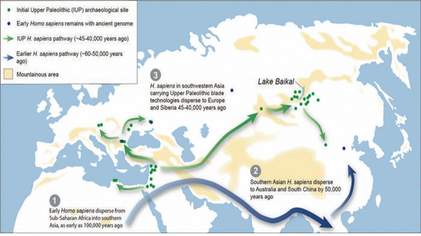

::: {.callout-tip}
## Key Points

- [**Time Period:**]{ .underline } MIS 2 (Last Glacial Maximum) and MIS 1
- [**Key Terms:**]{ .underline } Beringia, Cordilleran Ice Sheet, Laurentide Ice Sheet, Beringia Standstill,
Kelp Highway, Ice-Free Corridor, Clovis/Clovis-First 
- [**Summary:**]{ .underline } The earliest evidence of the peopling of the Americas sits between 18-15 ka. The ancestors of the first 
settlers of the Americas trace back to the Ancient Paleo-Siberians who settled in Northeast Eurasia
after migrating through the Inner Asian Mountain Corridor (IAMC). While it is clear that the route into North America
spans across the Bering Land Bridge, there is still much research into the path into the heart of the continent (or into S. America).
The primary hypotheses which aim to explain this process are the "Kelp Road" and "Ice-Free Corridor" hypotheses.
:::

## Initial Upper Paleolithic Migrations

We have been covering the Upper Paleolithic spread of *Homo sapiens* since the 
last large pulse out of Africa (~65-60 ka), through the Arabian Peninsula 
(~60-55 ka: Levantine Corridor and Inner Arabian “green windows”), into 
West Asia and the Caucuses (~45 ka: Turkey, Iran, Armenia, Azerbaijan, 
Georgia), and into Northeast and East Asia (~45-40 ka: Russia (Siberia), 
Mongolia, China). 

{.lightbox}



I will cover more on the South Asian route in the next 
lecture. We also made mention of the spread of H. sapiens into Europe from 
the Caucuses following the Danube River. Europe was subsequently insular for 
a time before Mesolithic and Neolithic expansion. Since I designed this 
course with a trajectory towards understanding how the earliest populations 
occupied the primary regions that we (in this class) live, I am omitting further 
discussion on what was happening in Europe at this time. While the ancestries 
of Polynesians and Native Americans can both be traced to the Middle-to-Upper 
Paleolithic populations that migrated into eastern Asia, the origins of these 
peoples have different timelines. While the earliest evidence of people in 
North America can be traced as far back ~24 ka (still paleolithic), Polynesia was not 
colonized until deep into the Neolithic (see time frames for Paleolithic, 
Mesolithic, and Neolithic below). While we will have to do a little jumping 
back and forth through time in the next unit, I will mostly try to keep a linear 
temporal path. Thus, our story picks up in Northeast Asia at the time just before 
reaching North America. 

::: {.paleo-table}

|           Paleolithic              | 
|------------------------------------|
| Lower Paleolithic (~2.6 Ma-300 ka) |
| Middle Paleolithic (~300-40 ka)    |
| Upper Paleolithic (~40-10 ka)      |

: Paleolithic Divisions {#tbl-paleo}
:::

::: {.paleo-table}

|           Mesolithic               | 
|------------------------------------|
| Europe (~10-4 ka) |
| Western Asia (~25-11.6 ka)         |
| Eastern Asia (~15-8 ka)            |

: Regional timing of Mesolithic {#tbl-paleo}
:::

::: {.paleo-table}

|           Neolithic                | 
|------------------------------------|
| Europe (~9-3.7 ka) |
| Western Asia (~12-6.5 ka)          |
| Eastern Asia (~10-4 ka)            |

: Regional timing of Neolithic {#tbl-paleo}
:::

Let’s clarify some confusing numbers here. If you take a look at the end of the paleolithic 
and the beginning of the Mesolithic (and notice the same thing for the end of the meso- and
 beginning of the neolithic), you see varying degrees of overlap. This is because these 
 time periods are not determined by absolute dates. This means that we are not drawing a 
 chronological line in the sand. Instead, they are defined by cultural signatures. Largely 
 this is determined by the degree of mobility and technology exhibited from archaeological 
 sites. In this regard, the Paleolithic commonly signifies mobile hunter/gatherer populations 
 with chipped stone tools (flake and core tools). The Mesolithic signifies semi-sedentary populations 
 with dynamic tools such as harpoons, bows and arrows, and ground stone tools such as adzes and axes. 
 The Neolithic is often directly correlated with the shift to agriculture from hunting and gathering. We 
 will talk about this and the associated innovations in the next unit. The point here is that the Mesolithic 
 and Neolithic occurred at different times in different places. 

## Reaching North America

* Key Points
  + Northeast Asia was populated by ~45 ka
	- Siberia, China, Mongolia
	- Following the IAMC
  + Northeastern extent reached by ~30 ka
    - Yana Rhinoceros Horn site (~32 ka)

::: {layout-ncol=2}

{.lightbox}

{.lightbox}

NE Asian migration routes
:::

Recall that the IAMC largely traverses northeast across Kazakhstan. The first 
image from this group (Atelian Low Stand), illustrates the number archaeological sites in this 
corridor from approximately 80-27 ka. The sites are color coordinated to reflect relative age 
with Orange being Upper Paleolithic (~40-10 ka), Red being Middle Paleolithic (~300-40 ka), and 
Green showing Lower Paleolithic (~2.6 Ma to 300 ka). You can see that there are some combinations
 of these colors, suggesting that many of these sites were occupied and reoccupied at various 
 times. The older sites also suggest that the region was important for many hominin groups 
 throughout the paleolithic (including Neanderthals, H. heidelbergensis, Denisovans, and H. sapiens). 
 This corridor not only provided habitable land for many populations, but provided a throughway 
 to reach the northeastern-most expanse of the Eurasian continent. 
