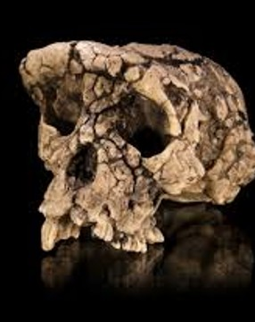
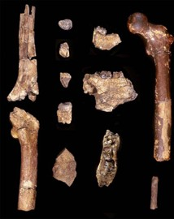
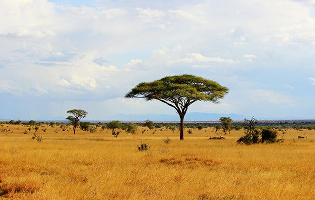
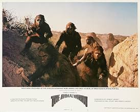
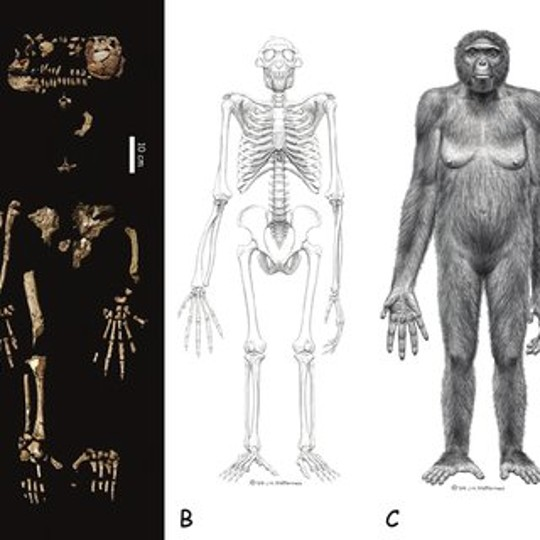
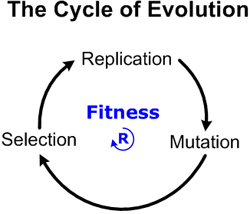
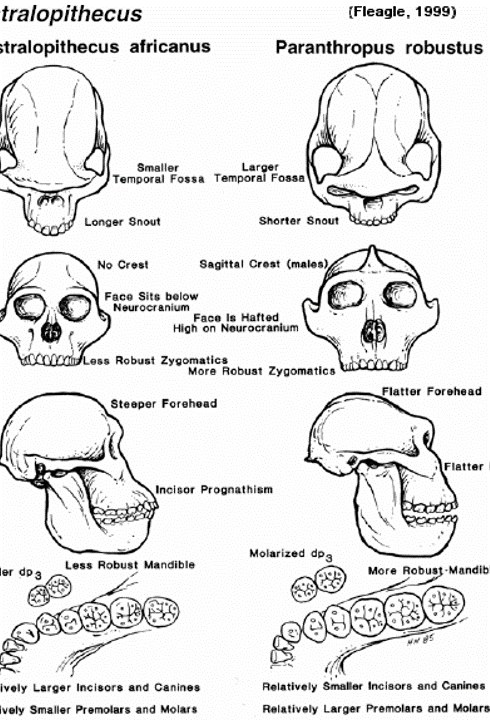

::: {.callout-tip}
## Key Points
- [**Additional Assigned Reading:**]{ .underline } 
- [**Key Terms:**]{ .underline } 
- [**Important Names:**]{ .underline } 
:::

{#fig-primates .lightbox width="60%"}

# Warning :warning: :rotating_light:

These next two weeks of course material are long, a little heavy, and super relevant to your upcoming "exam". [Do not put this off]{ .underline}. In addition to understanding this material
you should also be taking the time to review the literature on your exam topic. I will stress again that, since you are provided a good deal of time to put these presentations together,
there is the expectation that they will be well-researched and well-constructed. This class does not generally require much time commitment [except]{ .underline} for this aspect. Be sure to read through
the posted material and assigned textbook sections as soon as you can so that you can 1) use the information in your exam presentations, and 2) leave the needed time to work on your exam presentations. 

# The Human Evolutionary Timeline

This is going to be a very quick-and-dirty overview of the human fossil record and our evolutionary history. Our story will take us through some of the biggest morphological and adaptive shifts in human evolution and
highlight key fossils and fossil species which have added to this body of knowledge. Some of these species, such as Neanderthals, *Homo erectus*, and *Australopithecus africanus*, we have already encountered. Knowing the history 
of discovery, however, is very different than understanding evolutionary significance of these fossils. For this next level of understanding, we will need to develop a better framework for discussing anatomy and applied
evolutionary theory. Thus, we can begin this chapter with an overview of some key terms and concepts. These are [not]{ .underline} terms that you need to commit to memory (i.e., I will not ask you to define
in the quiz), but they will be important when reviewing and discussing the fossil record. 

## Glossary of Morphology 

#### Directional Terms

Probably the most difficult set of terms to get used to are those associated with anatomical positions. These are a specific set of words that circumvent the issues associated with how we typically refer to directions.
Many of your day-to-day directional terms are *relative* to your (our an object's) orientation. You might refer to something being on the *left* side of the street but if you were to turn around and face the opposite direction, the
left side has now changed. If, for instance, I am holding a Femur (large leg bone) and reference an interesting feature, I cannot say that this feature is on the left side of the bone. That is simply because different people
may be looking at the bone from different positions or angle. Further, if I were to turn the bone around or upside down, the term *left* would be refering to a different spot.Anyone that has spent time on boats is 
familiar with this distinction. Just as in anatomy, directions on a boat cannot be so casual, they have to be *absolute*. This is why left and right are more specifically defined as *port* and *starboard*. It does 
not matter how you are looking at the boat, port is port and starboard is starboard. These, of course, are specific to that context. The following terms, however, are specific to anatomy and will come up in the text often.


::: {.card .border-success .w-70 .me-auto .mb-3}
::: {.card-header .bg-success .text-white}
**Directional Terms in Anatomy**
:::
::: {.card-body}

<details>
<summary>Click to expand/collapse table</summary>

| Term | Definition | Examples |
|---|---|---|
| **Standard Anatomical Position** | This is our primary reference point for using anatomical terms. It references a complete body with the limbs stretched out and no bones crossing each other | It's essentially a person standing up straight, with arms at the side and palms open forward |
| **Anterior/Posterior**| These are the fundamental front/back terms. Anterior is your front and posterior is your back.| Your face is on the anterior aspect of your skull. Your calf is on the posterior aspect of your leg |
| **Medial/Lateral**| Medial refers to the portion closest to the midline. Lateral refers to the farthest from the midline. In this case, your midline bisects you into symmetrical halfs (lengthwise between the eyes) | Your big toe is medial and your pinky toe is lateral |
| **Proximal/Distal**| Also refering to the midline but specific to limb bones. Easier to think of them as *upper and lower* portions. Proximal is the upper portion and Distal is lower | Your proximal femur attaches to your hip (pelvis). Your distal femur attaches to your tibia (shin bone) |
| **Superior/Inferior**| Think of these as Top and Bottom. Unlike Proximal and Distal, these terms seldom refer to portions of limb bones but reference the "bird's eye" or "ant's eye" view of them | You wear a hat on the superior aspect of your skull. You walk on the Inferior aspect of your foot |

: Review of commonly used directional terms when referencing human (or hominin) anatomy {#tbl-directions}

</details>

:::
:::

While anatomical terms are generally absolute, the can still be used relatively to each other. For instance, in a broad sense both the eyes and the nose are situated medially on the face but the eyes are positioned laterally
to the nose. Further, manyy of these terms are used in combined forms for specific descriptions of position. The Foramen Magnum is a good example. When Dart discussed this feature of *Australopithecus africanus* he didn't 
just state that it was positioned *inferiorly* but rather that it was positioned *Antero-inferiorly* (Inferior and Anterior). We will run into this a few times through these next couple of chapters. 


#### Osteology Terms

Osteology is the study of the skeletal system (or simply the study of bones). Given that most of what we examine in the human fossil record are old bones, this field is of critical importance. Fortunately, you have some
experience refering to bones. Many of these terms are used in everyday discourse and so should not be too much of a shock to you. That said, we do need to be specific about the bones we are referencing. The table below
is therefore a very short list of bones that we will be referencing in these chapters.

::: {.card .border-success .w-70 .me-auto .mb-3}
::: {.card-header .bg-success .text-white}
**Osteology Terms**
:::
::: {.card-body}

<details>
<summary>Click to expand/collapse table</summary>

| Term | Definition | Relevance |
|---|---|---|
| **Dentition** | Dentition is a specific way of referencing teeth. The specific teeth that we have are Incisors, Canines, Premolars, and Molars. You read about these in the textbook (Ch. 6) | We will look at the changing size of Denition throughout the human fossil record. This will be used to discuss both diet and behavior |
| **Femur**| The Proximal bone of the leg, also known as the thigh bone. The Femur is the largest bone of the body and joints at the pelvis to form the hip joint and at the tibia to form the knee joint| The length and curvature of the femur or of great significnace when discussing Bipedal Locomotion |
| **Hallux**| The technical term for the Big Toe | A keystone trait of non-human primates (and therefore our ancestry) is the opposable Hallux. Hominins lost this trait as we adapted to a bipedal lifestyle |
| **Ilium**| One of three bones comprising either half of the Pelvis. The Iluium is best thought of as the Blade of your Hip | The ilia (plural form) create attachment sites for the Gluteal Muscles. These are key for propulasion and balance |
| **Ischium**| One of the three bones comprising either hale of the Pelvis. The Ischium is the inferior-most of the three bones and can be thought of as the bones that you Sit on | The Ischia (plural form) create muscle attachment sites for the Hamstrings. These are key for forward and upward propulsion |
| **Pelvis**| The Pelvis is a composit structure that serves to connect the thorax with the hindlimbs (legs). It is comprised of two *Os Coxae* each of which are made from the union of an Ilium, Ischium, and Pubis. Anteriorly, these Os Coxae join together at the pubis. Posteriorly they connect to the large triangular Sacrum | - |
| **Pubis**| One of the three bones comprising either hale of the Pelvis. The Pubis is the smallest and anterior-most of the three bones | We will not discuss the pubis much in this Unit other than its association with the other bones of the Pelvis |
| **Sacrum**| This is the postero-medial (posterior and medial) aspect of the Pelvis which serves as the posterior anchor for the two Os Coxae | The Sacrum is also the connecting point of the Vertebral Column to the Pelvis and so provides insight into the changes of two different anatomical regions |
| **Tibia**| The Distal most bone of your leg (Proximal to the Ankle). Also known as the Shin bone | The Superior Tibia joins the Inferior Femur to form the knee joint. As we shifted to a bipedal posture, both of these joint surfaces had to rearrange to position our knees under the center of gravity |
| **Vertebrae**| Plural form of Vertebra. The vertebrae make up the individual bones of you vertebral column (your Spine). It is comprised of different types of vertebrae that we will encounter throughout this chapter: Cervical, Thorocic, and Lumbar Vertebrae. | The different types of vertebrae comprise different regions of the spine (neck, upper back, lower back). These connect with each other to form distinct curves which have changes in shape throughout our evolution |


: Brief and colloquial definitions of important bones mentioned in the text {#tbl-directions}

</details>

:::
:::

# Earliest Hominins

After reading through the last chapter you should have a good bearing on what a Hominin is. We, of course, are hominins but so is every member of our ancestry since the split from the CLCA (see last chapter if you forgot what this means).
Knowning that hominins are direct human ancestors is all well and good, but that is hardly a descriptive definintion. Recall our discussion of Ancestral and Derived Traits in [Chapter 2](Primates.qmd#What-are-Primates?). We 
definine taxonomic groups by these traits as much as we definine them by their evolutionary histories/relationships. Thus, if we are using the term *Hominin* (a taxonomic tribe), we need to be able to associate specific traits
which differentiate it from other members of the next highest taxonomic group (in this case Hominidae). The question boils down to, "what makes hominins different than members of the Chimpanzee lineage?" While easy to point the 
differences in modern taxa (between chimps and humans), these criteria must apply to all members of the group...include fossil species. As we saw in the previous chapter, this creates a more challenging situation. Fortunately for 
us, we have already come to learn that the defining characteristic of Hominins is our **Bipedal** anatomy. Ever since the establishment of this trait as our most basal adaptation, the search for hominin ancestry became the 
search for the earliest bipeds in the human fossil record. 

The textbook (Ch. 9) provides a brief overview of the three earliest candidate hominins: *Sahelanthropus tchadensis*, *Orrorin tugenensis*, and *Ardipithecus ramidus*. Of these three, only *Ardipithecus* has so far been confirmed
as a hominin and securely dated. If you have read the assigned textbook sections, you may recall that acceptance of a *species designation* typically requires a [secure date]{ .underline}, [associated fossils]{ .underline}
for context, and enough <span title="many fossils are either fragmentary or warped from the pressure of sedimentation over millions of years. This obscures our interpretive ability."> ***undistorted morphology*** </span> 
to be compared with other hominin species (pg. 3: Dig Deeper). Both *Sahelanthropus tchadensis* (abbreviated *S. tchadensis*) and *Orrorin tugenensis* (abbreviated *O. tugenensis*) have been questioned on one or more of these grounds.
**I'd be curious to see where we stand in this debate. If anyone wants to use this topic for the first exam, I can add it to the list.** I'll provide a bit of context for this discussion below before 
moving on to the more strongly supported fossil species.


## *S. tchadensis* and *O. tugenensis*

::: {#fig-EarlyHoms style="float: left; max-width: 150px; margin-right: 20px; margin-bottom: 15px; width: 25%;"}

```{=html}
<!-- Outer Bound Box -->
<div id="HomsSlider" class="carousel slide" data-bs-interval="false" style="overflow: hidden; position: relative;">
  
  <!-- Carousel Image Slides Track -->
  <div class="carousel-inner">
  
    <!-- Slide 1 (active) -->
    <div class="carousel-item active" style="position: relative;">
      <!-- Slide Number Badge overlaying the top-right corner -->
      <div class="carousel-caption" style="position: absolute; top: 10px; right: 10px; left: auto; bottom: auto; padding: 0; z-index: 10;">
        <span style="background: rgba(0, 0, 0, 0.65); color: #fff; padding: 4px 8px; border-radius: 4px; font-size: 12px; font-weight: bold; font-family: sans-serif;">1 / 2</span>
      </div>
      
      <a href="../images/EarlyHoms/schad.jpg" class="lightbox" data-gallery="phylo-gallery" title="Sahelanthropus tchadensis" data-description="Reconstructed skull of *S. tchadensis*. Note the fragmentary and asymmetrical nature">
        
      </a>
    </div>
    
    <!-- Slide 2 -->
    <div class="carousel-item" style="position: relative;">
      <!-- Slide Number Badge overlaying the top-right corner -->
      <div class="carousel-caption" style="position: absolute; top: 10px; right: 10px; left: auto; bottom: auto; padding: 0; z-index: 10;">
        <span style="background: rgba(0, 0, 0, 0.65); color: #fff; padding: 4px 8px; border-radius: 4px; font-size: 12px; font-weight: bold; font-family: sans-serif;">2 / 2</span>
      </div>
      
      <a href="../images/EarlyHoms/otug.jpg" class="lightbox" data-gallery="phylo-gallery" title="Orrorin tugenensis" data-description="Found in a dried river bed, the *O. tugenensis* assemblage is comprised of 13 fossils representing a maximum of 5 individuals ">
        
      </a>
    </div>
	
  </div>
  
  <!-- Left Control Arrow -->
  <button class="carousel-control-prev" type="button" data-bs-target="#HomsSlider" data-bs-slide="prev">
    <span class="carousel-control-prev-icon" aria-hidden="true" style="filter: invert(1); transform: scale(1.0);"></span>
    <span class="visually-hidden">Previous</span>
  </button>
  
  <!-- Right Control Arrow -->
  <button class="carousel-control-next" type="button" data-bs-target="#HomsSlider" data-bs-slide="next">
    <span class="carousel-control-next-icon" aria-hidden="true" style="filter: invert(1); transform: scale(1.0);"></span>
    <span class="visually-hidden">Next</span>
  </button>
  
</div>

<!-- Inline CSS to manage mobile devices -->
<style>
@media (max-width: 576px) {
  #fig-EarlyHoms {
    float: none !important;
    margin: 0 auto 20px auto !important;
  }
}
</style>
```

The original fossil assemblages of *S. tchadensis* (reconstructed) and *O. tugenensis*. 
:::

The oldest *potential* hominin fossil dates between 7.2-6.7 Ma (*get used to time being represented this way. (**Ma**) means millions of years ago*). It was found in the Sahel Desert of  northern Chad (West-Central Africa), and
named by the research team for this area (the Sahel human from Chad). Announced in 2002, ***S. tchadensis*** was first represented by a single, highly fragmentary and clearly distorted skull. Fortunately the skull fragments
were mostly cemented together and, with the exception of the distortion, preserved most of the originally morphology of the individual (@Bobe2022; @Zollikofer2005). Debate regarding
the hominin status of *S. tchadensis* focuses on at two primary morphological structures. The first of these concerns the placement and orientation of the **Foramen Magnum**. While this feature is postioned somewhat more
antero-inferiorly than modern Chimpanzees, it is said that it still overlaps as much with modern and fossil apes as it does with other hominins. This ambiguity is not helped by the fragmentary/distorted nature of the skull,
which could obscure the true position, nor by the fact that there is only a single cranial specimen (little comparative morphology). Thus, *S. tchadensis* has sat in limbo as different research groups argued about its
bipedal abilities. There was, however, a potential breakthrough in this debate as a 2022 publication of associated post-cranial bones. The 2 forearm bones (Ulnae) and single partial femur were originally thought to belong
to be nonhominin faunal remains. Subsequent analysis by @Daver2022, however, suggested otherwise. Unfortunately, these remains are seemingly as ambiguous as the skull and so the debate wages on. On the whole, I believe that
most of the paleoanthropological community believes that *Sahelanthropus* is either a very early hominin or a very late ape-like ancestor just before the CLCA split (@Williams2026). 

\

***Orrorin tugenensis***, dating to ~6 Ma, has also been a debated species since being published on in 2001. One of the biggest issues with this *potential* hominin is the remarkably meager fossil assemblage. Comprised of
only 21 fragmentary fossil pieces, the only potential indicator of hominin status is a single proximal femur. While the specimen has indicators of bipedality, the sparse material for comparative studies, the lack of clear association
between the fossils in the assemblage, and the morphological overlap with other hominins and non-human primates makes *O. tugenensis* a difficult designation (@Bobe2022; @Williams2026). There simply is not enough material or strong enough 
contextual clues to make large claims about it. Thus, debates continue. 

### The *Other* Debate

::: {#fig-savanna style="float: right; margin-right: 15px; max-width: 30%;"}
{.lightbox}

Savanna based theories on the evolution of bipedalism were overwhelmingly supported since hominins were first discovered in Africa. 

:::

Both *S. tchadensis* and *O. tugenensis* made a splash in the paleoanthropological community when they were discovered and published. In each case, the authors made grandiose claims about their species (and genera) status,
their place in the human family tree (as basal ancestors), *and*, importantly, the bipedal abilities and habitat of our earliest ancestors. While the first two arguments are entirely valid and still active today, we have 
learned much about the morphology and ecology of early hominins and have come to realize that the authors of these publications were not far off in their interpretations. Let's break down the issue at hand.

Both of these purported hominin species exhibited distinct morphological overlap with hominin and nonhominin primate fossils. The morphology suggests that each animal was at least *partially* bipedal and, in both cases, the post-cranial
materials and associated fauna suggested that they lived in a forested environment in which they moved arboreally (with strong climbing adaptations). The presumption since at least the 1970s (and more likely since Raymond
Dart published on *Au. africanus*) was that our ancestors adapted bipedality in an arid open <span title="open grasslands with sparse patches of woodland"> **Savanna** </span> and had largely abandoned their arboreal tendencies (*see @fig-savanna*). Much like the debates regarding hominin trait progression from our previous
reading, this paradigm was instilled in the community and became the focus of nearly all hypotheses regarding *why* hominins had evolved in the first place. This is the other <span title="You might not find it fun...but many of us really do"> *fun* </span>
part of our field. Whenever we find new fossils (new morphology, potential adaptations, and ecology), it becomes our job to explain why these animals existed. What is the *selective* story? Why did our ancestors begin
to walk around on two legs? This is a research agenda that I have always loved.

# Theories of Bipedal Evolution

### Darwin...again

Of course Darwin had thoughts on why we became bipedal. By the time he published on Descent of Man, he had become fully invested in explaining human evolution. We can therefore start with him. Darwin did not specifically 
consider the impacts of open or closed environments. He was, however, convinced that early hominins were proficient users of sticks and stones as tools which, he determined, would require hands unburdened and
untarnished by the act of quadrupedal and/or <span title="hanging under branches"> **suspensory** </span> locomotion. According to Darwin's logic, bipedalism evolved to free our hands from this cumbersome activity so that we might better manufacture and use primitive tools. This hypothesis was
further expanded on later by Raymond Dart who, while investigating open air hominin sites in South Africa, believed that hominins were vicious hunters, optimally adapted for tool wielding. In attempt to support this idea, and 
propose a distinct <span title="a learned, tool making behavior which produces a specific style of implement"> *tool culture* </span> (known as the Osteo-donto-keratic culture), Dart suggested that it was the ability to control
and launch weapons which "demonstrated the direct relationship which exists between the carnivorous habit and acquiring upright posture" (@Darwin1871; @Dart1953).

::: {#fig-killer style="float: left; margin-right: 15px; max-width: 35%;"}
{.lightbox}

Cover shot of "The Animal Within" (1974), depicting interpretations of early hominin behavior. 

:::

Both variations of this theory (weapon/tool-wielding) were later dismissed as the leading selective pressure for bipedalism as more fossils were found and it became clear that tool manufacture, carnivory, and the large brains associated with both occurred
much later in our evolutionary timeline than had been expected. It was thus clear that bipedalism had to have benefitted our ancestors while we were still very much ape-like. And so paleoanthropologists of the 20th Century began looking
to other explanations. While hypotheses were diverse, many of these scholars based their explanations on a notable observation: hominin fossils had, as of yet, only been found in savanna environments. It was therefore logical
to assume that this environment, which was dramatically different from the forests occupied by chimpanzees, must have been the primary evolutionary influence. 

### Savanna Hypotheses

The book muddles this a little bit. Or maybe I do...not sure, but savanna hypotheses are typically more directed at the diverse explanations of bipedal evolution in the 20th Century. In the book this is conflated with a broader look at the
influence of habitat and climate on our overall evolution. In looking specifically at what it calls the Savanna (or Aridity) Hypothesis, it says little about the theory besides the expansion of
savannas driving bipedal evolution. This is a pretty major oversimplification that does little to help us understand why fossil species such as *S. tchadensis* and *O. tugenensis* were so intensly debated. It therefore does
little to help us understand why the interpretation of those fossils is important important to the current paleoanthropological paradigm. 

@tbl-savanna reviews the four most commonly discussed theories of the time. In each case, the proposed selective pressure requires little more than the hominin ability to walk or stand in an upright posture. This contrasts the
theories promoted by Darwin and Dart and allows for most every other aspect of the hominin anatomy and behavior to fall within what was known about chimpanzees. The first three theories on the list (Aquatic, Postural Feeding, and Vigilance)
are fairly self-explanatory and follow common logic. If you are not animal adept at swimming, for example, being able to walk upright through a body of water could afford a major advantage. Having observed the proponderance
of rivers and deltas bisecting savanna environments, and the tendency of chimps and gorillas to assum this posture in similar circumstances, @Hardy1960 developed a fairly logical environmental influence for this trait. He maybe
didn't consider the abundance of crocodiles and hippos in these aquatic environments, but it was still a decent explanation. Similarly, @Jolly1970 and @Wescott1967 studied the behavior of other primates when assuming an 
<span title="a more specific term for the upright posture"> **orthograde** </span> stance. Baboons commonly do this while collecting food and a variety of animals will do so when either trying to intimidate or simply observe
nearby threats. The last of the theories depicted in the table, referred simply as <span title="managing temperature. More specifically in reference to internal body temp"> **Thermoregulation** </span>, is an attempt to explain 
bipedalism *and* the loss of body hair in hominins. It suggests that standing upright allows us to reduce <span title="how much sunlight directly hits our body"> *solar exposure*, by reducing how much surface area is exposed.
Quadrupeds, for example, are constantly exposing their entire back to the sun. Bipeds, however, have an easier time shifting our body to keep out of the sun. Further, Wheeler determined that the midday sun exposure would 
be reduced by roughly 60% simply by standing upright. This posture would therefore reduce the potential for heat stress as well as the use of metabolic energy (used to cool
down) while also helping to conserve water (otherwise used when panting or sweating) (@Wheeler1984).

::: {.card .border-success .w-70 .me-auto .mb-3}
::: {.card-header .bg-success .text-white}
**Savanna-based theories of Bipedal Evolution**
:::
::: {.card-body}


| Theory | Explanation | Citation |
|---|---|---|
| **Aquatic** | To wade across rivers and deltas that punctuate savannas | @Hardy1960; @Cunnane1980 |
| **Postural Feeding**| To free their hands so that grass seeds could be gathered | @Jolly1970 |
| **Vigilance**| Look over tall grasses to identify resources and predators | @Wescott1967; @Videan2002 |
| **Thermoregulation**| To reduce heat stress by exposing less surface area to the sun | @Wheeler1984 |


: Brief summary of Savanna-based theories {#tbl-savanna}


:::
:::

This was the state of the field when *S. tchadensis* and *O. tugenensis* were published on. Each was associated with a forested environment and, while potentially bipedal, would only have been so in a reduced capacity (maybe more Orthograde than Bipedal). 
We firmly believed that a savanna based theory could be the only explanation of bipedal evolution and that our ancestors would have evolved to *walk* upright, not just stand. Given the contextual issues and
fragmentary nature of these fossils, their power to overturn the predominant paradigm was weak. That all changed with the 2009 reveal of *Ardipithecus ramidus*. 

## *Ardipithecus ramidus*

::: {#fig-ardi style="float: right; margin-right: 15px; max-width: 35%;"}
{.lightbox}

The fossil skeleton and artists rendering of Ardi. 

:::

While *S. tchadensis* and *O. tugenensis* challenged the savanna-centric paradigm for bipedal evolution, *Ardipithecus ramidus* blew it completely out of the water. First discovered in 1992, the full description of this
species did not occur until the entire assemblage of more than 100 fossil elements (representing 35 individuals) were examined. The results of this analysis were published in 2009. The Middle Awash Research Team, led by a renowned paleoanthropogist 
from Cal Berkeley (Tim White), uncovered enough fossil material to reconstruct nearly all aspects of the species' anatomy. This find cannot be overstated. We hardly ever get this much information from fossils, especially those 
as old as Ardi (~4.4 Ma). 

The anatomical evidence for Ardi's bipedal status is compelling. The cranial fossils, while fragmentary, clearly illustrated the antero-inferior position of the foramen magnum. Further, for those who still challeneged this, the hip bones
of the pelvis (ilia) were formed and positioned as they are in a biped (see *Bipedal Morphology* below). This solidifies the species status as a hominin. The surprising aspects of this find were twofold. First, like the 
other fossils discussed so far, Ardi was clearly associated with a forested environment. This was determined by examining the numerous other non-hominin fossils found with it that represent species that are only found in these environments.
Second, *Ar. ramidus* exhibits distinct arboreal adaptations. These include upper-limb traits observed in *S. tchadensis* and *O. tugenensis*, but also adds a lower pelvis (ischium) which resembles an ape and a very distinct opposable hallux. 
This last trait was very much a surprise to everyone involved in paleoanthropology. It is now clear from this that our earliest hominin ancestors 1) evolved in a forested environment, 2) evolved an upright posture before upright mobility,
and 3) adapted bipedality while still arboreal (@Lovejoy2009; @Lovejoy2009a; @White2009).

### Where we are

Clearly the theories of bipedal evolution had to change. Every explanation emphasizing adaptations to a savanna environment died with the 2009 Ardi publication(s). Whatever the selective pressure for bipedalism,
we now know that it occured while we were living an arboreal lifestyle. With that, three predominant theories had emerged: **Energetic Efficiency**, **Home Base/Male Provisioning**, and a revised version of
the **Postural Feeding** hypothesis. Each of these theories incorporates the forested environment but acknowledges that, at the time of *Ar. ramidus*, the forests were shrinking and becoming increasinly patchy 
(discussed as the *Aridity Hypothesis* in the textbook). This meant two things for our earliest hominin ancestors. First, habitat structure began to look different. Instead of a single, somewhat homogenous dense
forest, they now occupied patches of forest with swathes of open land seperating them. Second (and super important), the resource base that they were reliant on was shrinking. We presume (from dental records)
that the earliest, forest dwelling hominins had a predominantly soft fruit diet much like chimpanzees. As forests were shrinking so was the amount of available fruit. These two environmental changes placed a heavy selective 
pressure on both our ancestors and the ancestors of chimpanzees. Hominins aside, this is very likely the environmental shift that influenced the initial split of our two clades. 

Having spent the earlier years of my anthropological career tackling this topic, I could spend a tremendoous amount of time discussing these theories. I absolutely have my own strong opinions on which of these 
is most likely and which is utter rubish (*insert more colorful language here*).I will restrain myself though since this is an intro class which doesn't
focus on human evolution or even biological anthropology. Thus, review the table below for a general understanding of each. [Keep in mind that this topic is available as one of your exam options]{ .underline}. 
Just as above (@tbl-savanna), I am including the primary citations by each theory so you can review the articles yourself, if you so choose. 

::: {.card .border-success .w-70 .me-auto .mb-3}
::: {.card-header .bg-success .text-white}
**Post-Ardi theories of Bipedal Evolution**
:::
::: {.card-body}


| Theory | Explanation | Citation |
|---|---|---|
| **Energetic Efficiency** | Bipedalism is more efficient than *knuckle-walking*. Both are used for for terristrial locomotion. Bipedality evolved to conserve energy when travelling between forest patches | @Rodman1980; @Sockol2007; @Taylor1973 |
| **Home Base/Male Provisioning**| Sexual Selection model. Bipedal locomotion allows hominins to carrying a greater abundance of resources. Females maintain home base, males court females by bringing the most resources. | @Lovejoy2009 |
| **Postural Feeding 2.0**| Maintaining a bipedal stance on top of arboreal substrates allows for access to otherwise unavailable resources (terminal branch fruit) | @Hunt1994a |


: Brief summary of forest-based theories for bipedal evolution {#tbl-forest}


:::
:::


# Genus Australopithecus

Concensus currently holds that there is unlikely to be one, singular motivating factor (often referred to as an *evolutionary prime mover*). It is far more likely that there were a handful of coincidental
benefits of bipedalism. If you are to consider the theories above, all three of them could have been operating in tandem. Postural feeding could allow greater access to food. This could have benefitted some indivduals
more than others (those better or worse adapted for gathering sparse resources). If males began <span title="pursuing and attracting a potential mate"> **courting** </span> potential mates by <span title="supplying resources"> 
**provisioning** </span>, those that could gather more food would have better access to mates. The conservation of energy when moving terrestrially would additionally be a net positive for the whole species as the 
resource pool was shrinking. If each of these only provided a slight competitive advantage (see *competitive environment* below), they would have a better chance of surviving and reproducing than those without. 

<details>
  <summary>Competitive Environment</summary>

::: {style="float: left; margin-right: 20px; margin-bottom: 10px;"}
{.lightbox}
:::

Let us not forget that evolution is competitive. Maybe not directly in the sense that all creatures are antogonistic towards each other, but moreso that there are finite resources and mates. This unconscious competition drives evolution. Traits that are beneficial to the individual will typically provide some gain in metabolic energy (either through increased access to resources, lower resource requirement, are lower chance of injury and illness), and increased access to mates. While it is easy to think of different species competing with each other, it is <span title="members of the same species"> **conspecifics** </span> that are in greatest competition (clearly for mates).

If we consider the population of animals that was to be the CLCA. As far as we can tell, these animals were ape-like but largely occupied a habitat-level similar to arboreal monkeys. They would have lived above the branches but moved somewhat similar to Orangutans (similar to how you would climb around branches). This in itself is a fun story, but not the point we need to make. If you were to picture a population of these animals, and then begin to restrict their access to resources, the species would have to adapt different strategies or face possible extinction. This is what happened. Some members of the species became more efficient by switching to a terrestrial life. Living amid forest patches and open land, these populations adapted to move quickly across open land. Having inherited long hands and fingers (for suspensory locomotion), they faced some difficulty walking on open hands (like monkeys) and so curled their fingers in to walk on their knuckles. This population specialized to patchy forest environments. Other members of the ancestral population simultaneously developed traits that (if the above theories hold true) increased resource access in the tree canopy, shifted their reproductive pattern to suite more solitary (potentially monogamus) lifestyles, and lowered metabolic costs of terrestrial locomotion. Thus, we have a potential scenario for the cladogenic split between the chimpanzee and hominin lineages. 

```{dot}
//| fig-cap: "The Cladogenic Split of the CLCA Population into Panin and Hominin Lineages"
//| label: fig-clca-split
digraph G {
    rankdir=LR;
    nodesep=0.6;
    ranksep=0.8;
    splines=true;
    
    fontname="Helvetica,Arial,sans-serif";
    node [fontname="Helvetica,Arial,sans-serif", fontsize=11, style=filled, shape=box, margin="0.15,0.12", width=2.2];
    edge [fontname="Helvetica,Arial,sans-serif", fontsize=10, color="#666666", penwidth=1.5];

    CLCA [label="CLCA Population\n(Dense Forest Canopy)", fillcolor="#f9f9f9", color="#333333", penwidth=2, fontsize=12];
    Pressures [label="Environmental Pressures\n(Forest Fragmentation\n& Resource Scarcity)", fillcolor="#fff2cc", color="#d6b656", style="filled,dashed"];
    
    Panins [label="Strategy A: Panins\n(Chimpanzee Lineage)", fillcolor="#dae8fc", color="#6c8ebf", penwidth=2, fontsize=11];
    Hominins [label="Strategy B: Hominins\n(Human Lineage)", fillcolor="#dae8fc", color="#6c8ebf", penwidth=2, fontsize=11];

    P1 [label="Retained long, curved\narboreal hands", fillcolor="#ffffff", color="#cccccc"];
    P2 [label="Developed knuckle-walking\nfor terrestrial transit", fillcolor="#ffffff", color="#cccccc"];
    P3 [label="Retained intense mate\ncompetition (large canines)", fillcolor="#ffffff", color="#cccccc"];

    H1 [label="Refined arboreal bipedalism\ninto terrestrial walk", fillcolor="#ffffff", color="#cccccc"];
    H2 [label="Freed hands for\ncarrying food and tools", fillcolor="#ffffff", color="#cccccc"];
    H3 [label="Shifted toward pair-bonding\n& cooperation (small canines)", fillcolor="#ffffff", color="#cccccc"];

    CLCA -> Pressures;
    Pressures -> Panins;
    Pressures -> Hominins;

    Panins -> P1;
    Panins -> P2;
    Panins -> P3;

    Hominins -> H1;
    Hominins -> H2;
    Hominins -> H3;
}
```

<div style="clear: both;"></div>
</details>

The evolutionary prime mover(s) aside, bipedalism did confer an advantage to our hominin ancestors and ultimately primed us for the biggest environmental shift in our evolutionary history. The savanna theories for
bipdal evolution discussed above, may not have been the initial influence but at some point very likely encouraged the continued refinement of this trait. When we left the forests, we did so with the ability
to see over and collect seeds from the tall savanna grasses (Vigilance and Postural Feeding theories). We not only conserved energy through our upward mobility but were able to reduce solar exposure and 
wade across shallow bodies of water. These advantages, however, did not mean life was easy for hominins. The savanna is a very different world than the forest and required a new set of adaptations to effectively navigate.

The move to entirely terrestrial enviornments meant that bipedalism was no longer a secondary mode of locomotion. This meant abandoning some of the earlier arboreal traits (such as the opposable hallux) to make for 
a more efficient stride. It also meant shifting the primary diet. One thing that savannas are particularly lacking in is tropical fruit. Having left a frugivorous lifestyle, hominins now adapted what had previously
been <span title="secondary resources consumed when preferred diet is unavailable. They provide the needed nutrition but are of lower quality"> **fallback foods** </span> such as grasses, seeds, and roots. They were also
handcuffed to a degree by a new group of predators. Lions, Hyaenas, Cheetahs, Wild Dogs, and even Jackles and Large Birds of Prey were all new potential threats. The only defense that these primates had against such an
array of (mostly) nocturnal and terrestrial predators was our ability to climb. Savannas are low in tress but not absent of them. Thus, climbing in trees at night (roosting) would have been the best way to avoid danger.
This constrained the pressure to go "all in" on bipedalism by maintaining some key arboreal traits. It is with this new set of pressures and adaptations that we identify the emergence of the longest lived hominin 
genus in our lineage: the genus ***Australopithecus**.  

You will have read the textbook sections reviewing this genus and so I won't spend much time reiterating that information. There are a couple of key notes of interest and some minor squabbles that I'd 
like to discuss, however, which are relevant to how we think about our evolutionary history. 

## Gracile and Robust Cladogenesis

#### Who's who?

Your book, like many reviews, categorizes australopithecines in two groups: Gracile and Robust. While this divide is definitely observable in the human fossil record, the text takes some liberties with which species fall
into these groups. To explain, we will need to understand some of the evolutionary and environmental context.

::: {#fig-split style="float: left; margin-right: 15px; max-width: 20%;"}
{.lightbox}

Side-by-side comparison of Robust and Gracile Australopithecines 

:::

*Au. anamensis* is the earliest member of this genus and the first recogonized hominin to live in savanna environments. Like the subsequent evolution of *Au. afarensis*, this species adapted hard to the available resources.
Fruit continued to diminish, even along the rivirine forests that snaked through the grasslands, and australopithecines adapted bigger teeth, jaw muscles, and <span title="digesting fibrous plant matter such as grasses, leaves, and
tubers requires a longer and more intense intestinal tract"> **digestive tracts** </span> to better subsist on fallback foods. Everything about them became more robust than their predecessors. Your book groups these species into the 
gracile category because at about 2.5 Ma there was another big cladogenic event in the hominin line which emphasized dietary adaptations. This split resulted in a group of hominins (can call them **Robust Australopithecines** or
***Paranthropus***) that became much *more* robust than any other hominin. Thus, the logic is that, if an australopithecus species does not look like one of these hyper-robust species, it must be a gracile species. I'll tell
you why this is poor logic. 

First and foremost, we [do not]{ .underline} categorize something based on what it *is not*. Our evolutionary timeline is not binary. This is particularly true if both of the later forms (robust and gracile) are different
in these traits than the ancestral species'. Both *Au. anamensis* and *Au. afarensis* occured prior to this major cladogenesis. Neither are as robust as the "Robust Australopithecines" but neither is as gracile as the "Gracile Australopithecines".
It may seem semantic but it matters. We cannot step away from our general understanding of macroevolution. To that end, selection cannot act on traits that are yet to exist. Gracile and Robust australopithecines have distinct morphologies
that developed out of the variation present in the ancestral population (such as *Au. afarensis*). In short, the genus needed time to develop before either robust or gracile group could form. It is then improper to 
designate these earlier hominins as either category. Instead it is best to omit them from the divide and place species such as *Au. aethiopicus*, *Au. boisei*, and *Au. robustus* in the robust group while placing 
*Au. africanus* and *Au. sediba* in the gracile category. 

```{dot}
//| fig-cap: "Revised Hominin Macroevolutionary Model: Separating the Ancestral Matrix from Derived Groups around 2.5 Ma."
//| label: fig-hominin-split
//| fig-width: 11
//| fig-align: center

digraph G {
    /* 1. CANVAS CONFIGURATION */
    rankdir=TD;          // Top-Down layout to naturally show chronological time
    nodesep=0.5;         // Balanced vertical space between adjacent nodes
    ranksep=0.7;         // Balanced horizontal space between sequential columns
    splines=true;        // Allows edges to smoothly curve around nodes

    /* 2. GLOBAL STYLES */
    fontname="Helvetica,Arial,sans-serif";
    
    // Default properties for all nodes
    node [
        fontname="Helvetica,Arial,sans-serif", 
        fontsize=11, 
        style=filled, 
        shape=box, 
        margin="0.15,0.12",  
        width=2.5            // Uniform width keeps the layout steady across viewports
    ];
    
    // Default properties for all connecting arrows
    edge [
        fontname="Helvetica,Arial,sans-serif", 
        fontsize=10, 
        color="#666666", 
        penwidth=1.5
    ];

    /* 3. NODE DEFINITIONS */
    
    // Root Step: Ancestral Matrix
    AncestralMatrix [
        label="Ancestral Matrix\n(Au. anamensis & Au. afarensis)\n[Accumulating Variation]", 
        fillcolor="#f5f5f5", 
        color="#333333", 
        penwidth=2, 
        fontsize=12
    ];
    
    // Cladogenic Event Label
    Cladogenesis [
        label="2.5 Ma Aridity Crisis\n(Major Cladogenic Sorting)", 
        fillcolor="#fff2cc", 
        color="#d6b656", 
        style="filled,dashed"
    ];
    
    // Diverged Path A: Robust Group
    RobustGroup [
        label="Robust Group\n(Hyper-Robust Derived)", 
        fillcolor="#f8cecc", 
        color="#b85450", 
        penwidth=2
    ];
    
    // Diverged Path B: Gracile Group
    GracileGroup [
        label="Gracile Group\n(True Gracile Derived)", 
        fillcolor="#dae8fc", 
        color="#6c8ebf", 
        penwidth=2
    ];
    
    // Robust Species Leaves
    A_aethiopicus [label="Au. aethiopicus", fillcolor="#ffffff", color="#cccccc"];
    A_boisei       [label="Au. boisei", fillcolor="#ffffff", color="#cccccc"];
    A_robustus    [label="Au. robustus", fillcolor="#ffffff", color="#cccccc"];
    
    // Gracile Species Leaves
    A_africanus   [label="Au. africanus", fillcolor="#ffffff", color="#cccccc"];
    A_sediba      [label="Au. sediba", fillcolor="#ffffff", color="#cccccc"];
    Early_Homo    [label="Early Homo", fillcolor="#ffffff", color="#cccccc"];

    /* 4. RELATIONSHIPS / CONNECTORS */
    
    // Main Timeline
    AncestralMatrix -> Cladogenesis;
    
    // The Split
    Cladogenesis -> RobustGroup;
    Cladogenesis -> GracileGroup;

    // Robust Breakdown
    RobustGroup -> A_aethiopicus;
    RobustGroup -> A_boisei;
    RobustGroup -> A_robustus;

    // Gracile Breakdown
    GracileGroup -> A_africanus;
    GracileGroup -> A_sediba;
    GracileGroup -> Early_Homo;
}
```

#### Why Divide?


# Stone Tools and the Genus *Homo*

## First tools users

## First Tool Cultures

## Genus *Homo*

### *H. rudolfensis* and/or *H. habilis*?


# Species Table

::: {.card .border-success .w-70 .me-auto .mb-3}
::: {.card-header .bg-success .text-white}
**Pre-*Homo* Hominin Species**
:::
::: {.card-body}


| Species | Date Range | Region |
|---|---|---|
|  |  |  |
| |  | |
| |  | |


: Brief summary of forest-based theories for bipedal evolution {#tbl-forest}


:::
:::