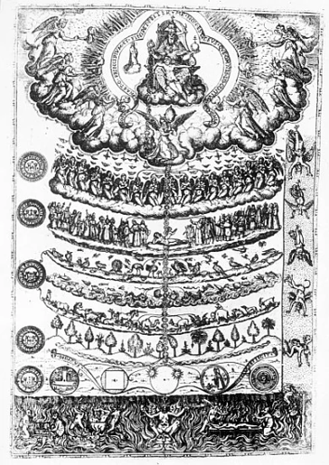
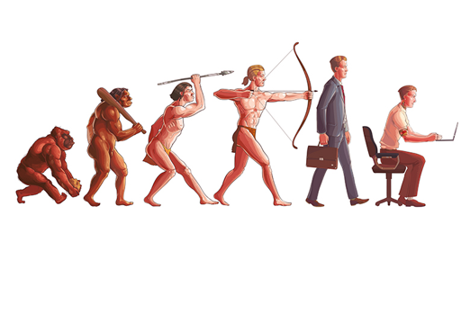
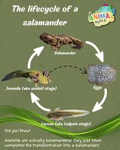
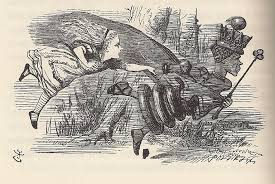
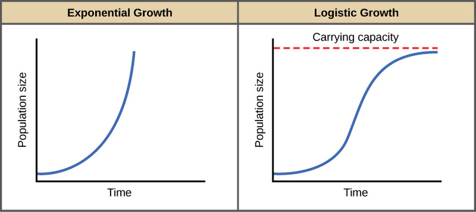
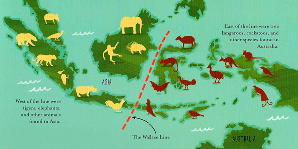
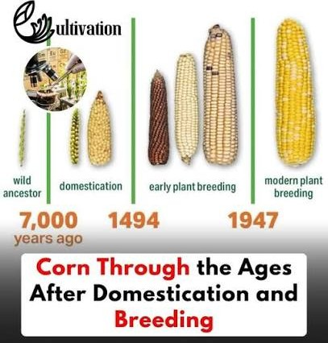
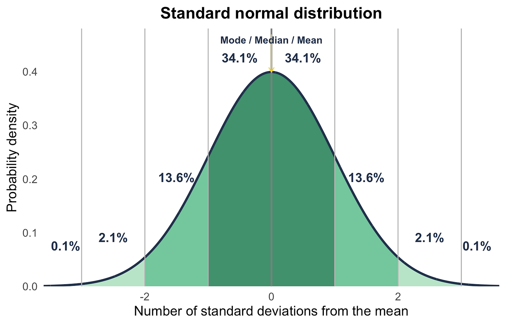
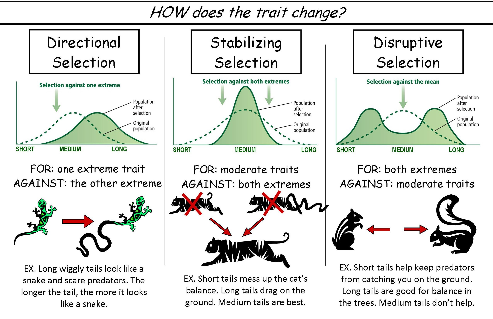

::: {.callout-tip}
## Key Points

- [**Additional Assigned Reading:**]{ .underline } Ch. 2 in textbook; Sections: [Beginnings of Evolutionary Thinking]{ .underline}, [Western European Evolutionary Thought]{.underline},
[The Mechanism of Natural Selection]{.underline}, [What Darwin Was Missing]{.underline};
Ch. 4 in textbook; Sections: [Natural Selection]{.underline}, [Special Topic: Sickle Cell Anemia]{.underline}
- [**Key Terms:**]{ .underline } Evolution, Adaptation, Fitness, Genetic Drift, Uniformitarianism, Carrying Capacity, Fitness, Artificial Selection, Natural Selection, 
Directional/Stabilizing/Disruptive Selection
- [**Summary:**]{ .underline } An overview of Evolutionary Thought and Natural Selection. Understand that people have been thinking about and writing on evolution for millennia.
Charles Darwin is hearlded as the father of evolutionary biology for his explanations of how evolution by means of Natural Selection works. As we will be learning about human evolution
throughout this unit, you should develop a working understanding of how the process works and the people throughout history that contributed to this understanding.  
:::

::: {#fig-Chain style="float: left; margin-right: 15px; max-width: 20%;"}
{.lightbox}

The representation of Aristotles taxonomy as *Scala Naturae* or "The Great Chain of Being"

:::

Chapter two of Explorations begins with a short overview of the development of Evolutionary Thought. One primary purpose of this section
is to steer you away from thinking that Charles Darwin (to be discussed at length below) was the first (or only) person to "discover"
how life has and continues to evolve. They open by discussing Aristotle, which is not surprising but is maybe a little misplaced. Aristotle is
well known for his systematic sorting of life (what we call taxonomy today) based on different levels of complexity. The text suggests that 
he did so by considering such factors as morphology (structure), physiology, mode of reproduction, and behavior. Such an endeavor was 
absolutly significant in developing evolutionary thinking but it was not necessarily designed to discussed
how life comes into being and how it changes over time (evolution). Aristotle was dedicated to making sense of the world and in doing so
he developed a way to sort and organize nature. 

Interestingly, the taxonomic work comprised by Aristotle was later co-opted
(and misrepresetned) by the Christian church which was even later misconstrued by the evolutionary-thinking public. The first of these accounts
is reflected in the development of *Scala Naturae* which included theological figures at either end of the scale. This transformed Aristotles 
taxonomy from one based on biological complexity to one based on closeness to "Gods" image. Note from the image (@fig-Chain) that these scales were not limited
to types of plants and animals but also types of humans (peasants and nobels). The second mis-representation of Aristotles taxonomy is promoted
in *Lay* evolutionary discourse (how evolution is understood by a less-informed public). The ranking of organisms based on complexity became a means
of understanding how life evolves from less-to-more complex forms. We have all seen the depictions of human evolution that looks like a linear progression from Ape to Human, right (@fig-Linear)?

::: {#fig-Linear style="float: right; margin-right: 15px; max-width: 40%;"}
{.lightbox}

Common portrayal of human evolution in a linear trajectory from Ape to Human. 

:::
This is the exact misunderstanding that I am referencing. The Great Chain of Being got people thinking that life evolves along a trajectory towards the
more complex (and often more "perfect"). This is sometimes true...and sometimes not. Certainly it is not a requirment of evolution. So, before going much 
further, let us define some terms.

# What is Evolution?

::: {#fig-Axol style="float: left; margin-right: 15px; max-width: 20%;"}
{.lightbox}

The evolution of the Axolotl is from a genetic shutoff during a Salamanders metamorphosis. Notice the dotted line showing how the Juvenile stage can bypass the final form and produce 
eggs (reproduce) without physical maturity.

:::

**Evolution** is less complicated and controversial than often presumed. At its core the a process of [change over time]{.underline}. As
mentioned above, this change does not need to be from less complex to more complex, it is just change. For instance, one 
awesome example that flys in the face of linear progression is the evolution of animals such as the Axolotl  [@Voss1997] which underwent a process
called *Paedomorphosis*, essentially stopping the process of metamorphosis in the Salamander ancestor. In this case, the Axolotl form is the precursor 
of the more "complex" Salamander form but it evolved to stay in the aquatic stage of its metamorphosis. This is absolutely an evolutionary step. It just
would not fit the linear depiction so commonly seen. 

One of my favorite anaogies for evolutionary thinking is referred to as the Red Queen Hypothesis. If you are at all familiar with Alice in Wonderland or, even better,
*Through the Looking Glass* (part two of the series by Lewis Carroll), you may have an image in your head of the Red Queen. There is a specific scene in this story
when Alice first returns to Wonderland and encounters the Queen. During their conversation, the Queen grabs
Alice by the wrist and begins to run. Minutes go by and they are running just as fast as they can. Alice is panting and her hair is blowing wildly behind her until
suddenly they stop. As Alice begins to catch her breath, she looks around in amazement. For as long and as fast as they were running, it seemed to her that they had
not moved at all from their original location. 

The book reads as so: 

::: {#fig-Alice style="float: right; margin-right: 15px; max-width: 40%;"}
{.lightbox}

Alice running with the Red Queen. In reference to an evolutionary system,
continuing adaptation is needed in order for a species to maintain
its relative fitness amongst the systems it is co-evolving with.

:::

::: {.italic}
Alice looked round her in great surprise. ‘Why, I do believe we’ve been under this tree the whole time! Everything’s just as it was!’

‘Of course it is,’ said the Queen, ‘what would you have it?’

‘Well, in our country,’ said Alice, still panting a little, ‘you’d generally get to somewhere else — if you ran very fast for a long time, as we’ve been doing.’

‘A slow sort of country!’ said the Queen. ‘Now, here, you see, it takes all the running you can do, to keep in the same place.

If you want to get somewhere else, you must run at least twice as fast as that!
:::

This quote has been used in a variety of ways but here it is used to convey a singular point: Evolution is not a means of progressing forward. It is a means of keeping 
up with the world around. It is a necessary constant. Life must continue to evolve, not to become ever more complex, but to simply exist in a dynamic world. If life
(or a particular species) stops evolving, it becomes extinct. 

As instructive as the Red Queen Hypothesis is, it does not fully represent Evolution. It is moreso an analogy for Evolution by means of Natural Selection, which we will discuss 
below. This is because of the emphasis put on the *need* to evolve...the need to keep up with the world around. As such it includes terms such as **Adaptation** and **Fitness** which
are key to understanding what Natural Selection is. Evolution as a singular concept, however, does not require adaptation, it only requires change. Thus, you will encounter
non-adaptive evolutionary mechanisms such as **Genetic Drift** and **Migration** that result in evolutionary change without the selection of adaptive traits. The Red Queen reference
is therefore a means to get you thinking about the process of evolution as a constant and as a non-linear system. 

# Back to Evolutionary Thought

Aristotle did not discuss evolution so much. In fact he mostly adhered to the notion that life was fixed, unchanging, and eternal. The next historical figure mentioned in the text,
however, did write about the felxibility of life. Al-Jahiz pretty much hit the nail on the head when discussing the struggle for existence and the process of inheritance and transformation.
He wasn't the only one either. Again, a major reason for these first couple of sections in your book is to illustrate that evolution wasn't a new concept by the time Darwin wrote about it.
We will come to see that Darwin was made famous not for his discovery of Evolution by Natural Selection, but for his explanation of how it works. In fact, all of the early scholars mentioned \
in the text play a part in building the foundation for his ultimate monumental monograph. *(That said, we shouldn't be surprised that it is mostly the Western European scholars that
garner most of the credit in our literature)*

The 18th and 19th centuries were big for investigating and promoting evolutionary theory, especially in Western Europe where academic discourse was a favorite pasttime of the wealthy 
elite. It is from this era that we solidified our committment to the use of Binomial Nomenclature through the lens of Linnaean Taxonomy and began heavily investing in studies of the diversity
of life and comparison of organisms from around the world. Your book does well to mention the contributions of Carolus Linnaeus, Compte de Buffon, Georges Cuvier, James Hutton, Charles Lyell,
Jean-Baptiste Lamarck, Alfred Russel Wallace, and Thomas Malthus. These are absolutely major players that contributed greatly to Darwin's great synthesis. A few of these names are of particular
importance as we come to understand what Natural Selection is.

### Jean Baptiste Lamarck

Lamarck gets a lot of flack in Biology and Anthropology textbooks (though your book treats him pretty well). The *Theory of Inheritance of Acquired Characteristics", as the book says,
was the first attempt by a Western scholar to explain how evolution works. If we simplify his theory, it becomes clear why this attempt is so commonly ridiculed. Lamarck suggested that
life in any environment is sometimes faced with changing conditions. Maybe the climate gets colder or warmer, or the habitat becomes wetter or drier. In these instances, Lamarck suggests,
the life which occupies said environment must respond by changing its behavior (survival strategy). So far, this is all rather brilliant for the time. The perceived misstep in this theory comes
from step three. This step suggests that, after changing its behavior, an organisms morphology will also change and, *importantly*, these physical changes which are acquired during life
can subsequently by passed on to the next generation. This is illustrated in the text by the progressive lengthening of giraffe necks. Unfortunatly, it matters very little how much
you change your body during life, your kids are unlikely to inheret the modifications (imagine if you lost your arm in an accident and had a child after...would they be born with one less
arm?). 

Lamarck got a lot of things right. Very much like Al-Jahiz he recognized that the physical environment plays a big part in how life evolves and brilliantly pointed out that physical
traits can be passed from parent to offspring. Even his ideas of acquired characteristics being inherited are having a bit of a resurgence as we continue to understand the role of 
epigenetics and transmission of biomarkers. 

### Hutton and Lyell

James Hutton has little more than a notable mention in your text, but his explanations of **Uniformitarianism** and **Deep Time** are key to understand for evolutionary thinkers. These
concepts, which were later expanded on by Lyell, lay the groundwork for arguements in favor of evolution over creationism. Hutton explained that there are intrinsic mechanics in place for our planet.
Specifically referencing the processes of sedimentation, erosion, and mountain uplift, he determined that these processes were in place when our planet formed and that 
they are still in place today (and will be into the future). This is what is meant by Uniformitarian. They are uniform and continuous processes. Additionally, the visible outcomes of these processes
come after extreme lengths of time (much longer than the proposed age of the earth at the time). As these became formalized in Lyell's *Principles of Geology* they shaped Darwin's thinking
on how slow evolutionary change could generate such diversity of intricacy in life. 

## Thomas Malthus 

::: {#fig-Capacity style="float: left; margin-right: 15px; max-width: 40%;"}
{.lightbox}

Graphical depiction of exponential (geometric) population growth and Carrying Capacity.
How populations respond to carrying capacity is more dynamic than this simple diagram but
the primary point is well-illustrated. 

:::

We will talk about Malthus a good deal in this class. Make sure you understand what is meant by **Carrying Capacity**. Malthus was an economist that was interested in population pressure
and resource limits. He recognized that people have a high 
**Reproductive Fitness** regardless of resource availability. More to the point, he observed that populations had a tendency to 
grow geometrically (growth multiplies by a constant) while resources tend to grow linearlly (adding a fixed amount). Thus, populations will
grow faster than resources. Populations, however, cannot grow indefintely in this way. At some point people will enevitably outweigh the amount 
of available resources. Malthus referred to this as reaching the Carrying Capacity, or the number of people, other living organisms, or crops that 
a region can support without environmental degradation.

Of course, populations are seldom aware of their carrying capacity and have no agency in trying to maintain population size relative to it.
This leads to the unfortunate consequences of growing population pressure: Malthusian Checks. Malthus suggested that population size would
be kept in check as it neared or surpassed an environments carrying capacity by episodes of famine, disease, and interpersonal conflict (i.e., warfare)
that would subsequently drop the population back under the resource threshold. 

## Alfred Russel Wallace

No conversation about Darwin's contribution to evolutionary thought is complete without a discussion of Alfred Russel Wallace. Wallace
was a naturalist and contemporary of Darwin. He is best known for coming to essentially the same conclusions about the formation of species
as Darwin did but getting no credit for the discovery. It is well known that Wallace sent Darwin a letter with an article attached that he meant to publish. It is said that
Darwin was going to publish a series of papers with Wallace but that he was ultimately encouraged to publish only under his name. There are
plenty of people in the world that have dedicated their lives to this history and, therefore, plenty of books that you could pick up
to learn about it (*Song of the Dodo* is pretty good) but the point is kinda moot. Wallace was not associated with the wealthy aristocracy like Darwin was.
His first major expedition to South America ended in failure as the ship he was sailing on caught fire and sank. And then he spent years in Island Southeast
Asia working on his research without anyone knowing about his work. Darwin spent his years after the Voyage of the Beagle (H.M.S. Beagle was the name of the 
ship he was on) rubbing shoulders with the most influencial people in the tightest academic circles of England. He was as much the face of Evolutionary Theory
because of his networking abilities as he was because of his ideas. 

::: {#fig-Capacity style="float: right; margin-right: 15px; max-width: 40%;"}
{.lightbox}

Discovery of a deep underwater trench that did not provided a land connection between the islands of SE Asia (Sunda) the islands of the Australian landmass (Sahul).
Wallace drew an imaginary line separating these regions (Wallace Line).   

:::

In addition to his influence on Darwin, Wallace later became an important name in understanding Island Biogeography. He observed the flora and fauna from nearby 
islands in Southeast Asia and determined that variants emerged across different islands due to the rising and falling of sea levels through deep time. Thus, in times
of lower sea levels, animals would travel freely across the exposed land connecting each island (we will talk about this a lot in Unit 2). Conversly, in warmer
climates when the sea levels would rise, these connections would be cut off and the different island popuations would evolve in isolation. This created a system
whereby similar species would develop unique characteristics but remain closely associated with those populations from nearby islands. Crucially, Wallace observed
that this remained true throughout much of Island Southeast Asia until moving Southeast past Bali and Borneo where there was a sharp departure from the typical
SE Asian Biota. This realization confirmed to him that new species emerge from coexisting species that were at some point isolated from the parent population.
Given that the physical environment and climate was mostly the same on either side of the "Wallace Line", there would be no logical means of explaining why
different species were found in each region if they had been placed there by the design of an *intelligent creator*. 
 

# Darwin and Natural Selection

Charles Darwin did not discover evolution. He didn't even entirely discover "Natural Selection". The reason why he is so commonly referred to as the father of evolutionary biology is
not just because of his discoveries but his ability to explain, step-by-step how evolution works. He did this so well that it shook many of their faith at the time and began the 
long, philosophical battle between evolutionists and creationists. As discussed above, he did not do this in a vacuum. His treatise on [The Origin of Species]{.underline} came from years
of study, experimentation, and discussion within the top academic circles of the time. While *Origin* can be a bit of a tedious read, it becomes wildly influencial because Darwin lays out
a very simple argument and he does so by opening the book with something very familiar to the world: Domestication and Selective Breeding (Artificial Selection).

### Artifical Selection

::: {#fig-Capacity style="float: left; margin-right: 15px; max-width: 20%;"}
{.lightbox}

The evolution of Maize through Artificial Selection.
:::

Beginning his book with a chapter on selective brreding was brilliant.  
Also known as Artificial Selection, it mirrors Natural Selection in nearly every way. Most 
people know that cattle are bred to produce more meat and more milk, that the huge ears of corn found at the market originate from the small seeds of wild Maize, 
and that purse-sized Chihuahuas, technically originating from wolves, would unlikely survive in natural settings. The traits that make these plants and animals important to people 
were selected for by people. The process is simple. 

If you observe a population of interest, you will notice that some individuals exhibit traits that you find 
more desirable than others (be it color, size, behavior, and etcetera). If you want to proimote this trait in future populations, all you need to do is control who breeds (or, rather, who doesn’t breed). If the subset of the population 
with your desired traits continues to breed over multiple generations (and those without it do not), then the bulk of the future population will have that trait. This is more-or-less the same 
process as Natural Selection with the exception that nature does not actually make a conscious choice. 

### Natural Selection

There is plenty of text regarding Natural Selection in your reading (which you should absolutely have read), but we can summarize some fine points here. After illustrating to the world
that populations can change through selective breeding, Darwin went on to explain how this happens unconsciously in nature. To do so he outlines **4 observations** and **2 inferences** from them.

::: {.card .border-success .w-60 .me-auto .mb-3}
::: {.card-header .bg-success .text-white}
**Natural Selection**
:::
::: {.card-body}

| Observations and Inferences | Description | 
|---|---|---|
| Variation | Populations vary greatly in their traits  | 
| Inheritence | Traits are inherited from parents to offspring | 
| Over-Production | All species are capable of reproducing quicker than available resources | 
| Differential Survival | Due to resource limits, not all offspring survive | 
| Inference #1 | Advantageous traits lead to greater fitness | 
| Inference #2 | With differential-survival, the accumulation of favorable traits will change the population over time | 

: This is a quick and dirty overview of how Natural Selection was explained by Darwin {#tbl-naturalselection}

:::
:::

#### Observation #1: *Populations vary greatly in their traits*

**Variation** is paramount in this discussion. Like many naturalists, Darwin was fascinated by the physical differences he observed between individuals of the same species. What he essentially
observed was that no two individuals were exactly alike. He had no idea how exactly this variation was generated (did not no about cells, cell division, or genes), but he did know that 
different individuals had different combinations of traits and, importantly, that these different traits could be advantageous in different contexts. 

#### Observation #2: *Traits are inherited from parents to offspring*

Darwin was absolutely familiar with the work of Lamarck (discussed above). While Lamarck didn't get all of the pieces of the puzzle, he did a very good job of discussing the **Inheritance** of traits.
He even covered the adaptive value of these traits when passed on to offspring. Darwin takes this notion and incorporates it into his greater synthesis. 

#### Observation #3: *All species are capable of reproducing at a geometric rate (quicker than resources)*

This and the next observation are taken directly from Malthus. Darwin simply observed that Malthus' conclusions about population growth and population pressure were not limited to humans.
As we mentioned earlier, life replicates rapidly. This happens at such a rate that populations tend to grow faster than the resources needed to support them. Let's call this **Over-Production**

#### Observation #4: *Due to resource limits, not all offspring survive*

Following Observation #3, Darwin suggests that an environments carrying capacity will limit how many offspring can survive from generation to generation. We can call this **Differential Survival** 
(not everybody survives).

Note that each of the above observations are nothing more than observations. Darwin spends a good deal of time detailing these clear facts about the natural world without needing to mention evolution
at all. Again...brilliant. At this point he hasn't said anything that well-informed people were not already aware of. Populations are variable. Traits are inherited. And generation to generation,
some offspring survive and others do not. The public could hardly argue against any of this. 

Darwin then sets his audience up by essentially saying "if you can except that these observations are true, then the following inferences must also be true". 

#### Inference #1: 

Individuals whose inherited traits give them a higher probability of surviving/reproducing in a given environment tend to leave more offspring than others.

#### Inference #2: 

This unequal ability of individuals to survive and reproduce will lead to the accumulation of favorable traits in the population over generations

That, my friends, is evolution by means of Natural Selection. Darwin saw this as a long and gradual process (much like the uniformitarian principles of Hutton and Lyell), where
incremental changes to a population would accumulate until eventually the population would look distinctly different from what it once had. 

# Selective Mechanisms

Darwin's work was so sophisticated that we still adhere to this primary principles today. That said, it has been expanded on plenty since the original publication. One key avenue of investigations
which occured after the initial understanding of Natural Selection was dedicated at determining how the process itself could vary depending on the population and the environmental conditions. Through 
this, a few primary mechanisms of Natural Selection have been deciphered. 

::: {#fig-Capacity style="float: left; margin-right: 15px; max-width: 35%;"}
{.lightbox}

Representation of Normal Distribution. We can use this as a means to consider the variation of a given trait in a population.
:::

To understand how these different mechanisms work we should first try to think of how a single trait might vary in a population. Consider the following hypothetical in reference to the bell curve depicted
here. We will imagine a species of fish that lives in a lake. As might be expected, this species varys in size. Some are pretty big, some are pretty small, but most of the population sits somewhere in the middle.
This can be represnted on the bellcurve by identifying the middle (high point) of the curve as the most common size (medium). As the curve dips on the left, we are seeing size reduction and as it dips on the right,
we are seeing enlargement. Thus, the left *tail* of the curve represents the smallest individuals in the population and the *tails* on the right represent the largest individuals. 

With this population in mind, we can now alter the *selective pressures* to force its evolution through time. Specifically, we are going to change the physical enviornment and the predator population
in discrete ways for each selective mechanism.

### Directional Selection

Directional selection is a fairly descriptive process. In this scenario, the population shifts in its character state (version of the trait) in a particular direction. For our hypothetical, consider what 
might happen if the climate changes and leads to the lake shrinking in depth and area. With a smaller habitat and reduced resources, which portion of the population would you expected
to have the greatest or least advantage. I'd argue that the larger individuals in the population are going to have the most difficult time surviving and reproducing. This would then tend to favor
the smaller individuals over the larger ones. If the conditions stay this way for many generations, it is likely that the entire bell curve would shift to the left. This is what is meant by
**Directional Selection**. The population evolved in a distinct direction across its *range of variation*. 

### Stabilizing Selection

Ok, that's all well and good, but let us add another factor. Consider that, not only did the lake shrink but that these fish have a tendency towards cannibalism in times of resource stress. All
of the sudden, with increased competition, the smallest individuals of the population become a food source. We can be very specific here and say that the small fish are a good size for both the 
large and the medium sized fish to eat but that the medium-sized fish are still too big for the large-sized fish to eat. This creates a scenario where the largest fish are still at a disadvantage
due to reduced mobility and high resource requirements and the small fish are at a disadvantage due to becomming prey for the large- and medium-sized fish. So what happens in this scenario? It seems
that selection will favor the mean of our distribution (medium-sized fish) and eliminate the extremes. This **Stabilizes** the population by maintaining selection against the outliers. 

**Important**: The book conflates Stabilizing Selection with something called Balancing Selection. This is a pretty big generalization that does not really work. Balancing Selection is its
own mechanism that includes dynamic scenarios such as **Heterozygote Advantage** and **Frequency-Dependent Selection**. These cases are [not]{.underline} the same as Stabilizing Selection.
Please do not confuse them.

### Disruptive Selection

The last of these primary mechanisms is arguably the most interesting. We can re-set the scenario. Forget about the dry conditions and let's just say that a new predator was introduced to the lake.
This predator preys on the fish species in this scenario but is limited by its own size constraints. Being a somewhat larger fish, it is too slow to catch the smallest member of our population
and not big enough to prey on the largest members. That, of course, leaves the medium-sized fish on the menu. This scenario will tank our mean population and lead to the differential survival of the outliers
(biggest and smallest individuals). This is what is meant by **Disruptive Selection**. It breaks the bell curve entirely and essentially creates two new curves (one for the small fish and one for the large).

So why do I argue that this is the most interesting? Because it is in these scenarios that you can begin to *see* the process of 
**Speciation**. To be clear, the other two mechanisms can also lead
to the generation of new species but it is much more difficult to discern (if you are interested, look into Anagenesis vs. Cladogenesis). Since disruptive selection creates two distinct populations,
we can envision a scenario where the become so distinct over time that that can be qualified as different species. This leads into a much bigger conversation about what a species is that we 
don't need to cover quite yet, so we will leave it there (if you have questions, feel free to reach out). 

{#fig-selection .lightbox width="70%"}

