::: {.callout-tip}
## Key Points
- [**Additional Assigned Reading:**]{ .underline } None
- [**Key Terms:**]{ .underline } Paleoanthropology, CLCA, *Pithecanthropus erectus*, Neanderthal, Post-Orbital Constriction, Bipedal/Bipedalism, Australopithecus, Piltdown Man, Foramen Magnum, Fluorine Dating, Taung Child,
Megafauna
- [**Important Names:**]{ .underline } Thomas Huxley, William King, Eugene DuBois, Charles Dawson, Raymond Dart
- [**Summary:**]{ .underline } Paleoanthropology is a field of two timelines. Most commonly we think of the evolutionary timeline which begins with our most distant hominin ancestors and 
continues until the evolution of our species and the modern condition. Additionally there is a historical timeline. This history not only depicts the development of our field
but illustrates the sociocultural influences that shaped it. While this may not seem entirely relevant at face value, many of the good and bad aspects of these historical influences
are still shaping our field today. To progress the science, we need to be aware of why we think about these fossils in the way that we do. 
:::

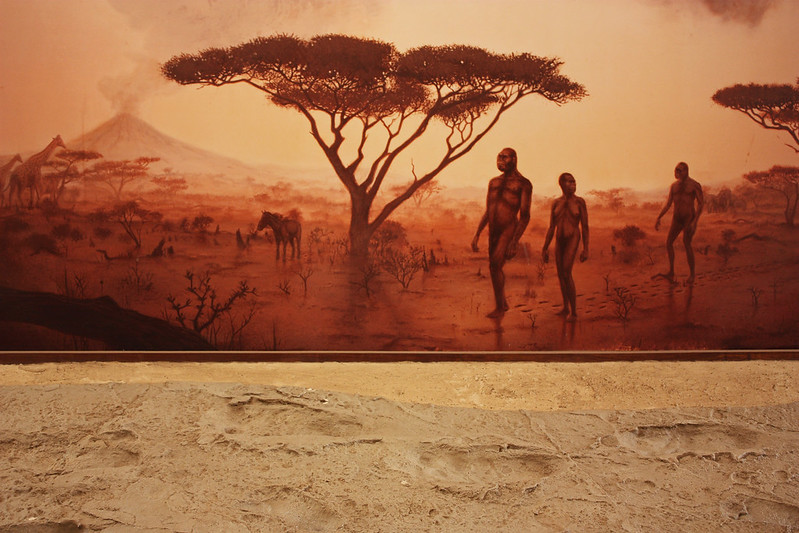{#fig-primates .lightbox width="60%"}

The story of human evolution can be told in two ways. It can be told as a progression through time, beginning with the earliest Hominin fossils and ending with modern *Homo sapiens*. This way is logical and, 
to some degree necessary. But the fossils were not found or understood in that order. As much as paleoanthropology (the study of human evolution) is a biological science, it has a ripe social history. Debates 
waged and discoveries were made throughout the 19th and 20th centuries. This sociocultural part of the story does not necessarily influence how we view the fossils today, but it did shape the current paradigm and becomes an 
important story to understand. Thus, we will start with a historical overview of our field. I’ll keep it brief and then turn to the fossils and our modern understanding. 

# Paleoanthropology?

I distinctly remember when I realized what makes Paleoanthropology different than Paleontology. I had recently graduated with my Bachelor's degree and was doing my best to begin a career in the field. I had jumped at a 
couple of research opportunities at Cal Berkeley but it was beginning to become clear that I would need to pursue grad school if I wanted to conduct my own research. And so I started networking, trying to meet people
that were doing what I wanted to do. And the best way to do this as a young academic? Conferences. Attend any and all conferences you can that are even vaguely related to what you want to do. In my case, I met a future advisor
(Henry Gilbert) at a <span title="the application of human osteology and archaeology to the medico-legal community to aid in missing persons and criminal cases"> **Forensic Anthropology**</span> conference at CSU Chico in California. We had 
actually both ditched the mid-morning presentation after separately enjoying the local circuit a bit too much the night before. I had done some research with his wife in Berkeley and so we knew each other a bit already, 
but seeing each other both a little hungover at a local coffee shop is when we really began to talk. He was a Paleoanthropologist that had a field study in Ethiopia where his team focused on understanding paleoenvironments associated 
with *Homo erectus*. I learned that Dr. Gilbert had an opening in his Master’s program and, after I not so subtly expressed my interests, he had asked what I was hoping to achieve as an anthropologist. I told him that I was most interested in paleoanthropology, that I wanted to add to our knowledge 
of the human fossil record. In short, that I wanted to explore the <span title="the **Great Rift Valley** of Ethiopia is a region well-known for its preservation of human (and other) fossils"> **Rift Valley**</span> 
and find hominins. I expressed that I was adept <span title="study of the human skeletal system"> **Human Osteology**</span>, have some research and publication experience in 
<span title="application of human osteology to the archaaeological record"> **Bioarchaeology**</span>, and was well versed in evolutionary theory and human paleontology. 
He laughed at a little at my expense, eventually suggesting that this was an understandable goal/desire but to pursue it I would need to have much broader knowledge of Paleontology and Osteology than that pertaining to
human fossils. Researchers go decades without finding hominins, but they still need to understand the variety of other fossils that they do recover. Further, even if and when you do find human fossils, it necessary to 
identify and understand all of the surrounding plant and animal fossils as well. He explained that in pursuing paleoanthropology, we needed to first be paleontologists. “If we find a hominin fossil or stone tools”, 
he said, “then we work as paleoanthropologists. But it’s all the same work. We find, excavate, identify, and describe the animal we’ve found.” 

For the researchers studying this material, finding hominins is a part of reconstructing the vast history of life. Human evolution is only one a part of this history. It does, however, receive much more attention
than other aspects of paleontology (*except for Dinosaurs...Dinosaurs get the most attention*). The attention given to our field is not due to it being dramatically different than other aspects of evolutionary
research, it is more simply because we have a somewhat conceited interest in ourselves. Further, while most people will go their entire lives without caring or knowing anything about evolutionary phenomena such as the
Cambrian Explosion, evolution of Mammals, or the Permian Extinction, many non-scientists do know a thing or two about human evolution and often have distinct *opinions* on it.

A primary point here is this: Plaeoanthropology is Paleontology. Besides the specific subject matter, it does not differ in any specific scientific way from other research in that field. The most distinct
difference then is the [sociocultural impacts]{ .underline} of the study of human evolution. This is no more evident than when reviewing the history and development of the field. Sounds boring, I know, but there are some funny
parts of this story.

# Darwin Again

::: {#fig-mansplace style="float: right; margin-right: 15px; max-width: 20%;"}
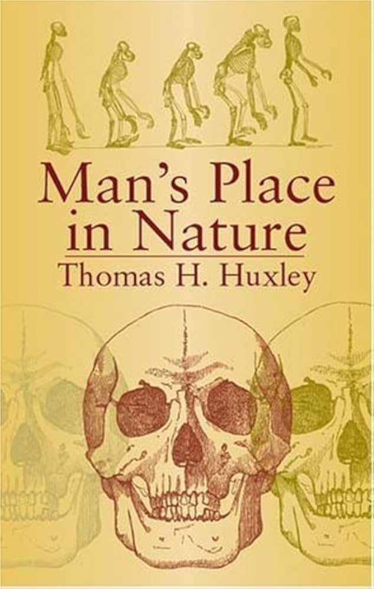{.lightbox}

Thomas Huxley (known as "Darwins Bulldog") published the first anatomical assessment of our species when compared to other non-human primates. He made clear and strong statements that we were directly related in our 
evolutionary history (@Huxley1899). 

:::

Just like the broad evolutionary theory you read about in Week 1, human origins had been debated long before the specified science even really existed. Discourse on the matter really took off, however, as the 
mechanics of evolution were pubished in Darwin's treatise on Natural Selection. Darwin and other evolutionary thinkers of the time could not ignore the 
simple fact that we, as humans, were no exception to the dynamics of evolution. Unfortunately, this was still not a time to openly suggest such a thing and Darwin wanted to be careful about how he breached the subject
(*see Darwin's Hesitence below*). Be that as it may, he made one short entry 
at the end of Origins of Species stating that *Much light will be thrown on the origins of man and his history* (@Darwin1859). This statement drew lines in the sand. Many of Darwin’s contemporaries were upset that he would 
challenge the common dogma, while others were upset with him for not taking a stronger stance on human evolution. This prompted years of debate with other scientific thinkers of the time taking the reins to
bring human ancestry into discussion. With Thomas Huxley 
publishing the far more assertive viewpoint in [Man's Place in Nature]{ .underline} (1863), Darwin eventually came around with his follow-up publication in 1871 (@Darwin1871) stating that 'Yes, evolution by means of Natural 
Selection explains all of life, including humans'. 

<details> 
  <summary>Darwin's Hesitence</summary> 

::: {style="float: left; margin-left: 20px; margin-bottom: 10px; max-width: 20%;"}

  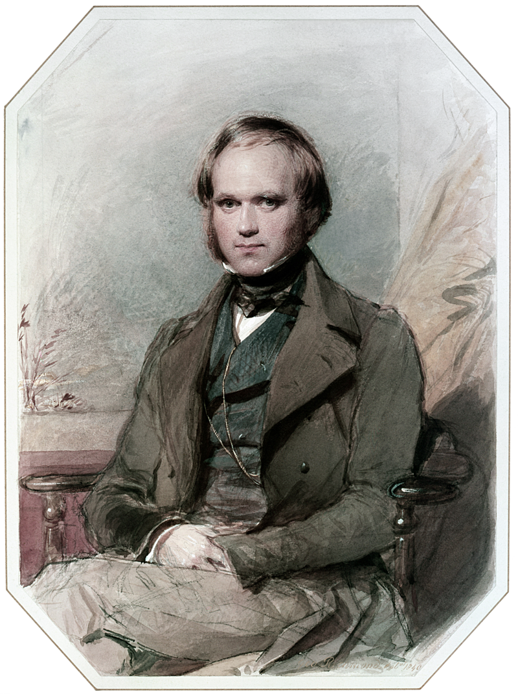{.lightbox}
:::

Darwin existed in a wealthy, aristocratic social sphere in 19th Century England. Navigating this environment was likely pretty comfortable except when it came to disrupting the common dogma. This, of course,
was already something that he was engaged in, being that evolution was starkly contra to notions of permanence and godly design. But the scientific world was becoming more aware of the need to reconcile
the diversity and variation in nature with the teachings of the Bible. Thus, discussing evolution on its own was growing in acceptance, even among the theological crowd. Knowing that this was a somewhat tenuous
situation already, Darwin was extra careful to avoid the topic of how humans fit into this evolutionary scheme. People could largely accept that other plants and animals were mutable and influenced by
the laws of nature, but humans (Man) was said to have been created by God in God's image. Being a wealthy aristocrat, Darwin was nervous about how a denial of this accepted truth would affect him and his
ultimate goal of explaining the Mechanisms of Evolution. 

  <div style="clear: both;"></div> 
</details>


More than 10 years passed between publishing *Origins* and *Descent of Man*, but the world still wasn't ready for what Darwin and Co. had to say. This was well-evidence by the public fury that had been directed at Huxley in the preceding
decade while he loudly argued for human evolution in tumultuous public debate. Even with his *Bulldog* (see @fig-mansplace) setting the stage, Darwin's placement of humans in the larger scope of evolution, illustrating our 
ancestral connection with non-human primates, was met with overwhelming ridicule. Remember the Great Chain of Being from Week 1? The primary doctrine of the Industrialized World was situated around Christianity and the
idea that humans (European humans, to be specific) were at the top of the *scale of perfection* of worldly beings. The closest to God's image and distinctly different than all other organisms. Being associated with 
primates was an afront to this dogma. 

The scientific thinkers of the time had to contend with a handful of seperate but related issues when arguing for human evolution. The first, as just discussed, was simply that humans were at all subject to the rules of nature. 
Many people simply did not want to accept that we were not put on Earth by God in *his* image. This is still a contention today and one that mostly cannot be helped. Beyond that, Darwin and Huxley had two pressing difficulties to 
overcome: one grounded in misconception and the other in a need for evidence. 
 

::: {#fig-Phylogenies style="float: left; max-width: 300px; margin-right: 20px; margin-bottom: 15px; width: 100%;"}

```{=html}
<!-- Outer Bound Box -->
<div id="phyloSlider" class="carousel slide" data-bs-interval="false" style="overflow: hidden; position: relative;">
  
  <!-- Carousel Image Slides Track -->
  <div class="carousel-inner">
  
    <!-- Slide 1 (active) -->
    <div class="carousel-item active" style="position: relative;">
      <!-- Slide Number Badge overlaying the top-right corner -->
      <div class="carousel-caption" style="position: absolute; top: 10px; right: 10px; left: auto; bottom: auto; padding: 0; z-index: 10;">
        <span style="background: rgba(0, 0, 0, 0.65); color: #fff; padding: 4px 8px; border-radius: 4px; font-size: 12px; font-weight: bold; font-family: sans-serif;">1 / 2</span>
      </div>
      
      <a href="../images/paleo/phylo.png" class="lightbox" data-gallery="phylo-gallery" title="Phylogentic Tree" data-description="Notice the yellow dot at the connection taxon A and taxon B. Referred to as a [node]{ .underline}, this point marks the common ancestor of A and B. Chimpanzees and Humans illustrate this type of evolutionary relationship. The common ancestor of both was neither a Chimpanzee or a Human.">
        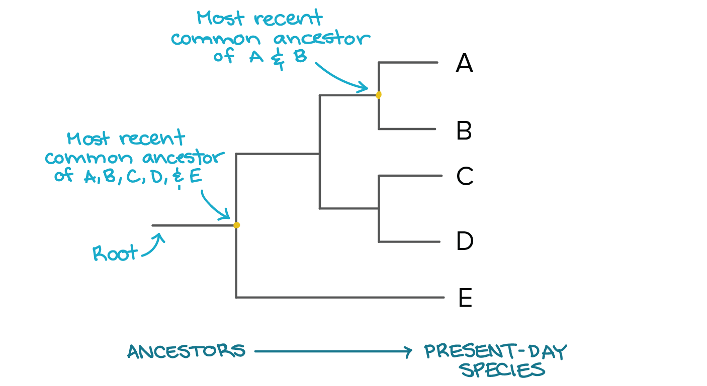
      </a>
    </div>
    
    <!-- Slide 2 -->
    <div class="carousel-item" style="position: relative;">
      <!-- Slide Number Badge overlaying the top-right corner -->
      <div class="carousel-caption" style="position: absolute; top: 10px; right: 10px; left: auto; bottom: auto; padding: 0; z-index: 10;">
        <span style="background: rgba(0, 0, 0, 0.65); color: #fff; padding: 4px 8px; border-radius: 4px; font-size: 12px; font-weight: bold; font-family: sans-serif;">2 / 2</span>
      </div>
      
      <a href="../images/paleo/phylo2.png" class="lightbox" data-gallery="phylo-gallery" title="cladogenesis vs anagenesis" data-description="Evolution can work linearly where one species 'turns into' another. This is called Anagenesis. Cladogenesis, however, is what is most often depicted in phylogenetic trees and illustrates the 'shared ancestry' of Chimpanzees and Humans.">
        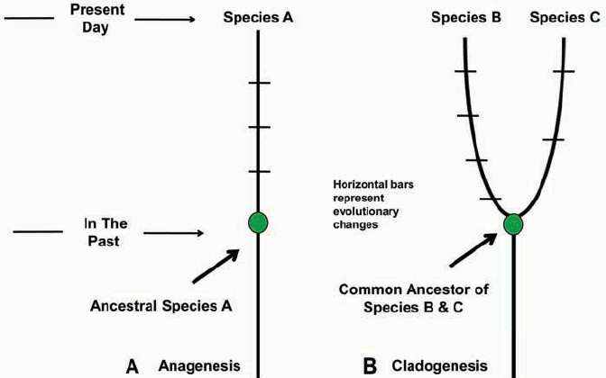
      </a>
    </div>
	
  </div>
  
  <!-- Left Control Arrow -->
  <button class="carousel-control-prev" type="button" data-bs-target="#phyloSlider" data-bs-slide="prev">
    <span class="carousel-control-prev-icon" aria-hidden="true" style="filter: invert(1); transform: scale(1.0);"></span>
    <span class="visually-hidden">Previous</span>
  </button>
  
  <!-- Right Control Arrow -->
  <button class="carousel-control-next" type="button" data-bs-target="#phyloSlider" data-bs-slide="next">
    <span class="carousel-control-next-icon" aria-hidden="true" style="filter: invert(1); transform: scale(1.0);"></span>
    <span class="visually-hidden">Next</span>
  </button>
  
</div>

<!-- Inline CSS to manage mobile devices -->
<style>
@media (max-width: 576px) {
  #fig-Phylogenies {
    float: none !important;
    margin: 0 auto 20px auto !important;
  }
}
</style>
```

Different types of evolutionary relationships and the distinction between 'evolving from' and 'sharing ancestry'.
:::

### Misconception: if we evolved from apes, why are apes still here?

Concepts of descent and ancestry were still new and somewhat complex topics which required a bit of a paradigm shift when thinking about ancestor-descendent relationships. Even those willing to listen to Darwin lacked enough of a grasp on 
evolutionary mechanics to understand what the claims actually were. This is still a struggle today. The question often arises as to why apes are still around if we evolved from them. Again trailing back to the linear 
idea of evolution, the logic follows that if one organism evolves into another, the original should go away. While this *can* be true, it is certainly not a requirement. Further, this was not the argument being made. Darwin
and Huxley had simply suggested that we shared ancestry with modern apes...not that we evolved from them.

To understand the basis of common ancestry, it is productive to think about the branching structure of evolutionary relationships. In image #1 from @fig-Phylogenies, notice the *node* uniting the lines from species A and species B.
This yellow dot illustrates a common ancestor of both <span title="plural form of Taxon which could illustrate any level of the Linnaean taxonomic scheme (species, genus, family, etcetera)"> **taxa**</span>. Hence, in 
the argument posed by Darwin and Huxley, chimps and humans represent species A and B from the image. Recall our discussion of 
[disruptive selection](Evolution.qmd#disruptive-selection) in Week 1. Populations can diverge depending on how selection favors different variants. The common ancestor of humans and chimps (referred to as the Chimpanzee 
Last Common Ancestor or **CLCA**) was a living population with natural variation. During a period of time called the <span title="a geological Period spanning from approximately 23-5 million-years-ago (Ma)"> **Miocene**</span>,
selection favored two different strategies which divided the population into seperate lineages. This process, seen in image #2 of the figure, is called Cladogenesis. As opposed to <span title="linear evolution of one species
into a form distinct enough to be called a new species"> **anagenesis**</span>, Cladogenesis divides the population into two distinct forms. Darwin and Huxley argued this evolutionary relationship for modern apes
and humans. In saying as much, they were suggesting that this common ancestor did not have a living correlate (it was neither chimp nor human), though it was likely to be more ape-like than human-like. This last assessment
was based off of the more *derived* morphology of humans and is what likely led to the public conflating "evolved from apes" with "evolved from Chimpanzees".

### Lack of Evidence: where's the missing link?

In the public's defense, Darwin and Huxley based their entire argument on comparative anatomy. They had no other
*proof* that we shared a common ancestor with apes or even that we had evolved at all (as opposed to being placed here by God). Many peopple today can conceptualize the evolutionary history of humans because of
the various fossils that have been found throughout the past century or so. This is why that image of humans becoming progressively more upright exists at all. In the late 19th Century, however, not even 
Darwin and Huxley had confidence in what our ancestors would have looked like. All they knew was that we are a part of the animal kingdom, that we share ancestral and derived traits with modern apes, 
and, from that, that we evolved from a common ancestor shared with them. They could, of course, point out some key differences between apes and humans but had no basis for saying how or when these traits came into existence.
This was a sticking point for those who argued against our evolution: *if we did evolve from apes, where are the fossils that show our intermediate morphology?* They wanted to see the fossil that *linked* apes and 
humans in evolutionary time. This was a fairly reasonable line of questioning and one that leads us into a new era of scientific exploration ![strawhat] where a new initiative
to prove the reality of human evolution took hold. 


# The Missing Link

::: {#fig-link style="float: right; margin-right: 15px; max-width: 30%;"}
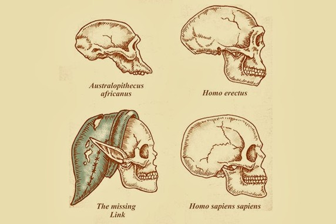{.lightbox}

The search to find a missing link between apes and humans became a primary agenda of 20th Century evolutionists. 

:::


[strawhat]: ../images/paleo/tourist-hat-accessory/strawhat.jpg {height=1.2em}


### First Found

The search for the "Missing Link" was as obscured in the unknown as it was exciting. No one knew exactly what to look for. Were they to search for fossils that resembled apes or those that were 
distinctly more human? Of course, the hope was to find something in the in between, but what the hell was that supposed to look like? The wealthy academic circle of that era very likely dedicated long hours
in dimly lit, smoke filled rooms to pontificating and ruminating on the issue. In deep discussion they would dream up what these amalgamations of *part-human/part-ape* creatures would reveal themselves to be.
Little did they know, however, that human fossils had already been discovered and published on in the years just before Darwin's great theory was published. 

When I mentioned the two seperate timelines of Paleoanthropology at the start of the discussion, this particular situation sits at the precipice of that distinction. Neanderthals are probably the most
well-understood and most publicized non-*sapiens* hominin in the human fossil record. They are also our most recent hominin relative. These cave-dwelling early humans came into existence sometime around 500 thousand
years ago (depending on who you ask) and went extinct by about 40 thousand years ago. This seems like a sizeable existence, stretching deep into the chasms of time but, in the scope of human evolutionary history,
their existence was somewhat brief and very recent. This is particularly true if you subscribe to a shorter Neanderthal timeline which clocks their existence at around 2 to 3 hundred thousand years. While Neanderthals 
represent one of the most recent hominins in the evolutionary timeline, and therefore a relatively late addition to the family tree, they simultaneously represent the very first documentation of human fossils in 
western academic discourse. They are therefore the first on one timeline (history of discovery) and among the last on the other (evolutionary history). Only, nobody knew that to be the case upon their discovery. 

::: {#fig-feldhofer style="float: left; margin-right: 15px; max-width: 20%;"}
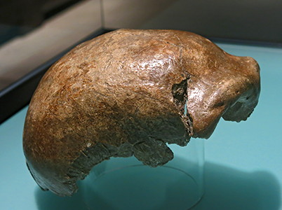{.lightbox}

The Feldhofer 1 (or Neanderthal 1) Calotte. Notice the *robust* brow ridge and long profile.

:::


The first Neanderthal remains found were designated as the Feldhofer fossils (Feldhofer 1 or Neanderthal 1). They were discovered as part of a mining operation by quarrymen in August of 1856 in Germany's Neander
Valley. The bones were fragmented
but included a skull cap (called a *calotte*) and various <span title="bone below the skull"> **post-crania** </span>. While the intital finders of these remains thought that they belonged to a cave bear due to 
their <span title="heavily built/thick"> **robust** </span> nature, they had the foresight to pass the remains on to a local school teacher. Keep in mind that this discovery and the following examinations and debates 
occured just before and shortly after the publication of 
*Origins*. Notions of Evolution were still highly controversial and the idea of *human evolution* was borderline blasphamous. That said, the Feldhofer remains subsequently found their way to two remarkable individuals
who get almost no credit in the history of Paleoanthropology. The first of these individuals was the man who was contacted by the aforementioned school teacher: Hermann Schaaffhausen. For the purposes of 
this class, you really do not need to remember the names of these historic figures. But I'll be damned if I don't at least mention them. Schaaffhausen produced a full description of the fossils in 1858 noting their
great antiquity (suggesting that they were very, very old) and suggesting that they might belong to the very first inhabitants of Europe. This assessment, however, was mostly brushed off by the influencial academic community
at the time. Given the lack of supporting evidence (other ancient fossils or primitive tools) and the remarkable resemblance to modern humans, most of Schaaffhausen's scientific contemporaries believed the remains
to belong to a pathological human of recent origins. 

The *pathological human* conclusion was promoted even more strongly after William King made a surprising counter-argument that shook the academic community. King was the chair of Geology and Mineralogy at Queen's
College Galway, a small and not very influential school in Ireland. Despite the low impact of this institution, King was able to acquire a <span title="a molded replica made out of plaster"> **plaster cast** </span>
of the Feldhofer fossil for his own study. Though a specialist in Geology, King dedicated much of his research to Paleontology and therefore was well-versed in comparative anatomy. This is pretty clutch. Those that have 
a habit of studying the fossil record end up having a very different perspective on morphological variation than those who study anatomy (even comparative anatomy). The scientitifc minds of peolpe like Huxley did not
have the same plasticity in seeing what variation could truely be encapsulated in a single species. Even Darwin was ill prepared to understand what deep time and expansive geographical ranges can do to a long-lived and
wide-ranging species. This is perhaps why William King came to a very different conclusion about Neanderthals than most scientists of the day. With a handfull of publications and impassioned conference presentations,
King confidently declared that the Feldhofer remains were not pathological nor were they simply ancient humans. King is the absolute first person in our field to have declared a set of fossils as belonging to a seperate 
human species. He declared its designation as *Homo nenaderthalensis* (@Murray2015).

The debate became somewhat fierce after King's proclamation. Unfortunately this becomes a David and Goliath scenario (with a rather delayed victory). King was brilliant. He had spent much of his life examining fossils 
from hundreds of millions of years ago and had a keen mind for evolution and variation, but was not a known entity in the academic circles of London. He was especially distant from the budding conversations regarding
human ancestors. Contrarily, Thomas Huxley was a mjor force in such debates. Huxley's assessment of the fossils was not too far afield from King's but he agreed more with Schaaffhausen's idea that the remains were an
ancient member of our own species. He believed that the fossils not only looked like modern humans in most of the post-cranial anatomy but that the brain size, being larger than modern humans, absolutely could not 
represent something outside of our species. And so the debate waged on (for more than a century). Additional fossils were subsequently found in Beligium and other regions across Europe, many of which had contextual
clues pointing to the antiquity of the sites, but much like Huxley the academic community struggled to agree on how to designate the fossils. And so Neanderthals remained designated as a *population*
of *Homo sapiens*. The ultimate validation of King's conclusion, and the species status of Neanderthals
did not officially take hold until the work of modern pioneers (such as Katarina Harvati (@Harvati2004) and Svante Paabo (@Krings1997) in our modern era. 

### The Search is On

The problem with Neanderthals is that they didn't match what was thought about a "missing link" between humans and apes. The Neanderthals *really* do look human. Hell, they are human for all intents and purposes. We will
spend much more time on this topic later in the unit, but for now you can assume that the differences between our two species are far fewer than the similarities. Especially at the time when each existed. Definitevly not a "missing
link". So what was the strategy developed in these smokey rooms full of academic intrigue? What did they propose to look for and, importantly, where? One unanimous conclusion was that Europe would not be the place to 
find this human ancestor. Not only did the continent represent moderenity and peak evolution, but it was notably lacking in non-human primates. If a fossil link between humans and apes was to be found, it was 
assumed, it would be done so in a part of the world where apes existed. This left them with eyes on the African and Asian continents.

::: {#fig-indies style="float: right; margin-right: 15px; max-width: 20%;"}
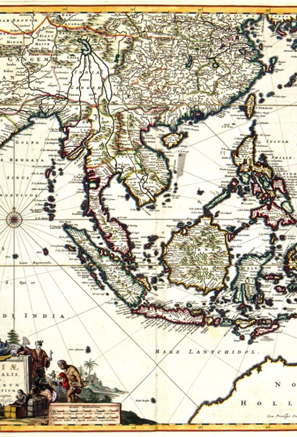{.lightbox}

With the region made accessible through the Dutch East Indies Trading Company years prior, South East Asia became a primary focus for human fossil hunters at the end of the 19th Century.
:::

I keep making attempts to remind you of the time period we are discussing. Don't forget that this history is situated at the turn of the 20th century. A world very much different from our own. Not only was international
travel tremendously difficult but it was fairly dangerous and riddled with unknowns. This is particularly true of Asia and Africa (*Joseph Conrad shortly after published his explorations of the Congo in North Central Africa,
naming the region, and his book, The Heart of Darkness*). Thus, these intrepid academic adventurers were struck with the difficulties associated with such a search. Fortunately for this cause there was already an established
throughway for explorations throughout Asia. Europe proper may not have the necessary qualities for early human fossils, but emergent European colonies certainly did. Thanks to the Dutch East India Trading Company,
ship routes connecting Western Europe to Island South East Asia had already existed. Despite the collapse of this company, the Dutch East Indies as a colony were still well intact. This particular opportunity was capitalized on by one of the earliest discoverers of human fossils. A man named
**Eugene DuBois** (you should make note of this name). 

#### Eugene DuBois

DuBois was a Danish Anatomist and Zoologist working as a lecturer at his Alma Mater, the University of Amsterdam. While a somewhat prestigious position, he was largely frustrated working in the academy. He didn't get along very well with the rest of the 
faculty and found himself impatient with teaching. Further, the study of anatomy was not stimulating to his analytical mind. Instead Darwin's book on Natural Selection and the ongoing debate about human origins occupied
his thoughts and he deeply wanted to add to the discussion. 

I'm not sure if any of you have hit this point in your academic pursuits, or if you ever will. For a handful of us, this is exactly what happens. You get a bit of a bug. You can't stop thinking about the missing
pieces of a puzzle which kinda has an indefinite amount of pieces. The object of your interest is likely unattenable but you persist and dedicate your life to adding some information to the growing body of knowledge. This
is science in its purest form. We don't pursue the headlines. The covers of National Geographic are almost insulting. We pine to add something significant to the discussion. Something that seems innocuous and irrelevant to 
your average person but somehow impacts our understanding in a great deal. This, to a degree, is the drive that DuBois had. And it was this drive that lead him to pack up his family and move to what is now Indonesia. Rest assured,
this was no small endeavor. These islands were known for decimating leagues of Dutch colonists due to poorly understood illnesses and attacks from wild animals. 

Thrilled by the thought of adventure, DuBois joined the Royal Dutch East Indies Army, packed up his wife and child, and headed east. He got to Sumatra and worked as a military surgeon, but spent
most of his free time searching the nearby caves for human ancestors. While he had plenty of luck finding fossils, very few were human and those that were were not old enough or distinct enough to represent a human ancestor.
This lead to plenty of frustration of which DuBois was happy to voice in his reports to the Dutch Army. We will come to see that nationalism and political competition was a significant driver of early paleoanthropology. The major Western
European powers, among other things, vied for the glory of finding the earliest human fossils and DuBois convinced his benefactors that other nations would find them first if was was not given more time and money. 
He was thus reassigned under the Ministry of Education, Religion, and Industry as a full-time fossil hunter (@Shipman1999). Sumatra was a hard start. He lost many of his crew and found little of academic interest.
A dedicated scientist though, he continued unphased. This remained true through illness, animal attack, loss of crew, and injury. It is said that DuBois nearly died numerous times during his tenure
in Indonesia but that he remained unphased and determined. After some time of poor luck in Sumatra, he became convinced that
he was searching the wrong island. Having examined a few fossils coming from Java, he decided to pick up his family and move again.

Java is not too far from Sumatra and so afforded the same enviornmental difficulties. DuBois, however, found far more success on this neighboring island. He stopped searching the limestone cave sites that 
he originally expected to bear fossils (given the situation in Europe), and started searching open-air sites along river banks. One brilliant lesson here is to consider the value of water and erosion. Both work
together and are independently important. Water, of course, is a major draw to [all]{ .underline} animals in the area and so acts as a lure. Whether by predation or simply chance of the environment, many animals die along river banks. 
For us, rivers and other aquatic environments have the additional benefit of quickly burying any unfortunate creature that happens to die in its wake. Water, it turns out, can also generate the opposite effect in different circumstances.
As much as it can lead to the rapid burial of animal remains it can also, through the act of erosion, expose long since buried bones and fossils. Thus, DuBois found himeself examining a new abundance of skeletal material,
some of which became wildly significant to our understanding of human evolution. 

::: {#fig-pith style="float: left; margin-right: 15px; max-width: 20%;"}
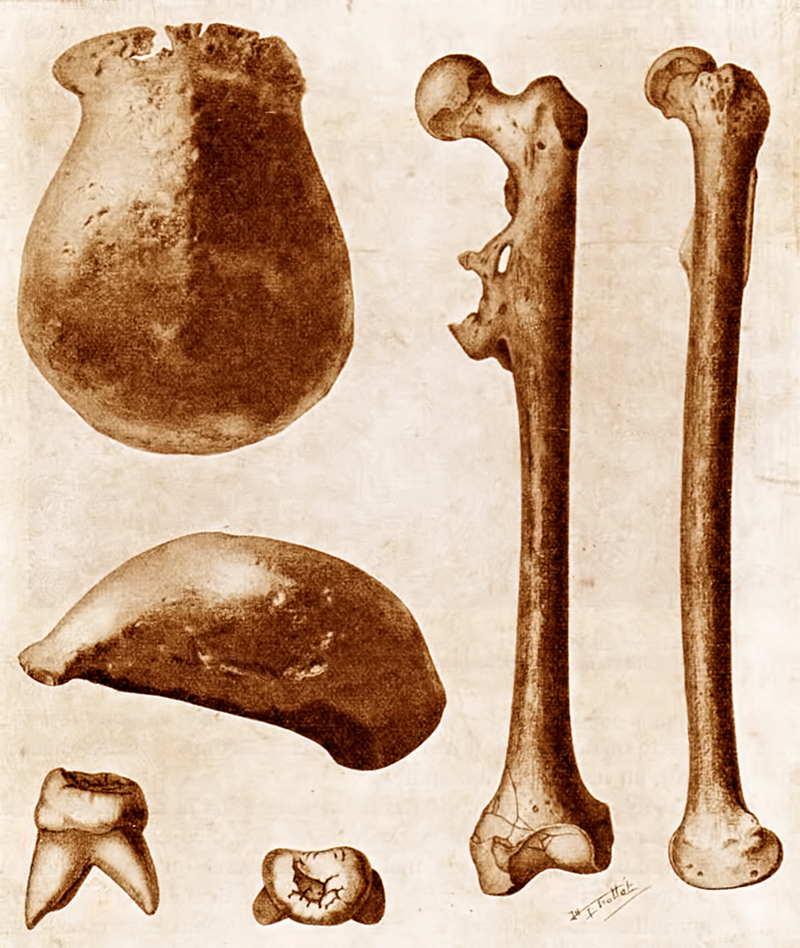{.lightbox}

The *Pithecanthropus erectus* assemblage found outside of Trinil. These fossils fave been referred to as Trinil 1, Solo Man, and Java Man.
:::

In his 1944 obituary, Sir Arthur Keith wrote that DuBois "brought to life the most famous of 'Missing Links' - *Pithecanthropus erectus*" (@Keith1944). He found a small assemblage of human-like remains along the Solo River
bank outside of the village of Trinil in Java. Among the remains was a *calotte* which was similar to humans but lower and longer in profile, had pronounced brow ridges, and, unlike that of the Neanderthal remains, had a brain
size noticably smaller than humans (but much larger than a Chimpanzee). While this Calotte was distinctly primitive in most qualities it was found in association with a rather modern looking Femur (upper leg bone). The
association and similar condition of these remains suggested to DuBois that they came from the same individual leading to the conclusion that he had found a fossil human with a primitive skull and modern post-crania.
He named this species *Pithecanthropus erectus*, roughly translating to "ape-man who walks upright" (@Bae2024). 

And the crowd went wild. This was absolutely a *missing link*. It was the first human fossil reported that looked different enough from us to warrant a new species designation. Additionally, many of the cranial traits
(such as the large brow ridge, the long and low profile, and the "pinched in" braincase around the frontal lobe ("**Post-Orbital Constriction**"), looked very much ape-like. DuBois did it! He found a connection between apes and 
humans. As excited as the world was, however, it was still not quite as unique as the evolutionary scholars were hoping. *Pithecanthropus* (later re-named as *Homo erectus*) was still much more human in appearance than ape.
I know, I know...what the hell? We can't ever be satisfied in this endeavor. Just remember that the scientists of the day were fighting to prove that humans and apes share ancestry. A fossil that emerges looking mostly human
with some cranial peculiarities just wasn't going to be enough to appease the masses. It was becoming more and more apparent that we would need to find a string of fossils that show the progression of ape-like to human-like
traits. And so while DuBois' find was absolutely incredible and highly regarded, these scholars went back to their smokey rooms to further deliberate on how to better elucidate the evolutionary story.

# What to Expect

DuBois discovered *Pithecanthropus* in 1892. Neanderthals had been published on and discussed just prior to and concurrently with it. While the skull and cranial capacity of "Java Man" were decidedly more primitive than 
the Neanderthal, the rest of the body looked pretty similar to a modern human, and not much at all like that of a chimpanzee. This continued to add skepticism to our inferred primate lineage. The evolutionary scholars 
of the time then had to ask what sort of evidence was needed? What do we need to find to convince the world that humans evolved from an ape-like lineage. The answer was more-or-less to find something that looks like an ape but 
has a *keystone human feature*. Something that was unique to humans and notably absent in non-human primates. Darwin suggested four unique features that made us distinct from apes: Intelligence, Manual Dexterity, Technology, and Uprightness (@Darwin1871). So the mission came to be to find an apelike fossil 
that had either human-like cranial capacity (brain size), human-like hands, stone tools, or walked upright like modern humans. 

## Theoretical Debate

Even among the evolutionists, the power of theology was real. No one denied God. Thus, the narrative became, if humans did evolve, they did so by design. Human evolution would therefore have been directly influenced
by God's gift. This certainly wasn't the thought of everyone in these discussions, but it was a major influence in the academic sphere. I have to wonder if anyone in this class has seen Stanley Kubrick's 1968 classic [2001: A Space Odyssey]{ .underline}.
I'd venture that few, if any of you have. If you haven't seen it, check out the opening scene below. I mention this, of course, because there is a portion of the film that is relevant to this discussion. This opening scene 
depicts a common expectation regarding *trait progression* in human evolution in the early 20th Century. Those who leaned more heavily towards theological explanations of our evolution believed strongly that we were
seperated from the rest of the animal kingdom by our intelligence and that this intelligence was gifted to us by God. While not an absurd hypothesis for the time, even with the few fossils that had been found at the time,
it was not entirely fitting the evidence. Nonetheless, there was a major contingent that believed it to be the only way we could have evolved. On the other side of the debate were those that
came to notice the preponderance of modern post-crania associated with somewhat primitive looking skulls. This group concluded that the first trait that appeared in the human side of the lineage was going to be our
upright, or **bipedal**, anatomy. And so the debate waged and followers of either side aspired to find fossils which proved their theory (@Gould1983).

::: {.text-center}


*2001: A Space Odyssey-Monolith Scene*
:::


## Piltdown Man

::: {#fig-piltdown style="float: right; margin-right: 15px; max-width: 20%;"}
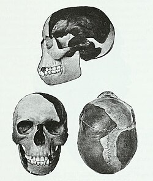{.lightbox}

Reconstruction of Piltdown Man "fossil"
:::

The first line evidence added to this debate came out of the small village of Piltdown in Sussex, England in 1908. The fossils were "discovered" by an amateur archaeologist named Charles Dawson who, upon finding the remains promptly
brought them to the Keeper of Geology at the British Museum, a man named Arthur Smith Woodward. The story was that these fossils had been unearthed by a workman and that Dawson subsequently excavated the rest on his own.
The bones had the look of being ancient (worn and stained by the surrounding earth) and were peculiar in their mix of advanced and primitive traits. The human remains were few, represented by a fairly complete skull
and a partial **mandible** (lower jaw). Additionally, the excavation yielded bones from extinct Ice Age mammals such as Mastodon and Hippopotamus that hadn't been in the region for more than 100 thousand years. The find took the
world by storm. Having named the species *Eoanthropus dawsoni* (Dawson's Dawn Man), Dawson and Smith Woodward claimed that they had found *the* Missing Link between Humans and Apes. The skull that was uncovered 
looked very much like a modern human but was much heavier and was associated with an ape-like jaw. Importantly, this skull had a modern human cranial capacity despite the appearance of primitive **dentition** (teeth). The find
proved two things to them and the world. First, it suggested that the large human brain was a quality that occured before the advance of other human traits (such as modern teeth). Second, and of great significance at
the time, it proved that this early human ancestor that was favored by God, first occured in England. ... ...

Ok, so what was happening in the world in 1908? 

Didn't I just say that nationalism was an important influence in early paleoanthropology? As much as we want to believe it to be true, you cannot separate cultural bias from science. Just won't happen. The world was in 
a tenuous state and at the precipice of World War One. Much of Western Europe was in competition for supremacy, heralding nationalistic and imperialistic ideals. England at the time was at a disadvantage in the human fossil race. 
Germany had claimed human fossils with the Neanderthal discoveries and, by this time, early *Homo sapiens*, referred to as Cro Magnon, had been dicovered in France. Not to mention, of course, the Dutch discoveries in
Island South East Asia. A handful of the world powers had laid claim to human fossil discoveries, but not England. *Eoanthropus*, or more colloquially, Piltdown Man, had changed this. And so it was. England had not only claimed 
its own human fossils but claimed *the* human fossil proving the theological paradigm that humans first evolved large brains and later developed other human-like traits. This was the reigning philosophy for more than 40 years.
That being said, there were those who challenged this fossil species and the notion that England, a land without any non-human primates, would be the cradle of human evolution. Possibly the most significant individual in this debate 
is a man by the name of **Raymond Dart**. 

## Australopithecus

::: {#fig-dart style="float: left; margin-right: 15px; max-width: 20%;"}
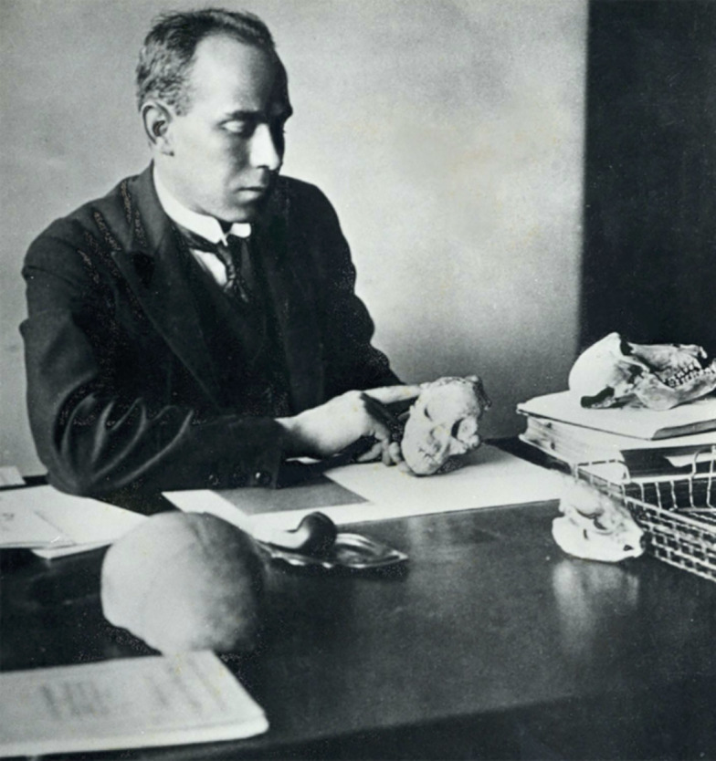{.lightbox}

Raymond Dart with the Taung Child fossil
:::

Piltdown Man was the primary human fossil species of interest from 1908 until about 1953. That is a super long period of time, during which the hunt for other human fossils did not subside. Keep in mind that, thus far, fossils had been found in 
the UK, mainland Western Europe, and Island South East Asia. Nothing had yet been found in the part of the world that the greatest minds in evolutionary science had expected to find human fossils. Africa had remained
dormant in the search. That, of course, did not stop people from looking. Raymond Dart was not necessarily among the fervent seekers but was well-positioned, both geographically and academically, to participate in the conversation.   

Like many of the key players at the time, Dart was an Anatomist. He worked with the University of Witwatersrand, in South Africa and dabbled in the comparative anatomy of local animals and fossils. He, like many of us,
made it a point to develop a relationship with the people who ran local quarrying operations and requested that fossils that were found in the area be saved for him. Again, Dart was not necessarily looking for human fossils. He
was, however, very interested in non-human primates and so was quite excited when he was brought the remains of what looked to be a young chimpanzee-like ape. The fossil had been found as part of a limestone mining operation.
Have we talked about limestone? Not sure. Limestone is a sedimentary rock made predominantly out of the exoskeletons of marine microorganisms. Thus, it typically represents the stratigraphy of ancient seabeds. Limestone
has the additional quality of being particularly water soluable. It dissolves and reforms readily. This means two things for us. First, after it has risen above the waterline (through the rise and fall of sea levels
or the process of geologic uplift) limestone facilitates cave formation. Water percolates through and across this foundation and dissolves massive cave systems that
hominins, among other animals, love to occupy. Second, any animal remains that find themselves situated in limestone caves are subject to becoming part of the limestone substrate. The base material dissolves and covers bones and teeth within
and ends up "gluing" everything together. Thus, the fossils retrieved by Dart were often stuck within a larger stone construct that we call **Breccia**. All this means for us is that Dart did not receive a clean, easy to interpret 
fossil. What he received was embedded in a much larger rock, requiring him to painstakingly remove the surrounding **matrix** before he could really understand what he was looking at. 

::: {#fig-formag style="float: right; margin-right: 15px; max-width: 20%;"}
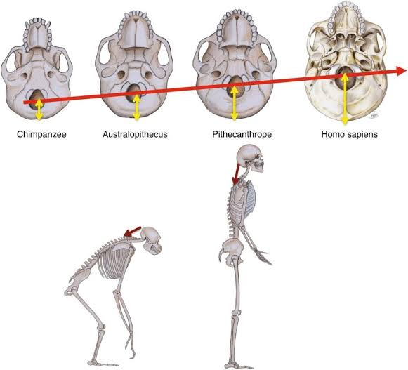{.lightbox}

Shifting placement of the Foramen Magnum from quadrupedal apes to bipedal hominins.
:::

After his diligent work removing the surrounding breccia, Dart made an incredible discovery. There was no aspect of this fossil that did not look like a young ape with the very distinct exception of an anatomical
feature called the **foramen magnum**. This feature translates roughly to "large hole" and refers to the hole at the base of our skull which connects our head to our vertebral column. More specifically it is the 
outlet for the spinal cord reaching out from the brain stem. The position of this feature, it turns out, tells us a lot about the posture of the animal in question. For Quadrupeds (see last week's reading), the foramen 
magnum is situated at the back of the skull. This should make some sense. Quadrupeds, walking on all fours, maintain a posture where the face *and* vertebral column run parallel to the ground. For us, however, we have 
a vertebral column that runs perpendicular to the ground. Thus, if we had a *posteriorly positioned* foramen magnum (positioned at the back of the skull), we would find ourselves staring directly up at the sky as 
we walked around. To facilitate our bipedal locomotion (walking on two legs), this *large hole* had to reposition to the base, or bottom, of the skull. With this we can keep our gaze forward as we walk around on two legs
with our head balanced on top of the vertebral column (see #fig-formag). 
This <span title="positioned below or under"> **inferior** </span> position is exactly what Dart observed in his "ape" fossil, confirming a new paradigm: the earliest humans looked much like apes but began walking upright.

::: {#fig-taung style="float: left; margin-right: 15px; max-width: 20%;"}
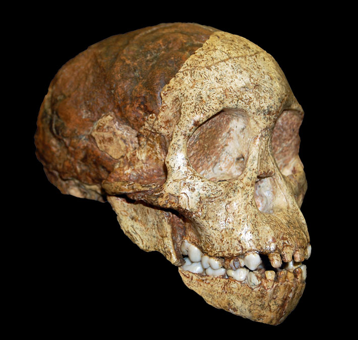{.lightbox}

High resolution Taung Child with **endocast**
:::

While the modern era of paleoanthropology notes this as one of the most absolutely pivotal moments in our field, Dart was living in the era of Piltdown man and was almost immediately brushed off as a second-hand scientist
that didn't know what he was talking about. This was a bit of a blunder. The fossil was presented to the world in 1925, at which time Dart claimed that it was a direct human ancestor. He called
this admittedly ancient hominin *Australopithecus africanus*: the Southern Ape of Africa. 

### Dawson vs Dart, or *Eoanthropus* vs *Australopithecus*

Piltdown Man had confirmed the deeply held suspicions of many scholars in the early 20th Century. From it, many had believed the question of *trait progression* in human evolution to be solved. Humans came to be seperate
from the rest of the animal kingdom in a relative instant. We developed our large brains and impressive intellect before any other evolutionary achievement and subsequently evolved to become the dominant species on the 
planet. It illustrated that humans were more-or-less *chosen* and were clearly on a different level from any supposed ape-like ancestors. It is little surprise then that Dart's proposed human fossil was poorly accepted 
at its time of discovery. This fossil, lovingly referred to as the **Taung Child** (from the Taung Limeworks quarry), was essentially the antithesis of this belief and the Piltdown specimen. While Dart's claim about the
position of the Foramen Magnum was observed and accepted by the scientific community, many pointed out the juvenile age of the specimen, suggesting that the adult version of the species would have later developed the expected 
posture of a quadrupedal ape. There was only a small contingent of scientists who strongly and outwardly backed the designation of *Australopithecus*, many of whom thought that the fossil at least warranted a side-by-side 
comparison with Piltdown. Heres where things get a little fishy. Charles Dawson died in 1916. After his death Smith Woodward commited care of the Piltdown remains to the British Museum which placed heavy restrictions on who could access the originals.
Cast models were made for study but few, if any researchers could examine the actual remains. Thus, a true comparison of these fossils became impossible until, that is, a man named Kenneth Oakley brought the Piltdown
fossils under heavy suspicion. 

Oakley worked for the British Museum and so was not subject to the same regulations as outside researchers. By this time more fossils resembling Dart's *Australopithecus* specimen, along with more remains of
*Homo erectus* had generated anxiety when regarding Piltdown Man. Oakley was among the skeptics. Curious about the antiquity of the remains, and eager to test new scientific methods in determining the age
of archaeological materials, he jumped at the opportunity to test this Piltdown paradox. The test he was to perform is called **Fluorine Absorption Dating**. It operates from the premise that buried 
bone has the tendency to absorb elemental materials from the surrounding soils and percolating water. This method does not so work to provide a direct age of fossil materials but instead provides valuable context. In essence,
it can tell us if all of the materials being tested are of the *same* age. If they were all deposited together, having the same *depositional context*, each bone should have the same Fluorine concentration. And so Oakley tested
different bones from the Piltdown assemblage. What did he find out, you might ask? Drum roll please...

::: {#fig-hoax style="float: right; margin-right: 15px; max-width: 20%;"}
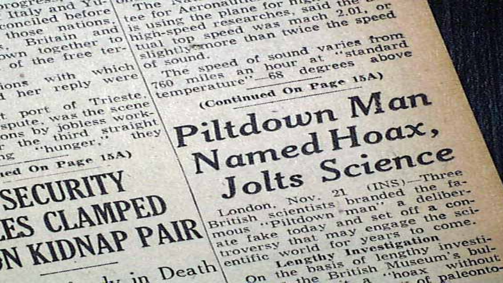{.lightbox}

Piltdown man was fully exposed by 1953
:::

The Skull, Mandible, and associated <span title="giant mammals such as elephants and rhinos"> **Megafauna** </span> had different fluorine concentrations. Naturally the skepticism grew and the Piltdown remains were brought out for
re-examination. Not only were the remains tested by two other levels of elemental analysis (which both confirmed the fluorine test), but the quality of the bones themselves were scrutinized under magnification for the 
first time ever (absolutely wild that no one looked at these with a magnifying glass before). The results of these combined analyses shook the world. Dawson faked the whole thing! The skull looked modern because
it was modern. The mandible looked primitive because it came from an Orangutan (South East Asian Ape). And the associated megafauna remains were added seperatly to bolster the claims about antiquity. The magnifying glass, it turns out,
is a tremendous scientific tool and it allowed the researchers to identify the portions of the Orangutan mandible that were filed down to better fit the human skull. The whole damned thing was a fraud. The world had
been bamboozled for more than 40 years and poor Raymond Dart was badly mistreated in the scientific community for it. But Dart sure did have his redemption. With Piltdown no longer a proverbial fly in the ointment, the
numerous *Australopithecus* remains coming out of Africa took center stage in the world of paleoanthropology. And Dart's claims about human trait progression became the new paradigm to understand human evolution. 

# Where We Are Today

Here we can set the stage for the rest of this unit. Raymond Dart, along with a growing pool of paleoanthropologists had proven that **Bipedalism** had evolved long before our ancestors developed large, complex brains.
From there, we will come to see, our evolution progressed through different stages leading to increased <span title="lightly and slightly built. An antonym of Robusticity"> **gracility** </span>, more dexterous hands,
the development of tools, and the exponential growth of our brains. 

The conditions and selective pressures by which different hominin species developed these traits, however, is another story. This next one will require us to spend a few weeks examining a few key species in our 
evolutionary timeline. If you thought the tales from the 19th and 20th centuries are ancient history buckle up, because our next story will begin at around 7 million years ago.

# Pau

Make sure to take quiz three after reviewing and understanding the assigned reading!