::: {.callout-tip}
## Key Points

- [**Additional Assigned Reading:**]{ .underline } Ch. 5 in textbook; Sections: [Studying Primates in Biological Anthropology]{ .underline}, [Key Traits Used to Distinguish Between Primate Taxa]{.underline};
Ch. 6 in textbook; Sections: [Sexual Selection]{.underline}, [Communication]{.underline}, [The Question of Culture]{.underline}
- [**Key Terms:**]{ .underline } Ancestral/Derived Traits, Primate, Prehensile, Arboreal, Pentadactyl, Opposable Toe, Flattened Nails, Frictional Ridges, Depth Perception, Evolutionary Tradeoff,
Post-Orbital Bar/Plate/Closure, Prognathism, Trichromatism, Stereoscopic Vision, Encephalization, Gestation, Ontogeny. [Terms from Textbook:]{.underline} Heterodont, Incisors, Canines, Premolars, Molars, 
Sexual Dimorphism, Dental Formula, Diastema, Folivore, Frugivore, Omnivore, Locomotion, Verticle Clinging and Leaping (VCL), Arboreal/Terrestrial Quadrupedalism, Brachiation, Bipedalism.
- [**Summary:**]{ .underline } The book gives you a decent overview of what primates *are*. It does, however, gloss over some key aspects of why primates evolved in this way. From the textbook and the reading
here, students will develop a good sense of what makes primates unique in the Animal Kingdom. The emphasis placed here on early primate traits is significant to understanding how it is that humans (hominins)
began to evolve in the first place. Take some time to understand the selective importance placed on primate Dexterity, Vision, and Cognition. 
:::

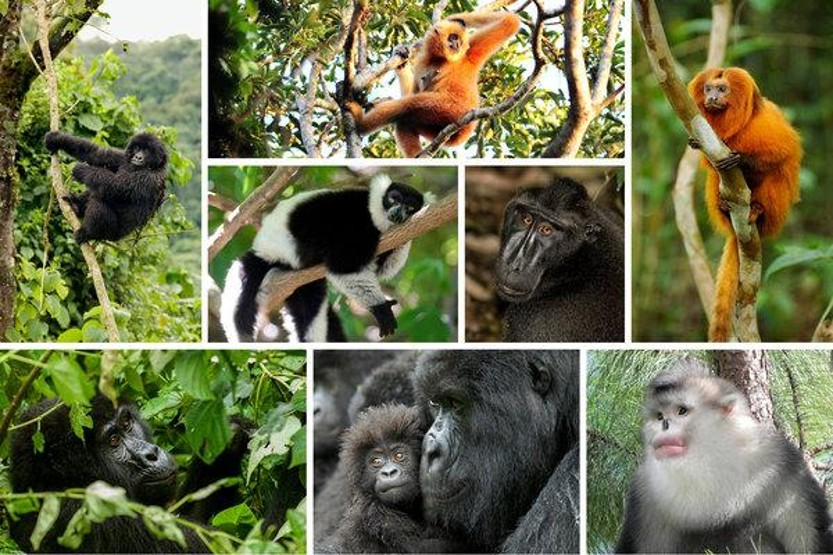{#fig-primates .lightbox width="70%"}

# What are Primates?

This is always kind of a fun section. It is one that is expanded on much more in the Biological Anthropology course and is aimed at 1) illustrating to students
what the taxonomic group we belong to looks like, 2) walking through some of the fundementals of comparative anatomy and adaptive behavior/morphology, and 3) introducing the
field of Primatology (of which students could choose to pursue a career in). For this class, however, it is a very brief introduction to understanding primates so that we can
move forward into understanding our evolutionary history. Thus, we will spend this week on non-human primates and use this knowledge as a yardstick to measure evolutionary changes
in <span title="the narrowest group of human ancestors that is seperate from all other primates"> **hominins**</span>. 

So what is a **Primate**? *You are a primate*! But you are not just a primate, right? You are also a **Mammal** (a placential mammal at that), a **Vertebrate**, an **Animal**, and etcetera. It 
turns out that you belong to a number of different (but nested) taxonomic groups. How we define where we fall in this taxonomy depends on how narrow you want to be. For instance, you can define
humans as being warm-blooded organisms which produce live offspring and nurse said offspring with mammary glands. This is all well and good, and is certainly accurate, but it is not very 
helpful in defining *humans* specifically. What we have effectively done here is to identify some of our **Ancestral Traits** which ally us with all other placential mammals. Your reading covers 
this information in the *Types of Traits* section. When biologists discuss particular groups of organisms, they often begin by sorting through Ancestral and <span title="the traits most specifically associated with the group in question (evolved specifically in that group)"> **Derived Traits**</span>. 
Derived traits are those that are specifically associated with a specific group of organisms. This does not mean that other groups do not have some of these traits
(consider that both Birds and Dragonflies have wings), but when identifying derived traits we mean to say that they evolved once in the common ancestor of the group and were passed on (inherited) to the decendent populations (or species).
We can try to clear up a little confusion by discussing the ancestral and derived traits of Primates. 

::: {#fig-Tax1 style="float: right; margin-right: 15px; max-width: 40%;"}
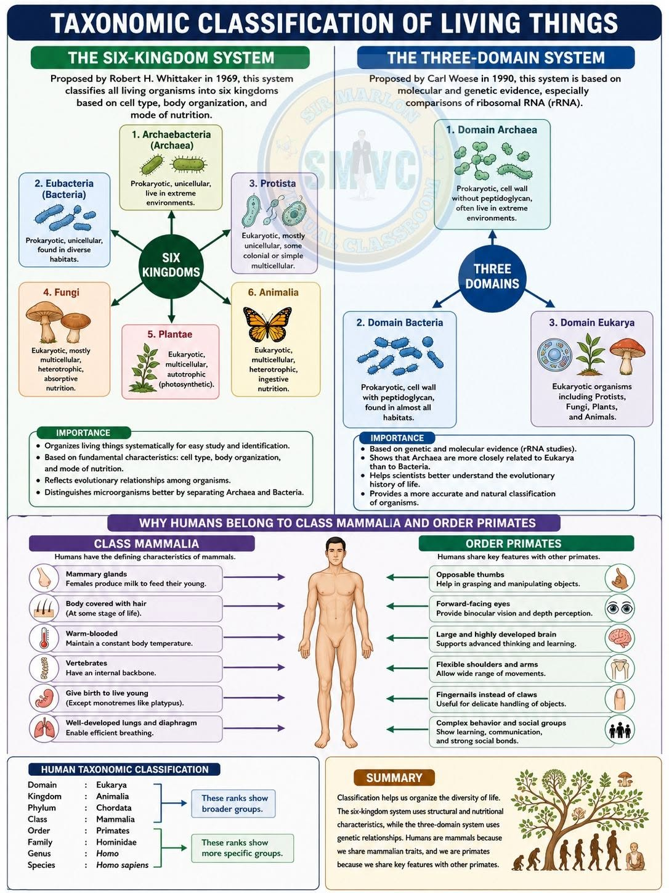{.lightbox}

A glance at how life can be classified. This image illustrates
the two of the highest broad taxonomic categories (Domain and Kingdom) and depicts how they
are differentiated. Notice how the Kingdoms fit into (or nest into) different 
Domains. This also shows how humans fit into the narrower Class and Order categories. 
The image was taken from *Sir Marlon: Virtual Classroom*

:::


Primates share a number of ancestral traits with different organisms. Consider (@fig-Tax1). On the bottom left of this image you get a glimpse at our
broad taxonomy (from Domain to Species). Notice that the name of our *Order* is Primates and that Primates are nested within Mammalia, Chordata, Animalia, and Eukarya. This tells us
that we share traits (Ancestral) with all other members of these groups. When considering primates, examine the middle section of the image. Everything on the left (under Mammalia) is an Ancestral trait
and everything on the right (under Primates) is derived for our Order. So, *yes* we are Mammals, but if we are to be more specific, we should define the Derived traits which make us primates.
Later in this unit we will be even more narrow and define the derived traits which make us Hominins, members of the genus *Homo*, and finally, *Homo sapiens*. But first, Primates.

## Primate Derived Traits


The book does a good job of explaining primates in terms of a *suite of characteristics*. It emphasizes this because there is no singular trait that can be used to say whether something is or is not a primate.
Of course, it would be so much easier if we could define these groups with singular characteristics. Many of the higher taxonmic classifications work this way. Eukaryotes have cells with specific organelles 
(such as the Mitochondria). Chordates have a spinal cord or pseudo-spinal cord (notochord). Animals are multicellular, mobile consumers. Which requires a few more characteristics, but is still pretty straightforward.
The farther you go down the line, however, the more specifically each group needs to be defined. This should make some sense for a nested classification. With each narrower assessment, the categories get more 
*specific* (...all the way down to *species*). In our case, specificity does not mean a singular unique trait, but rather a specific organization of traits. A major reason for this is that, in the grand scheme of things,
the narrow traits that define these more specific group are typically less consequential. This means that many organisms can exist with or without them and, because evolution is working off of pre-existing body plans (*decent
with modification*), these features have a tendency to come in and out of existence often. Hence the evolution of wings which has evolved seperately in insects, birds (archosaurs), and mammals (and kinda fish...though I don't know too much
about this trait in fish). The different taxonomic groups do not require the existence of wings but their presence is derived in particular groups within each. Thus, wings become part of a suite of traits for different taxa.

::: {#fig-thumb1 style="float: left; margin-right: 15px; max-width: 30%;"}
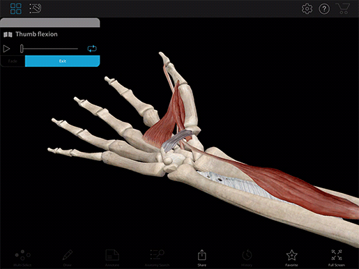{.lightbox}

Showing primary muscle actions of thumb opposition.

:::

Closer to home, we can discuss the **Opposable Thumb** that primates are so well-known for. Opposability of the thumb simply means that the thumb can be moved over the palm to sit across from the other fingers. More specifically, the pad of the thumb
can be positioned to face and come in contact with the pads of the other digits, most notably the fifth (the "pinky finger"). This provides the hands with strong grasping abilities, allowing the user to wrap their
hand around an object. Many vertebrates have five digits across their hands and feet but only some species can employ a <span title="wrapping all fingers and the palm tightly around an object"> **power**</span> 
and/or <span title="using pad of thumb against the fingers"> **precision**</span> grip to hold onto substrates and/or to manipulate objects in the environment. While a defining trait, primates share this 
<span title="grasping"> **Prehensile**</span> ability with animals such
as Opossums and Raccoons, Otters, and Koalas (see also the *Shared Trait Caveat* below if interested). It is thus not a super useful classificatory trait on its own but if we were to combine the trait with others, a unique minimum set of traits could be established which defines the group,
and that's the goal. 
Thus, it is important to consider what combination of traits (unique or otherwise) make primates primates. While there is a decent list of specifics, it may be first useful to the primate derived traits in broad categories.

<details> 
  <summary>Shared Trait Caveat</summary> 

::: {style="float: right; margin-left: 20px; margin-bottom: 10px;"}

  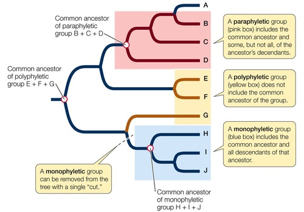{.lightbox}
:::

  Many traits are shared across different vertebrate groups but are [not necessarily Ancestral]{.underline}. For the trait to be considered Ancestral for the group, it must have evolved [once]{.underline} in that evolutionary line. In the science of Systematics (science behind the classification of life), this illustrates the difference between Monophyletic and Polyphyletic groupings. Monophylic means a single group that shares a common ancestor and shares traits because of that whereas polyphyletic refers to a group that shares traits by chance and did not inherit that trait from a common ancestor (not an evolutionarily related group). The evolution of the opposable thumb in different large animal taxa (i.e., different Orders) such as Primates, Carnivora, and in Marsupials happened through a process called **Convergent Evolution** (the independent evolution of similar features in species of different lineages), where each group of animals developed this trait independently. Ancestral traits, on the other hand are found at the most recent common ancestors of the groups in question, and help us to form monophyletic groups.

  <div style="clear: both;"></div> 
</details>


The Primate Order emerged at some point shortly before, or just after the extinction of the Dinosaurs (somewhere between 90 and 55 million years ago). They evolved to take advantage of an <span title="in and amongst the trees"> **Arboreal Environment**</span>,
adapting in three primary ways. They developed increased dexterity to traverse branched environments and adapted to move through them efficiently. To help navigate and subsist amongst the trees, these animals adapted a 3-dimensional and 
<span title="seeing three color spectrums"> **Trichromatic**</span> visual field. And along the way primates evolved complex, high-functioning brains. It is then instructive to think about primate traits in terms of **Vision**,
**Dexterity**, and **Cognition**.
  

## Manual Dexterity

As I mentioned before, much of our anatomy is ancestral. A good starting point to undersand our adapted dexterity then is to consider the ancestral trait of being **Pentadactyl**. Pentadactyl means that we have 5 digits 
(fingers and toes) per hand/foot. Consider how many mammals have modified this trait. 
Horses have only one digit on each foot. Cats and dogs really only have 4. The Tapirs of South America have 3. Primates, rodents, and related mammals retain the 5-digit (pentadactyl) appendage. Our hands (and most 
primate feet) *have* been modified, however, for enhanced grasping (or prehensility). Adaptations associated with the hands and feet of primates emerged early in our evolutionary history in a group of 
pseudo-primates called *Plesiadapiforms* (no need to remember this term). Identifiable in the species
*Carpolestes simpsoni* (or this one), the first adaptation in the primate trajectory was the development of the **Opposable Big Toe** and the presence of a **Flattened Toenail** over it instead of a claw. Keep in mind that 
the evolution of traits which define taxonomic groups is often an additive process. Not all traits emerge at the same time. Primates share a deep common ancestor with Rodents and so exhibited a number of 
rodent-like traits early on. These traits were subsequently modified through evolution as the group began adapting strongly to arboreal conditions. Thus, these early rodent-like Plesiadapiforms scurried through the trees 
and slowly accumulated traits that would come to represent primates.

::: {#fig-thumb1 style="float: right; margin-right: 15px; max-width: 25%;"}
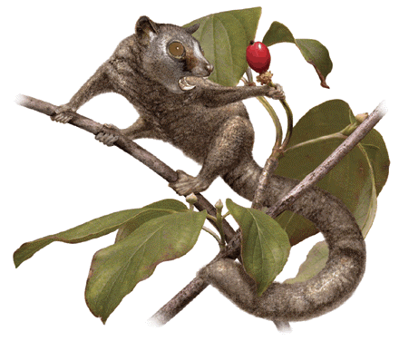{.lightbox}

Artist rendition of *Carpolestes simposoni*.

:::

Ok, so the opposable big toe and the replacement of a claw with a flattened toenail developed before any of the other traits we are going to discuss. But why these traits? How come these traits form the floor of the primate evolutionary tree? I began explaining the value of 
Prehensile hands and feet above. Primates are some of the only animals in the world that can effectively grip objects and substraits of variable size. This ability can be used to hang from branches, wield tools, and/or manipulate small objects.
Additionally, the flattened nails over these digits expose the pads of our fingers and toes which have developed concentric ridges (**Frictional Ridges**) across their surfaces. These *finger prints* have a couple of 
different functions which ultimately aid in generating friction across surfaces (though not necessarily in the way that you'd think (@Scheibert2009, @Warman2009, @Yum2020). The adaptation of prehensile digits, with
wide fingertips covered in nails (not claws), and ridged finger pads all work together to increase grip strength across different surfaces. These likely evolved in *Carpolestes* to assist in traversing small and narrow
branches that a clawed animal would have difficulty grasping (@Silcox2013). This is particularly the case as one appendage (arm/hand) would inevitably be used to reach and collect resources (such as small flowers, fruits, or insects) while
the other three worked to stabilize the body across that small branch. Check out the two videos below for a better understanding of these dynamic traits. 


::: {layout-ncol=2}

::: {#fig-nails}


*Nails not Claws*
:::

::: {#fig-friction}


*Friction climbing in primates*
:::

:::


::: {.card .border-success .w-70 .me-auto .mb-3}
::: {.card-header .bg-success .text-white}
**Primate Dexterity Adaptations and Morphology**
:::
::: {.card-body}

| Trait | Description | Tradeoff|
|---|---|---|
| **Prehensility** | Grasping ability afforded by opposable digits | Stiffness of feet/reduced running speed and efficiency |
| **Flattened finger/toe nails** | Lack of claws. Exposing digital pads | Loss of defensive/offensive trait. Inability to climb flat surfaces |
| **Frictional Ridges** | Finger prints. Increased mechanical traction/slip prevention | Not sure there is one |

: Very brief overview of key dexterity adaptations in *most* primates {#tbl-dexterity}

:::
:::


## Vision

While the evolution of dexterous appendages was key in the initial development of primate anatomy, it is not a stretch to suggest that subsequent visual adaptations were among the more dynamic and inluential 
modifications for our success. As our primate ancestors became more accustomed to moving through arboreal environments, adaptations emphasizing visual perception began to emerge. Sensory systems dictate how
an organism perceives the world around it and alterations to these systems have large scale impacts on neurocomplexity. Any one change to such a system can have big evolutionary impacts, but 
primates developed two (3-dimensional vision and enhanced color vision) that greatly shifted our trajectory. 

### Stereoscopic Vision

Seeing in three dimensions (**Stereoscopic Vision**) mostly accounts for the ability to perceive depth. **Depth Perception** is a sensory process where the brain determines spatial 
relationships in terms of [distance]{.underline}, [speed]{.underline}, and [trajectory]{.underline}. It is such a significant adaptation that it has evolved in a variety of large taxonomic 
groups in different ways. One common strategy to perceive the 3-dimensional world is to integrate inputs from mutliple sensory organs simultaneosly. While
<span title="the combined effort of multiple sensory organs to perceive the surrounding environment"> *multi-sensory integration*</span> is a clever way
to perceive the 3-dimensional world, with each integrated sense organ there is a reduction in processing speed and an increase in processing cost (metabolic energy). This is exactly the 
case for 3-D vision (@Surmeli2025). Many fish, for example, have a built in system (*lateral line*) for detecting change in water pressure and currents that, along with visual perception, help them map out 
their 3-dimensional environment. Mammals, as well, often employ whiskers along with  visual or olfactory organs to sense changes in air and/or water currents. As these animals utilize 
multiple inputs simultaneously to perceive their environments, they incur the aforementioned penalties. An alternative strategy to perceiving depth is accomplished in the streamlined visual
system of animals such as Primates. While it requires emphasizing one sensory receptor over another ([Evolutionary Tradeoff]{.underline}), adapting Stereoscopic Vision allows 
for a highly efficient and rapid sensory pathway which optimizes visual acuity and depth perception. 


::: {#fig-stereo style="float: right; margin-right: 15px; max-width: 25%;"}
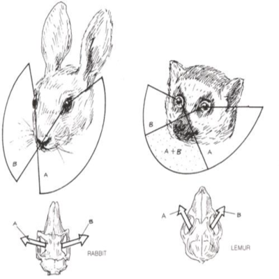{.lightbox}

Stereoscopic vision refers to overlapping fields of vision that facilitate depth perception.

:::

Stereoscopic vision is facilitated by the forward migration of the eyes to the front of the primate face. Like Carnivores, Primates benefit from the ability of overlapping visual fields
to piece together 3D environments. Many non-predatory mammals, including the Primate Last Common Ancestor, instead have laterally postioned eyes (placed on the sides of the head, like Cattle or Deer). 
While this placement doesn't allow the individual to perceive depth all
that well, it does provide a wide-ranging visual field that increases detection of potential predators. As seen in @fig-stereo, this evolutionary shift represents a tradeoff on either
side of the visual scale.  The centrally placed eyes of the Lemur create an overlapping field of vision (A + B), granting them high-fidelity stereoscopic vision. This shift in
eye placement, however, leaves stereoscopic animals blind to the space behind. The laterally placed eyes of the Rabbit provide a greater visual range with the included ability to 
pretty-well see behind them. 

#### Associated Costs

A morphological shift at this scale requires a fair amount of reshaping (or remodelling) of the skull. Imagine the skull is made out of a block of clay. Any sort of reshaping you do of
one region (say around the eyes) will necessarily pull clay from another region. All organisms have their own delicate internal economy. This is to say that the materials and energy that
are put into the development of bodily tissues (muscles, bones and sinews) are finite. Thus, when optimization of a body occurs over evolutionary time, it is done so through a series of distinct 
<span title="evolutionary improvement of one trait at the cost of another"> **Evolutionary Tradeoffs**</span>. Hence, molding extra clay into one region of our clay-block skull incurs a 
tradeoff which removes clay from a different region. Here inlies the issue for Primates. Remodelling our sensory dependence since the Primate Last Common Ancestor required reducing the
energy and material allocation dedicated to smell and redistributed it to highten our vision (@Barton1995). Notice in @fig-viscompare how the Lemur skull has its cheek bones shifted forward
and its snout pulled back. This is the exact tradeoff that we are talking about and can explain in a bit more detail.

::: {#fig-viscompare style="float: left; margin-right: 15px; max-width: 20%;"}
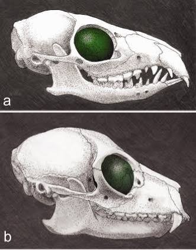{.lightbox}

Top-down comparison of the eye placement in (a) Treeshrews and (b) Lemurs. Notice that the eyes do not necessarily move. Instead it is as if they pivot forward. As they do two 
things happen: 1) the nasal region shortens and, 2) the boney region around the eye becomes thicker. 

:::

##### Cost #1: Reduced Prognathism & Olfaction

First, shifting the eyes forward requires new scaffolding. Pulling (or pivoting) the eyes forward requires 1) larger boney attachment for the muscles of the eyes and 2)
a larger skeletal barrier between this important sensory organ and the physical environment. Thus, early Primates evolved a distinct boney ring around the eyes called the **Post-Orbital Bar**. 
This bar acts to fulfill the two above requirements. Scroll through the images below (click on each for descriptions). The first is (*image #1*) 
a Gray Squirrel that has a standard rodent morphology for laterally placed eyes. Again, this is a common adaptation for prey animals that do not rely on vision-centric depth perception to navigate
their environments. As you move through the next two images, you can see two different strategies for the development of stereoscopy. The Raccoon (*image #2*) illustrates a common morphological
shift to
stereoscopy where the eyes pivot forward by repositioning and bolstering the cheek bones (*Zygomatic bones*). The Fishing Cat (*image #3*) has a similar morphology but places less emphasis on the cheek
bones and more emphasis on developing a boney ring around the eyes. We will come to see that these two strategies directly relate to the primary muscles used while chewing. Finally, the Pachylemur
skull (*image #4*) exhibits broad cheek bones with a full boney ring around the eye orbit. 

```{=html}
<!-- Outer Bound Box (Max-width 300px) -->
<div id="primateSlider" class="carousel slide" data-bs-interval="false" style="max-width: 300px; width: 100%; float: right; margin-left: 20px; margin-bottom: 15px; overflow: hidden; position: relative;">
  
  <!-- Carousel Image Slides Track -->
  <div class="carousel-inner">
  
    <!-- Slide 1 (active) -->
    <div class="carousel-item active" style="position: relative;">
      <!-- Slide Number Badge overlaying the top-right corner -->
      <div class="carousel-caption" style="position: absolute; top: 10px; right: 10px; left: auto; bottom: auto; padding: 0; z-index: 10;">
        <span style="background: rgba(0, 0, 0, 0.65); color: #fff; padding: 4px 8px; border-radius: 4px; font-size: 12px; font-weight: bold; font-family: sans-serif;">1 / 4</span>
      </div>
      
      <a href="../images/primates/squirrel1.jpg" class="lightbox" data-gallery="primate-gallery" title="Gray Squirrel" data-description="Laterally placed eyes. Great peripheral vision but little depth perception. ">
        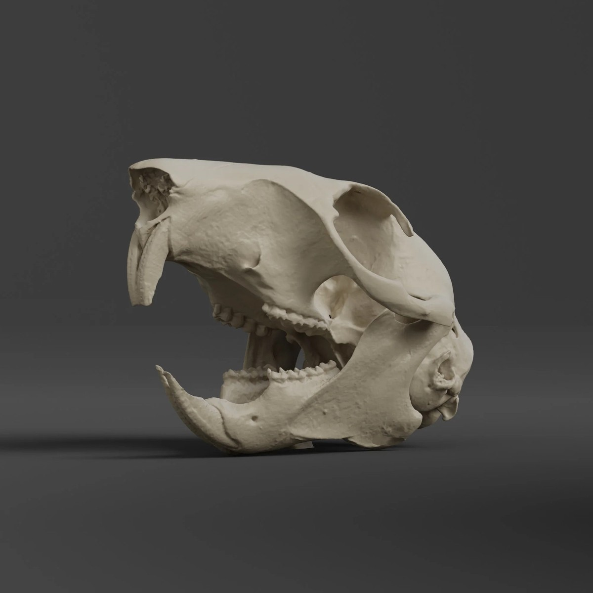
      </a>
    </div>
    
    <!-- Slide 2 -->
    <div class="carousel-item" style="position: relative;">
      <!-- Slide Number Badge -->
      <div class="carousel-caption" style="position: absolute; top: 10px; right: 10px; left: auto; bottom: auto; padding: 0; z-index: 10;">
        <span style="background: rgba(0, 0, 0, 0.65); color: #fff; padding: 4px 8px; border-radius: 4px; font-size: 12px; font-weight: bold; font-family: sans-serif;">2 / 4</span>
      </div>
      
      <a href="../images/primates/raccoon1.jpg" class="lightbox" data-gallery="primate-gallery" title="Raccoon" data-description="The eyes pivot centrally by pushing the cheek bones forward. Notice that there is no additional upper or posterior scaffolding">
        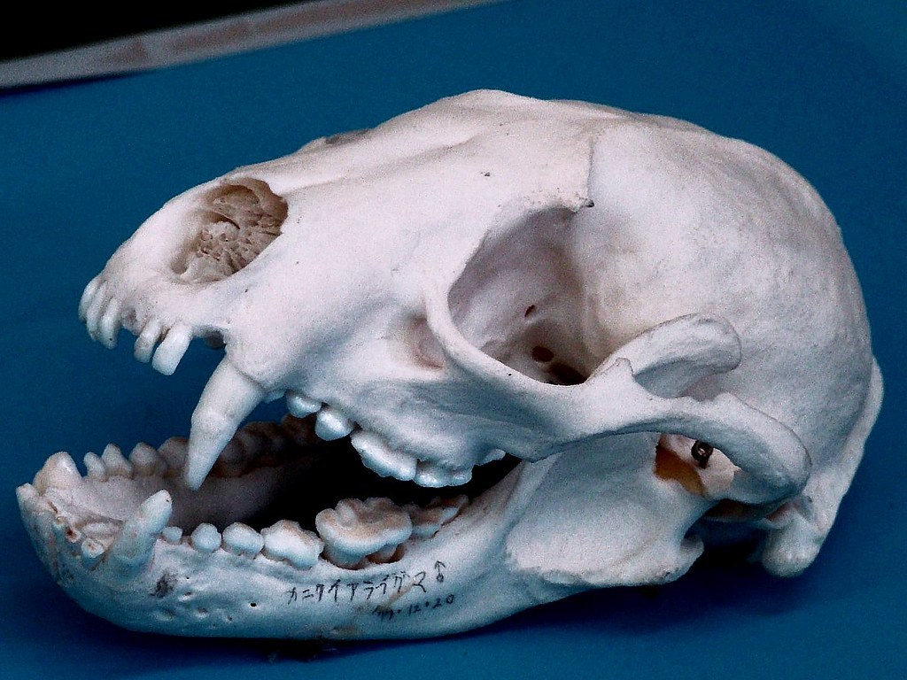
      </a>
    </div>
    
    <!-- Slide 3 -->
    <div class="carousel-item" style="position: relative;">
      <!-- Slide Number Badge -->
      <div class="carousel-caption" style="position: absolute; top: 10px; right: 10px; left: auto; bottom: auto; padding: 0; z-index: 10;">
        <span style="background: rgba(0, 0, 0, 0.65); color: #fff; padding: 4px 8px; border-radius: 4px; font-size: 12px; font-weight: bold; font-family: sans-serif;">3 / 4</span>
      </div>
      
      <a href="../images/primates/cat.jpg" class="lightbox" data-gallery="primate-gallery" title="Fishing Cat (*Prionailurus viverrinus*)" data-description="Similar to the Raccoon but there was very little movement of the cheeck bones. There is, however, additional scaffolding around the eye socket">
        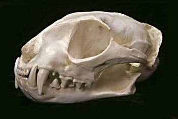
      </a>
    </div>
    
    <!-- Slide 4 -->
    <div class="carousel-item" style="position: relative;">
      <!-- Slide Number Badge -->
      <div class="carousel-caption" style="position: absolute; top: 10px; right: 10px; left: auto; bottom: auto; padding: 0; z-index: 10;">
        <span style="background: rgba(0, 0, 0, 0.65); color: #fff; padding: 4px 8px; border-radius: 4px; font-size: 12px; font-weight: bold; font-family: sans-serif;">4 / 4</span>
      </div>
      
      <a href="../images/primates/pachylemur.jpg" class="lightbox" data-gallery="primate-gallery" title="Pachylemur" data-description="This Lemur species went extinct about 1000 years ago. Notice the complete boney ring around the forward-positioned eyes">
        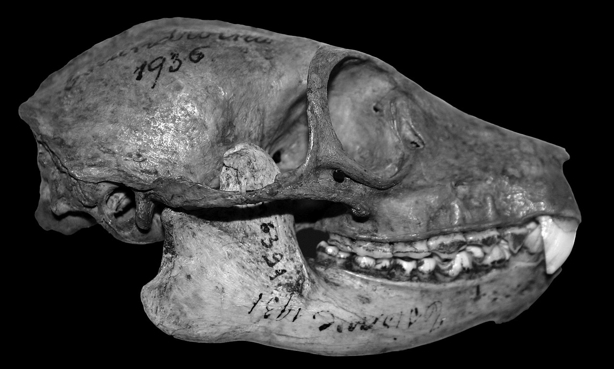
      </a>
    </div>
	
  </div>
  
  <!-- Left Control Arrow -->
  <button class="carousel-control-prev" type="button" data-bs-target="#primateSlider" data-bs-slide="prev">
    <span class="carousel-control-prev-icon" aria-hidden="true" style="filter: invert(1); transform: scale(1.0);"></span>
    <span class="visually-hidden">Previous</span>
  </button>
  
  <!-- Right Control Arrow -->
  <button class="carousel-control-next" type="button" data-bs-target="#primateSlider" data-bs-slide="next">
    <span class="carousel-control-next-icon" aria-hidden="true" style="filter: invert(1); transform: scale(1.0);"></span>
    <span class="visually-hidden">Next</span>
  </button>
  
</div>

<!-- Inline CSS to make sure text layout behaves nicely on phones -->
<style>
@media (max-width: 576px) {
  #primateSlider {
    float: none !important;
    margin: 0 auto 20px auto !important;
  }
}
</style>
```

In each of the three stereoscopic animals, you should also be able to notice the reduction of the snout
as you did in @fig-viscompare. The term that anthropologists use to examine this phenomenon is **Prognathism**. While not mentioned in the assigned chapters from our textbook, Prognathism (the 
forward portrusion jaw and face) is an important morphological variable in a lot of anthropological research (*including primatology, paleoanthropology, bioarchaeology, and forensic anthropology*).
Applied here we would say that as primates evolved stereoscopic vision they experienced a correlated reduction in *prognathism*. This provides evidence of one of the associated costs of
stereoscopy. As our primate ancestors developed highly 3-dimensional vision they sacrificed (*evolutionary tradeoff*) acuity in the sense of smell (*olfaction*).


##### Cost #2: Bite Force

::: {#fig-masmus style="float: right; margin-right: 15px; max-width: 20%;"}
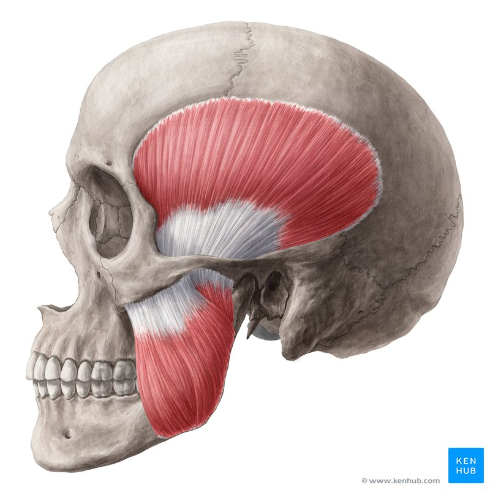{.lightbox}

Illustrating two primary masticatory (chewing) muscles (*Temporalis and Masseter muscles*). 

:::

There is another mechanical variable, beyond the repositioning of the eyes, that had to be reconfigured as we evolved into being a stereoscopic group of animals. One of my favorite parts of 
this is the unforseen danger having your eyeballs placed right in front of the muscles of the jaw. Notice in @fig-masmus that the larger of these two muscles (*Temporalis Muscle*) is positioned 
directly behind the eye. You can feel how this muscle works. Take a second and place your fingertips on your temples (soft spot just behind your eyes). While holding this position, try 
clinching your jaw by biting down (be sensible...don't hurt yourself). You should feel this jaw muscle bulge in your temples. Importantly, what you do not feel is any pressure in your eyes. 
The reason for this is a part of this evolutionary story. 

::: {#fig-tarsier style="float: left; margin-right: 15px; max-width: 25%;"}
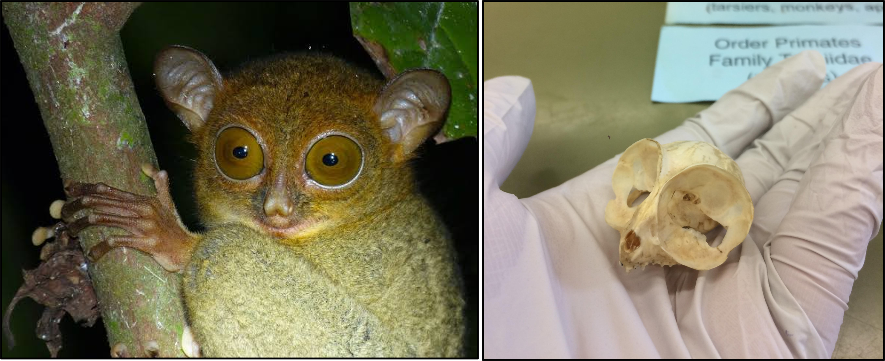{.lightbox}

Side-by-side images of a Tarsier and Tarsier Skull. Tarsiers are a nocturnal primate which evolved huge eyes so that it can hunt at night. These eyes require the additional scaffolding of a
**Post-Orbital Plate**. 

:::

The obvious danger here is that a large temporalis muscle, when in use, can put enough pressure on the eyeball to cause serious damage. This is not often actually a problem in the animal
kingdom but became one for Primates. While other animals typically have either small jaw muscles, small eyes, are an otherwise large surface for both the eyes and the jaw muscles to comfortably sit,
the primate evolutionary strategy affords none of these benefits. This didn't really become the case, however, until the evolution of Monkeys from the more Lemur-like (*Tarsier-like...*) early 
Primates. Lemurs and other <span title="a somewhat colloquial term for the group of Primates which maintain more ancestral morphologies. More specifically, Lemurs, Lorises, and Tarsiers"> **Prosimians** </span>
did not need any barrier between these tissues because they had yet to develop stronger jaws and bigger brains (relative to their descendents at least). A notable
exception is the *Tarsier* that developed such large eyes that it needed a more inclusive boney eye-socket. The Tarsier evolved this needed function through the development of a 
<span title="the combined effort of multiple sensory organs to perceive the surrounding environment"> *Post-Orbital Plate*</span> (@fig-tarsier) which provided a partial barrier between the
eyes and the muscles behind them. Of course, very few Primates have eyes as large (relatively) as do Tarsiers. This holds true for the earliest groups of Monkeys that evolved from the Trasier-like ancestor. Thus, the Post-Orbital
plate was not a necessary adaptation outside of the Tarsier lifestyle, though it maybe laid the groundwork for the subsequent adaptation in Monkeys.  

Real quick, let's talk about how the reduced sense of smell effected the Primate lifestyle. I think we have a tendency to think of olfaction being useful to smell food and otherwise detect
changes in our environment. In much of the mammalian world, the sense of smell is also crucial for communication. Think of domestic cats and dogs. They pee on everything! And they aren't alone. Most
of the mammals in the world do this. Paricularly the more solitary ones. The pheremones in urine are personal indicators. They can be used to establish territories and to indicate reproductive
receptiveness. Losing these abilities for long-distance communication, the less prognathic Monkeys that evolved from prosimians were forced to become more sociable. This is why you commonly
see Monkeys (and Apes and Humans) depicted in groups. We evolved into social animals as our sense of smell got worse. This is all well and good but group existence introduced some distinctly
new dynamics for Primates. Of particular influence was the introduction of direct mate competition. Potential mates were no longer choosing their partners after seeking them out through
trails of pheremone latent scents. Instead, most of the potential mates lived within the same community and would need to directly compete for their shot at reproduction. While this new form
of mate competition impacted the morphology of males and females alike, we see the most explicit changes occur with males that developed aggressive traits to help them establish dominance over a group
and the breeding rights that come with it.

Here is how this ties in with the above discussion on the eye-to-jaw muscle barrier. Weapons typically take one of three forms in the world of mammals. You either have sharp claws, sharp teeth, or both.
We discussed earlier why Primates would not necessarily want sharp claws, so that strategy is off the table (along with the option of having both). Big sharp teeth though...that works for us.
Do not be tricked into thinking that the large fangs of Mandrills or Chimpanzees are for eating meat. Nope, the big ol' fangs seen in non-human Primates
are used as weapons, most commonly used during mate competition. To use these weapons effectively, however, you need increased bite force, and this requires very large temporalis muscles. 

And so we can wrap this section on the morphological changes associated with stereoscopic vision up. The last big shift with the facial bones around the eyes was an extension of what we saw 
with the Tarsier. To protect the eyes from the very large Temporalis muscles that became necessary for social competition in "Higher Primates" (Monkeys, Apes, and Humans), these animals evolved to
have complete **Post-Orbital Closure**. It required more of those finite resources to build this boney barrier but we could continue to take resources from olfaction and dedicate them to vision.
This is true too for our last major vision-related adaptation. While not visible in the gross morphology as much, it is clear through behavioral and genetic studies that, as opposed to the Prosimians,
Higher Primates developed a greater range of color vision during the evolution of Monkeys. 

```{=html}
<!-- Outer Bound Box (Max-width 300px) -->
<div id="Mandrill" class="carousel slide" data-bs-interval="false" style="max-width: 300px; width: 100%; float: right; margin-left: 20px; margin-bottom: 15px; overflow: hidden; position: relative;">
  
  <!-- Carousel Image Slides Track -->
  <div class="carousel-inner">
  
    <!-- Slide 1 (active) -->
    <div class="carousel-item active" style="position: relative;">
      <!-- Slide Number Badge overlaying the top-right corner -->
      <div class="carousel-caption" style="position: absolute; top: 10px; right: 10px; left: auto; bottom: auto; padding: 0; z-index: 10;">
        <span style="background: rgba(0, 0, 0, 0.65); color: #fff; padding: 4px 8px; border-radius: 4px; font-size: 12px; font-weight: bold; font-family: sans-serif;">1 / 3</span>
      </div>
      
      <a href="../images/primates/mandrill.jpg" class="lightbox" data-gallery="primate-gallery" title="Male Mandrill" data-description="Male in middle of social display (a yawn with a purpose)">
        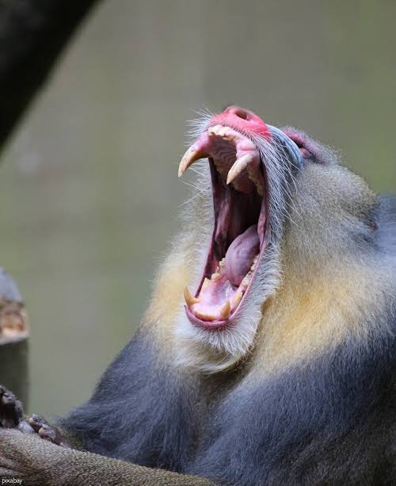
      </a>
    </div>
    
    <!-- Slide 2 -->
    <div class="carousel-item" style="position: relative;">
      <!-- Slide Number Badge -->
      <div class="carousel-caption" style="position: absolute; top: 10px; right: 10px; left: auto; bottom: auto; padding: 0; z-index: 10;">
        <span style="background: rgba(0, 0, 0, 0.65); color: #fff; padding: 4px 8px; border-radius: 4px; font-size: 12px; font-weight: bold; font-family: sans-serif;">2 / 3</span>
      </div>
      
      <a href="../images/primates/mandrill.webp" class="lightbox" data-gallery="primate-gallery" title="Mandrill Skull" data-description="Mandrill skull in lateral view. Notice the huge area for the temporalis muscles to sit">
        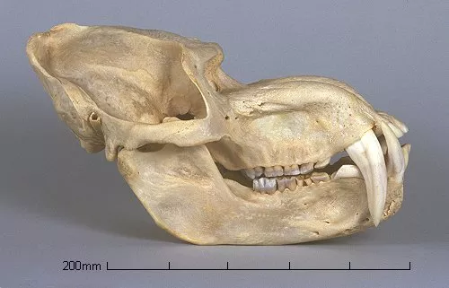
      </a>
    </div>
    
    <!-- Slide 3 -->
    <div class="carousel-item" style="position: relative;">
      <!-- Slide Number Badge -->
      <div class="carousel-caption" style="position: absolute; top: 10px; right: 10px; left: auto; bottom: auto; padding: 0; z-index: 10;">
        <span style="background: rgba(0, 0, 0, 0.65); color: #fff; padding: 4px 8px; border-radius: 4px; font-size: 12px; font-weight: bold; font-family: sans-serif;">3 / 3</span>
      </div>
      
      <a href="../images/primates/monkmas.png" class="lightbox" data-gallery="primate-gallery" title="Mandrill Masacatory Muscles (*Prionailurus viverrinus*)" data-description="Illustrating the large temporalis muscles. Don't worry about the highlighted word but we will learn more about that Sagittal Crest later.">
        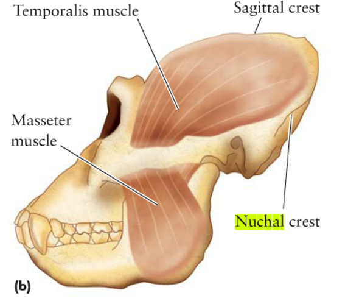
      </a>
    </div>
	
  </div>
  
  <!-- Left Control Arrow (Updated data-bs-target) -->
  <button class="carousel-control-prev" type="button" data-bs-target="#Mandrill" data-bs-slide="prev">
    <span class="carousel-control-prev-icon" aria-hidden="true" style="filter: invert(1); transform: scale(1.0);"></span>
    <span class="visually-hidden">Previous</span>
  </button>
  
  <!-- Right Control Arrow (Updated data-bs-target) -->
  <button class="carousel-control-next" type="button" data-bs-target="#Mandrill" data-bs-slide="next">
    <span class="carousel-control-next-icon" aria-hidden="true" style="filter: invert(1); transform: scale(1.0);"></span>
    <span class="visually-hidden">Next</span>
  </button>
  
</div>

<!-- Inline CSS to make sure text layout behaves nicely on phones (Updated ID target) -->
<style>
@media (max-width: 576px) {
  #Mandrill {
    float: none !important;
    margin: 0 auto 20px auto !important;
  }
}
</style>
```

### Trichromatic Vision

Wow that was a lot. I will keep this section brief. One last key difference between how Primates see the world versus other mammals is in the degree of color vision that most Primates have.
This really just amounts to being able to see in the Red Spectrum. As you can see in @tbl-vision, the evolutionary tradeoff for color vision was acute night vision. There is a fascinating
evolutionary story to be told about why mammals evolved high-fidelity night vision during the Mesozoic (time of the Dinosaurs) but, as much as I'd love to tell you all about it, this story 
is truly not necessary for you to understand in this class. And so I will get to the point. Just as there are material tradeoffs associated with our skeletal scaffolding, so too is there a biochemical
trade off with cellular dominance in our eyes. You have maybe heard that our visual perception is largely mediated by cells referred to as *Rods* and *Cones*. Each of these is a light-detecting cell type and
both are in competition (figuratively) for space in the retina. Rods are the primary light receptors that, while highly sensitive to light are not configured to distinguish colors. Cones are less sensitive
and so need ample light to function but, when doing so are employed to provide high-resolution color detail. As Primates switched from the noturnal habits common of prosimians into being
primarily *diurnal*, they no longer required acute night vision and opted for color sensitivity instead. This adaptation was heavily selected for in the Primate lifestyle by 1) helping to differentiate 
ripe fruit and flowers in their environment (dietary adaptation) and 2) displaying social signals through colorful skin (social adaptation). 

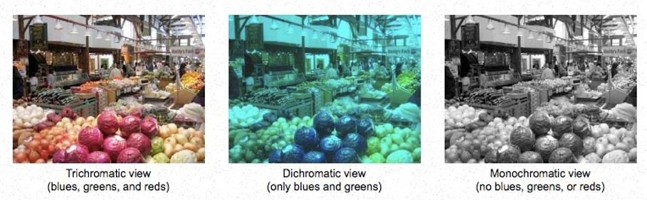{#fig-color .lightbox}

::: {.card .border-success .w-70 .me-auto .mb-3}
::: {.card-header .bg-success .text-white}
**Primate Vision Adaptations and Morphology**
:::
::: {.card-body}

| Trait | Description | Tradeoff|
|---|---|---|
| **Stereoscopy** | Forward facing eyes | Reduced Peripheral Vision/Reduced Prognathism|
| **Reduced Prognathism** | Shortening of the snout | Reduced Olfactory abilities (sense of smell)|
| **Post-Orbital bar/plate/closure** | Scaffolding for eyes/protection from masticatory muscles | Reduced Masticatory Power/Metabolic Energy |
| **Trichromatism** | Ability to see Red Spectrum in addition to Blue/Yellow | Reduced Night Vision |

: Very brief overview of key visual adaptations in *most* primates {#tbl-vision}

:::
:::


## Cognition

I very much enjoy conversations regarding evolutionary side effects (clearly). While side effects can be discussed in terms of *trade-offs* as was the case for our visual 
adaptations above, many side effects are neutral and, occasionally, others are beneficial. Further, while some traits start out as side effects, if beneficial in some way, selection has
a tendency of doubling down and emphasizing them. This seems to be the case with the famously large primate brain.

Truth be told, primates (including humans) do not have the largest brains in the animal kingdom. Not even close. Naturally, a blue whale has a much larger brain than you. It weighs roughly 15 pounds, 
which is larger than your entire head. Now you should be thinking, "Well, that's not fair. Blue whales weigh between 110 and 330 thousand pounds. Everything about these animals is bigger than us." Super true.
How very insightful of you. When we talk about brain size in different animals, seldom do we actually care about the *absolute* size of the brain. The blue whale brain is *absolutely* way bigger than yours
but relative to the size of its body (again between 110 and 330 thousand pounds), the 15-pound brain is pretty dang small (at most about .0136% of its body mass). The human brain only weighs around
3 pounds but contributes to roughly 2% of the human body weight. This is a massive difference! Even more so, the human brain demands approximately 20% of our bodily energy and oxygen (@Herculano-Houzel2011). 
It is thus not the *absolute* size of the brain but the *relative* size and energetic demand that we track. We refer to this relative measure as the **Encephalization Quotient**, or simply as *Encephalization*. 

The trend towards increased encephalization in Primates can be attributed to a couple of these early adaptations. Much attention in this regard is given to the rewiring of the brain with the development of both
Stereoscopic and Trichromatic vision. As discussed above, stereoscopic vision in mammals is not unique to primates. Besides us, the Felids (cats) are specifically adapted to seeing the 3-dimensional world.
Cats, however, process this information a bit differently and so have differently adapted neurological pathways. For the felids, vision is focused largely on movement (the speed and trajectory components of
depth perception). If you are particularly interested, you can look into the differences in the Visual Cortex and *lateral geniculate nucleus*, but this is much more technical than is needed here (@Barton1998).
What you should understand is that the pathways for detecting movement in a 3D world are distinctly different from those which emphasize fine detail, high-fidelity shape, and color. This is the primate 
strategy, and it is one that is far more costly (energetically) than that employed by cats. Thus, while Stereoscopy is definitely a player in the evolutionary trend towards greater encephalization, Trichromatic
vision seems to have kicked this trend into high gear. 

{#fig-visbrain .lightbox}

::: {#fig-faces style="float: left; margin-right: 15px; max-width: 30%;"}
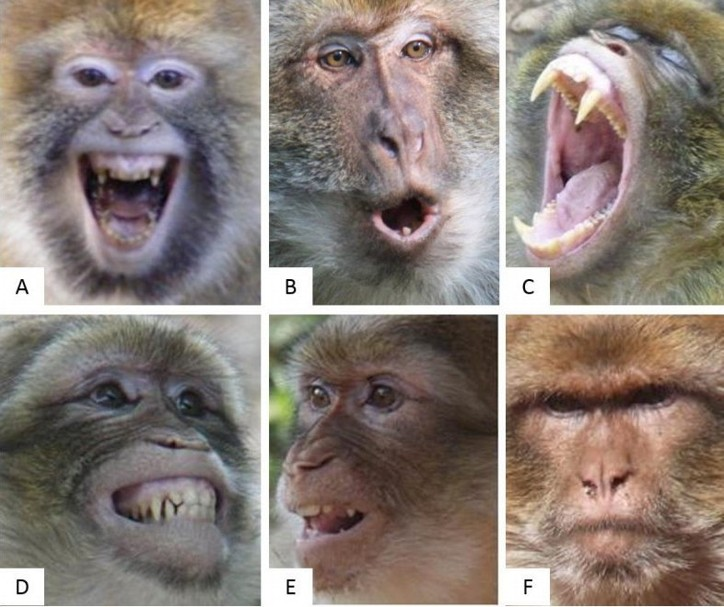{.lightbox}

The ability to express emotions with facial gesturing was an adaptation in the evolution of Monkeys (anthropoids). 

:::

Part of the primate encephalization story is tied to our increased social structure. This plays into vision as well, given that primate brains had to adapt more strongly to recognizing facial gestures. 
This requirement went hand-in-hand with living in social groups during <span title="Taxonomic grouping (infraorder) that includes Monkeys, Apes, and Humans"> **Anthropoid**</span> evolution. While vocalizations
are important too, they are also dangerous. In most contexts primates are prey animals and do their best to not alert potential predators. Look through (@fig-faces), you can probably tell 
what these monkeys are thinking/feeling without the need for vocalization. Further, living in social groups means that individuals must navigate delicate relationships, placing additional processing 
stress on the primate brain that did not exist before.

Finally, a key aspect of increasing cognition in primates relates to our <span title="Pregnancy period"> **gestation period**</span> 
and <span title="Formative (growing-up) period"> **Ontogeny**</span>. In both cases, primates evolved to extend these life-history traits. The prolonged gestation allows for more overall development
during the pregnancy period which provides a greater stream of nutrition and less environmental stress to the growing fetus. The **extended ontogeny** reflects a longer growing up process (and, in turn
a longer brain development process) where social/cultural inputs are are adding greatly to what will become the fully developed brain. 

The increased encephalization and overall cognition of primates seems to have largely began as a side effect of other adaptive influences. As this highly effective and efficient brain begun to 
have significant returns, however, selection began to emphasize it more and the primate internal economy began to dedicate more metabolic resources to it. We will see this come into play again
when we begin talking about hominins and human evolution in the coming weeks. 


::: {.card .border-success .w-70 .me-auto .mb-3}
::: {.card-header .bg-success .text-white}
**Primate Cognitive Adaptations and Morphology**
:::
::: {.card-body}

| Trait | Description | Tradeoff|
|---|---|---|
| **Hightened Visual Cortex and processing regions** | Growth of occipital, temporal, and parietal lobe | Reduced olfactory bulbs |
| **Increased Social Behavior** | Increased information sharing, cooperative feeding, child rearing, defense...etc  | Food/Mate competition |
| **Greater Encephalization** | More energy dedicated to brain growth and function | Energy taken from other mechanical process (i.e., strength and speed) |
| **Prolonged Gestation and Ontogeny** | Increased *in utero* and childhood development | Reduced reproductive output, increased birthing complications (large brained babies) |

: Very brief overview of key cognitive adaptations in *most* primates {#tbl-brain}

:::
:::	

# Pau

Make sure to take quiz two after understand the assigned reading.