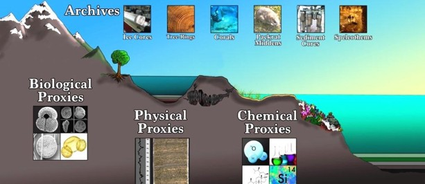
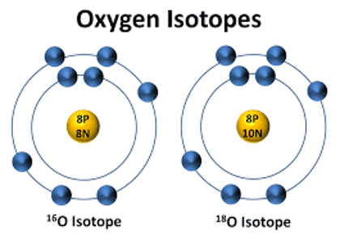
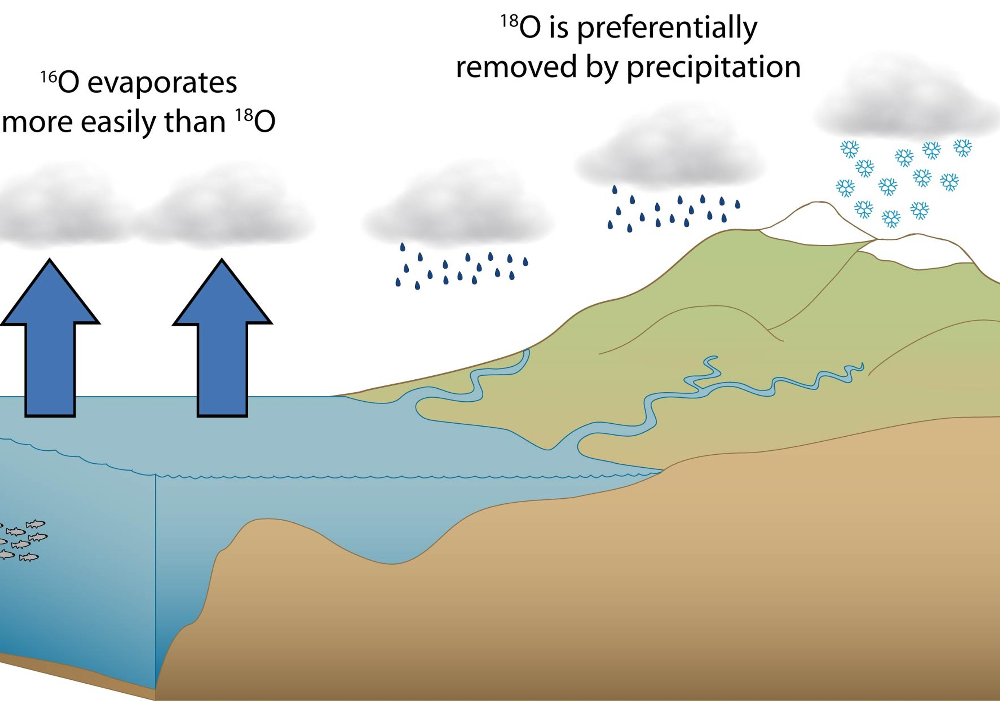
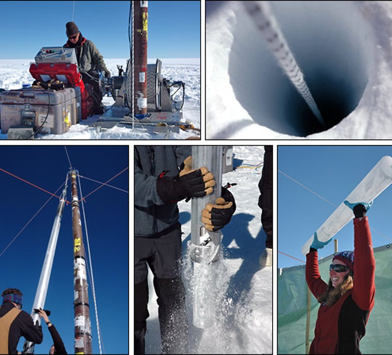
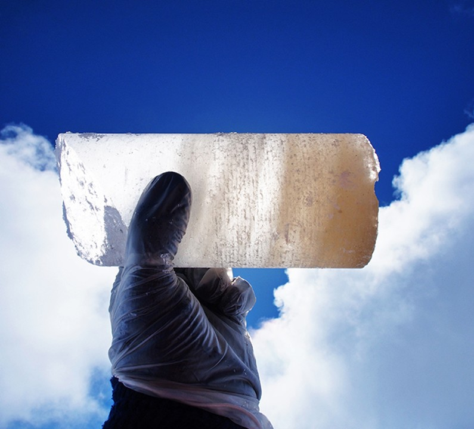
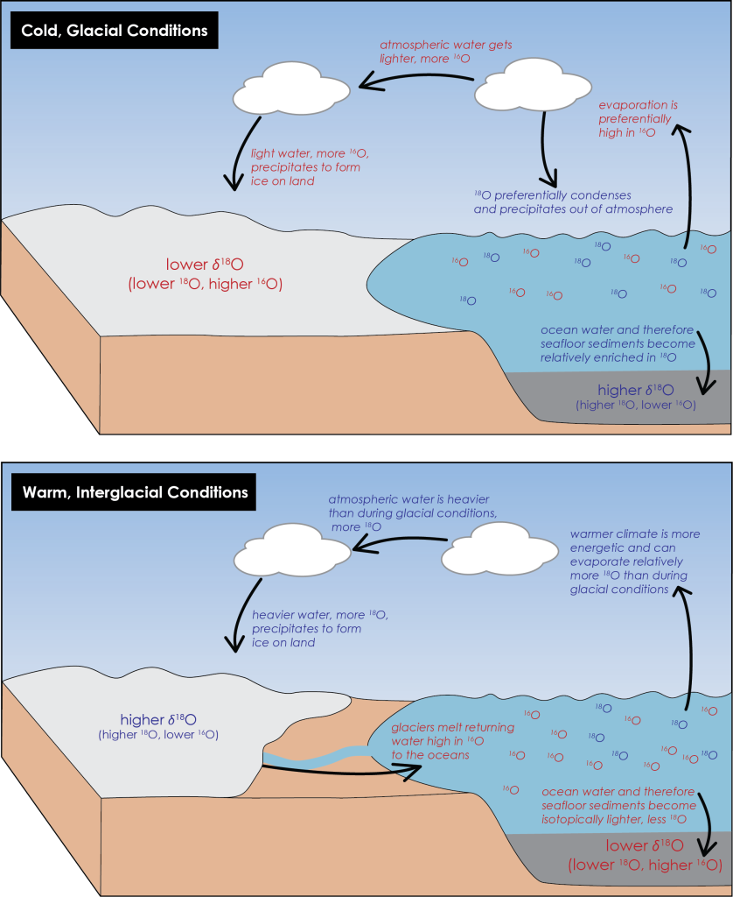
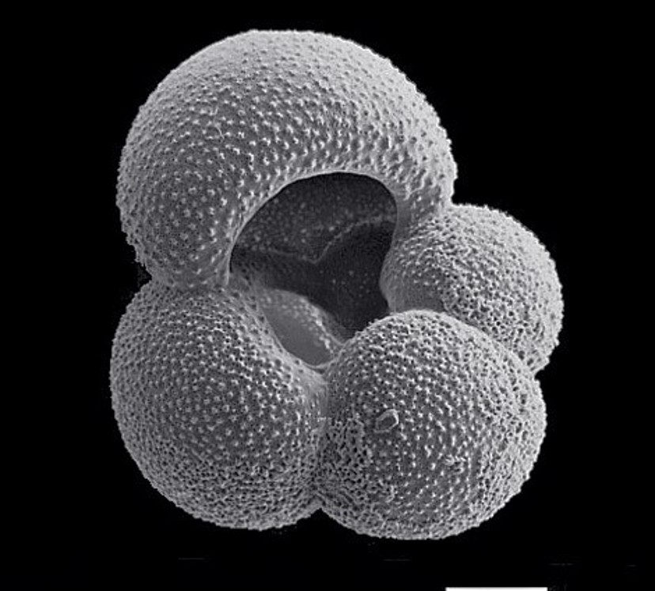
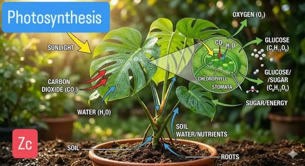
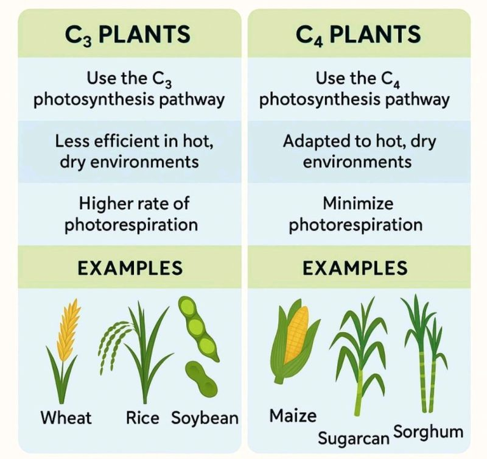

{#fig-proxies .lightbox width="70%"}
 
::: {.callout-tip}
## Key Points

- [**Additional Assigned Reading:**]{ .underline } Ch. 7 in textbook; Section: [Environmental Reconstruction]{ .underline}
- [**Key Terms:**]{ .underline } Oxygen Isotope Fractionation,
- [**Summary:**]{ .underline } One of the most important tasks in archaological and paleontological investigations is in establishing a timeframe for a site.
Establishing a *Temporal Context* is achieved by these scientists in different ways depending on how old the site is and what materials are available for testing. No method is perfect
so pay attention to some of the difficulties of each approach. Be sure to take note of the age-ranges (including half-lifes) and needed materials of each method. 
:::

In the previous section, we hinted at a couple of ways to investigate past environments. Recall that different colored horizons in a stratigraphic column are environmental 
indicators just as the thickness of tree-rings can illustrate changes in annual precipitation. In this chapter we will continue on with this line of investigation. 

Once upon a time, archaeologists and paleontologists would collect only the materials that they found interesting from a site. Bordering on [antiquitarian]{.underline}, 
these tomb raiders* searched for relics, artifacts, and idols, often leaving a wake of destruction along the way. Not surprisingly, their findings were commonly devoid 
of context, meaning, and truth. Those days are thankfully behind us (at least mostly). In modern approaches to these historical sciences the goal is not simply to "collect" and 
"describe" but instead to "reconstruct" and "understand". An absolutely crucial component of such investigations is to develop an environmental context for the material in question.
Reconstructing past environments helps us make sense of what we find. In evolutionary studies climate can help explain specific adaptations, radiations, ditributions, and extinctions. For 
Archaeologists, who specifically examine **Material Culture** and culture change, interpreting a site before knowing what the environmental conditions were is almost blasphemous. Without
a known environment (*i.e.*, ecology, weather, climate) it can be impossible to correctly interpret the intended use of an artifact or the meaning behind prehistoric art and it can make it difficult to understand
the motivation behind cultural innovations like agriculture and militarism. For our purposes in this unit, establishing an environmental context will also be important for explaining how, why, and 
when our ancestors spread across the globe. While there are many different environmental conditions to study and just as many specific methods to investigate them, we will only be focusing on two in this unit:
[Paleoclimate]{.underline} through the use of [Oxygen Isotopes Fractionation]{.underline} and [Paleoecology]{.underline} by way of [Photosynthetic Pathways]{.underline}.

# Paleoclimate Reconstruction

Anytime we pursue investigations into the past it is important to remember that we don’t have a time machine. I know this sounds self-evident, but what it means is 
that we can never be 100% sure of our *interpretation* of evidence. Further, much of the evidence that we are using is what would be called Proxy evidence. Proxies are 
stand-ins when the actual thing we want to discuss is not available (@fig-proxies). The climate of the past has come and gone. We will never be able to directly measure global 
temperature. Climate does, however, have a direct impact on materials that do preserve through time. In our case we will use the climate signatures preserved in 
[glaciers and marine sediments]{.underline} to figure out roughly what the conditions were and how they changed through time. To do so we investigate how stable oxygen isotopes are 
differently sorted into the hydrosphere (water cycle) and biosphere (metabolic pathways). The differential sorting of these isotopes is called **Fractionation**. Hence, 
**Oxygen Isotope Fractionation** is the primary epistemology discussed here to determine Paleoclimate. 

## Oxygen Isotope Fractionation

::: {#fig-Oiso style="float: left; margin-right: 15px; max-width: 20%;"}
{.lightbox}

Oxygen Isotopes: ^16^O and ^18^O fractionate under specific conditions. Their chemical signatures, stored in glacial ice and marine shells provide clues to past climates.

:::

OK, let's break down this jargon. You probably already know that Oxygen
<span style="display: inline-flex; position: relative; align-items: center; 
justify-content: center; border: 1px solid #333; width: 1.4em; height: 1.4em; line-height: 1; font-family: sans-serif; background-color: #ffe6e6; 
border-radius: 3px; vertical-align: middle; margin: 0 2px;"><span style="position: absolute; top: 1px; left: 1px; font-size: 0.35em; 
font-weight: bold; line-height: 1;">8</span><span style="font-size: 0.75em; font-weight: bold; padding-top: 0.15em;">O</span></span>  is one of those elements on the periodic table and, from
the last chapter on Radiometric Dating, you are aware that Isotopes are different versions of these elements (same Atomic Number but different Mass Number). The term **Fractionation**, then 
is all that remains. Restating from above, *Isotope Fractionation* refers to the process whereby isotopes of particular elements are differently partitioned and distributed throughout the environment [@Wolf-Gladrow2009].
Thus, we are investigating the conditions which result in different distributions of element isotopes in the archaeological and paleontological records. We will begin to understand this as 
we discuss how different concentrations of oxygen isotopes in glacial and marine bed samples inform us on past climates. 

We can start with some logic: isotopes which have higher Mass Numbers (those with more neutrons) are heavier than the others. Much like the eroded sediments we discussed in the 
previous chapter, isotopes (atoms) are moved through our world by some energy force. The higher energy the environment, the heavier the material it can move. If energy dissipates, however,
it is these heaviest materials that first become separated and fall into depositional environments. This same logic is applied to Oxygen Isotope Fractionation. In this process the primary
force responsible for partitioning Oxygen Isotopes is thermal energy (heat) by means of evaporation and precipitation. 

::: {#fig-evap1 style="float: right; margin-left: 15px; max-width: 40%;"}
{.lightbox}

Preferential evaporation of oxygen isotopes.

:::

The assigned text for this week (Ch. 7: Environmental Reconstruction) reviews this nicely but briefly. So let's expand. 

The element Oxygen boasts a nucleus with 8 protons and comes in three isotopic forms: ^16^O, ^17^O, and ^18^O. Given the scarcity of ^17^O, most research focuses 
on the proportional differences of ^16^O and ^18^O [@Delaygue2009]. As stated in the book, these isotopes occur naturally in Earth's water (H~2~[O]{.underline}). Since the 
water cycle (evaporation -> condensation -> precipitation) is largely mediated by thermal energy, the differential transport of oxygen atoms through the hydrosphere, atmosphere, and biosphere can
be said to reflect varying degrees of this same energy. If we go back to our earlier stream of logic it becomes apparent that the lighter molecules (^16^O) will 
evaporate more readily than heavier molecules (^18^O) and that the heavier molecules will precipitate more readily than the lighter molecules (@fig-evap1). 
[This is the primary logic to understand!]{.underline}. Evaporation favors ^16^O and Precipitation favors ^18^O. This doesn’t mean that only O16 
evaporates, just that it does so in higher proportions than O18, just as it doesn't mean that *only* ^18^O is rained out (removed by precipitation) but that it is at higher 
proportions than ^18^O. See summary table below (@tbl-watercycle)

::: {.card .border-success .w-70 .me-auto .mb-3}
::: {.card-header .bg-success .text-white}
**Isotopic Fractionation**
:::
::: {.card-body}

| Isotope | Mass Properties | Behavior in Water Cycle |
|---|---|---|
| ^16^O | Lightest | Evaporates preferentially; condenses & precipitates last |
| ^17^O | Intermediate | Typically excluded from standard studies |
| ^18^O | Heaviest | Evaporates less readily; condenses & precipitates first |

: Oxygen Isotopes in the Water Cycle. Fractionation occurs because heavier isotopes preferentially remain in liquid or solid phases. Under varying thermal conditions, heavy and light molecules separate. {#tbl-watercycle}

:::
:::


### Studying Oxygen Isotopes

To study the distribution of these isotopes in past environments, researchers make use of the oxygen record trapped deep in glacial [Ice Cores]{.underline} and [Marine Cores]{.underline} drilled
from the ocean floor. *Cores* are drilled-out cylinders of ice or sediment that can stretch for thousands of meters (up to 4 miles in some cases). Ice cores are nice because they directly 
capture water molecules for us to measure. Marine cores are slightly more complicated. Instead of measuring water molecules, we look at the shells of marine 
organisms from a particular period of time. More on this in a bit, but in general we can measure the proportion of oxygen isotopes in the calcium carbonate (CaCO~3~) structure of 
a shell. These shells were made from the molecules that existed in the ambient seawater during a specfic geological period and so carry the isotopic signatures of that environment. 
Since the use of Ice Cores is a bit more straightforward, we will start there.

### Ice Cores

::: {#fig-icecore style="float: left; margin-right: 15px; max-width: 30%;"}
{.lightbox}

Drilling and Extracting Ice Cores

:::

The logic behind oxygen isotope fractionation is pretty straightforward. For these isotopic ratios to be meaningful for our purposes (as paleoclimate proxies), however, 
the analysis must also correlate with a precise geological timeline. For instance, if researchers want to understand the global climate during the Younger Dryas 
cold reversal (we will discuss later in this unit), they need to be sure that the sample being analyzed comes from approximately 12,850-11,650 BP. Fortunately, 
glacial ice preserves more than just water molecules. Glacial environments are certainly not as abundant in life as the tropics but life does exist there. 
Further, wind currents in the upper atmosphere cycle over these high latitude environments, depositing wind-blown particulates along the way. Such 
particulates include pollen, ash, dust, and small organisms (i.e., insects) from all over. Many of these things can either be directly dated or traced back 
to a different environmental context that provides other materials for dating. This is all to say that glaciers form like sedimentary rocks do. They 
accumulate signatures of atmospheric conditions that existed during their formation and do so in a regular, datable fashion. 

::: {#fig-duststrata style="float: right; margin-left: 15px; max-width: 25%;"}
{.lightbox}

Layer of seasonal "dust spikes" demarcating a single year of glacial ice accumulation. 

:::

There are a couple of ways that this is done. First, since snow-pack accumulates similarly to sedimentary rocks, we can use the same process of delineating strata (snow builds in seasonal layers).
Much like tree-ring dating, these layers are counted as annual layers that can be calibrated by checking for the regular interspacing of seasonal debris (typically "dust spikes") and layers of volcanic ash 
(which can be radiometrically dated). While the uppermost layers can clearly depict the "strata", the deeper the core extends the more compaction occurs, ultimately obscuring the visible time markers.
To overcome this compression, researchers rely on advanced computation and high resolution chemical analysis to extend the timeline deep into the past. This is all to say that ice cores 1) 
preserve isotopic signatures of past climates and 2) can be dated by both relative and absolute means. For our purposes though, the interpretation of climate signatures is paramount.  

#### Interpreting Ice Core Samples!

This section is important. The primary points to understand are outlined in the diagram below. When investigating oxygen isotope fractionation in Ice Cores, we are interested in 
how much ^18^O made it to the higher latitudes relative to ^16^O. The logic is that in colder conditions that will be a much higher proportion of ^16^O relative to ^18^O in accumulating glacial ice.

::: {#fig-warmcold style="float: left; margin-right: 15px; max-width: 50%;"}
{.lightbox}

Oxygen isotope fractionation in warm and cold climate phases

:::

Regardless of climate, evaporation inherently favors the lighter isotope, meaning that atmospheric water vapor always starts with a higher proportion of ^16^O than the ocean water it came from. 
This is a general and expected phenomenon and should not be misinterpreted to mean that ^18^O is not evaporated, it's just that the typical ratio of atmospheric water favors ^16^O. 
Thus, while still an important part of this discussion, differential evaporation is less directly associated with climate than the condensation and precipitation that occurs while the 
water vapor moves through the atmosphere toward the poles. Here, the ^18^O that does evaporate is the first to condense and therefore the first to be "rained-out". This system is true in both warm and cool
climates but greatly exaggerated in [cool climates]{.underline} with greater total losses of ^18^O. Thus, by the time that this moisture reaches the higher latitudes and is able to contribute to 
glacial snowpack, nearly all of the ^18^O that once existed has been depleted. This process reflects two important concepts relating to the expected ratio of ^16^O to ^18^O in glacial conditions: first, ^16^O is 
evaporated in much greater proportions than ^18^O and second, ^18^O has a much greater chance of condensing and precipitating than ^16^O. Therefore, the proportion of ^16^O in glacial 
ice during colder climates is going to be much higher than ^18^O. 

A key consideration to keep in mind throughout this discussion is that we are describing differences in the relative proportion (the ratio) of these isotopes. Under any conditions, it should be expected
that both ^16^O and ^18^O will be measurable in the sample. Thus, researchers are looking for differentiated time periods which are marked by heavier or lighter isotopic ratios. As described above, in 
glacial conditions ice core samples will illustrate oxygen isotope concentrations characterized by lower ^18^O/^16^O  ratios than in warmer, interglacial conditions. 

The converse results are expected in warmer conditions (though this will follow the same principles). While we know that ^16^O will always be evaporated at higher proportions than ^18^O, the water
vapor which moves through the atmosphere towards the poles is better situated to hold on to the ^18^O that did evaporate as it gets to higher latitudes. This thus reflects a higher relative proportion
of ^18^O to ^16^O in glacial snowpack during warmer (interglacial) conditions. The image to the left includes one last detail that will become important to us as we examine this same
phenomenon in Marine Sediment Cores next. 

```{mermaid}
%%| label: fig-icecores
%%| fig-cap: "Oxygen isotope ratios assessed from Ice Cores under glacial and interglacial conditions."

graph LR
    A[Preferential evaporation of <sup>16</sup>O over <sup>18</sup>O] -->|Glacial Conditions| B("<sup>18</sup>O depleted via increased condensation and precipitation")
    B --> C("Higher ratio of <sup>16</sup>O to <sup>18</sup>O in glacial snowpack")
    A -->|Interglacial Conditions| E("more <sup>18</sup>O retained in warmer conditions")
    E --> F("Lower ratio of <sup>16</sup>O to <sup>18</sup>O in glacial snowpack")
```

### Marine Cores

The above explanation of oxygen fractionation in glacial ice cores illustrates how these isotopes are sampled from the hydrosphere/cryosphere. While most of the science remains the same for 
Marine Cores, the isotopes under investigation are only available in these samples as part of a more complex system of [biomineralization]{.underline} within the biosphere (biological systems). We thus
investigate the composition of seashells from organisms that existed at the time in question. These shells are not quite as extravagant as those that you might collect on the beach. 
Large shells such as those erode quickly in many contexts and so lose much of their informative value. The shells that are more commonly used are barely discernable to the naked eye and belong to 
a class of microorganisms called [foraminifera]{.underline}.

::: {#fig-duststrata style="float: left; margin-right: 15px; max-width: 25%;"}
{.lightbox}

Foraminifera shell. These micrscopic shells have some of the most intricate designs of all seashells. With so much diversity in shapes and textures, these are work a quick google search. 

:::

Biomineralization is the key concept of this discussion. It is perhaps easiest to first envision this process in our own bodies. Our bones and teeth act as a good example being that they have
partially inorganic structures (we need calcium for strong bones, right?). During the development of our bones and teeth our bodies extract minerals (calcium and phosphorous) from our bloodstream and
apply them to an organic scaffolding to make these structures that are both strong and flexible. We can thus extract minerals from our environment (in this case through our diet) to build inorganic structures
within our bodies. This process is nearly identical to the development of seashells. Instead of needing to consume these minerals, however, marine organisms live in an aqueous environment abundant with
dissolved minerals. In the case of seashell biomineralization, the primary minerals extracted from these marine environments ar Calcium, Carbon, and Oxygen (Calcium Carbonate or CaCO~3~). The Calcium enters into
this system most commonly through the erosion a dissolution of geological materials while the Carbon typically inters through the dissolution of atmospheric CO~2~. We are, of course, more interested for our
discussion in the Oxygen component that we already know is bound to the water molecules. 

#### Interpreting Marine Cores!


The oxygen isotope ratios recovered fro marine cores follow an opposite pattern to those assessed in ice cores. This should make some sense. Consider the expected ratios from warm interglacial periods in
ice cores. ^18^O is removed from ocean waters more readily and it is less likely to be rained out as it moves toward the poles in our atmosphere. This should already suggest to you that, while the ice
cores show higher concentrations of ^18^O, the marine cores might show lower. This is true and even doubley so because of the glacial melt that occurs during these warm phases. Because glacial ice has 
higher concentrations of ^16^O on the whole, in warm interglacial conditions, the ice that is melting a flowing into the ocean is enriched with ^16^O. This means that, not only is ^18^O more readily
removed from ocean waters during interglacial periods but more ^16^O floods the the ocean waters during these periods too. Thus, in warm conditions, marine cores illustrate oxygen isotope ratios 
with lower concentrations of ^18^O than are observed in glacial conditions. As the inverse conditions dump ^18^O back into ocean waters through increased condensation and precipitation of the heavier
isotope and lock away huge stores of ^16^O in glacial ice, marine core from glacial periods show an increased ratio of ^18^O/^16^O.

```{mermaid}
%%| label: fig-marinecores
%%| fig-cap: "Oxygen isotope ratios assessed from Marine Cores under glacial and interglacial conditions."

graph LR
    A[Preferential evaporation of <sup>16</sup>O over <sup>18</sup>O] -->|Glacial Conditions| B("oceans enriched with <sup>18</sup>O as it is precipitated back into the waters")
    B --> C("Higher ratio of <sup>18</sup>O to <sup>16</sup>O in foraminifera shell development")
    A -->|Interglacial Conditions| E("more <sup>18</sup>O removed from ocean waters and depostied in glacial snowpack")
    E --> F("Increased glacial melt enriches ocean waters with <sup>16</sup>O")
	F -->G("Lower ratio of <sup>18</sup>O to <sup>16</sup>O in foraminifera shell development")
```

::: {.card .border-success .w-70 .me-auto .mb-3}
::: {.card-header .bg-success .text-white}
**Oxygen Isotope Ratios**
:::
::: {.card-body}

| Sample Type | Glacial Conditions | Interglacial Conditions |
|---|---|---|
| Ice Cores | ↓^18^O/^16^O  | ↑^18^O/^16^O |
| Marine Cores | ↑^18^O/^16^O | ↓^18^O/^16^O |


: Following the text above, Marine and Ice Cores illustrate opposing oxygen isotope ratios in glacial and interglacial periods. {#tbl-isocores}

:::
:::

# Stable isotope indicators of habitat and migration

Understanding the global climate conditions from oxygen isotope fractionation is an absolute must if we are going to explain the distribution of our species across the planet 
throughout the Pleistocene. It is not the only arena of isotopic analysis applied to paleontological and archaeological questions, however. Global climate studies, at least 
in this field, are most commonly applied to understanding how our populations were able to move from one landmass to another (@nte-check). Such analyses, however, do not 
actually tell us what the local conditions of these new environments were while humans occupied/migrated through an area. Global climates are largely polarized in the literature 
(Glacial/Interglacial) but global conditions do not necessarily mean that the entire planet is cold or warm during these periods. Certainly, even during glacial periods 
the equatorial latitudes stay warm and relatively moist. This is not only true of the more predictable environments (such as those along the equator). Climates operate along a gradient
which is further influenced by local topography, open water systems, and seasons. It therefore becomes important to examine not only the global climate conditions but the local impacts
of climate on habitat structure in order to understand how our ancestors navigated and colonized the Earth. Like global climate conditions, such lines of inquiry can also be approached
by studying stbale isotope fractionation. In this case, however, we need to examine how plant communities isotopically differ in varying environmental conditions (i.e., aridity, elevation, 
ambient temperature)[@Leavitt2009a].

::: {#nte-check .callout-note}
## Rising and falling sea levels

We will discuss this much more in the following chapters but a big reason why we study paleoclimate in archaeology and paleoanthropology is because glacial and interglacial climates have a direct effect on sea levels.
During glacial climates, so much ocean water becomes trapped in ice that the ocean levels drop and previously submerged landmasses become exposed. Under such conditions, exposed land can sometimes
connect two continents (*e.g.* Africa and Eurasia) that would otherwise be separated by ocean during interglacial conditions. Likewise, potential migration routes that might be blocked by glacial ice
during cold phases are likely to have opened up during interglacial periods. Stay tuned for more, this is an important topic.
:::

## Carbon Isotopes and Photosynthetic Pathways

::: {#fig-photosynth style="float: right; margin-left: 15px; max-width: 25%;"}
{.lightbox}

Paleohabitat reconstruction relies on knowledge of photosynthetic pathways which regulate atmospheric carbon intake. 

:::

The most common method used to understand past habitats (outside of faunal analysis) is an investigation into the differential consumption of stable carbon isotopes by plant communities. I know 
that this is a mouthful but we are pretty familiar with these terms by now. You should know from our last lecture that Carbon is known to have three regularly occurring isotopes: ^12^C, ^13^C, and 
^14^C. ^14^C occurs at much lower levels in these systems and is in a constant state of decay (radioactive/unstable). These factors combined make it a poor indicator of habitat in paleoenvironmental 
reconstructions. We are thus left with the *stable* ^12^C and ^13^C isotopes. You will also already understand that ^13^C is inherently heavier than ^12^C and that differently weighted 
isotopes sort differently within their environments. Since we are discussing plant communities, the next step is to assume that some plants will absorb the heavier/lighter isotopes in 
different proportions and that it is from the analysis of these isotopic proportions that we can reconstruct past habitats. 

## Carbon intake during Photosynthesis

To maintain reproductive fitness, plants need to balance their resource intake and loss. Among the many resources they use, these organisms are highly dependent on water and carbon. I know you 
have all heard about photosynthesis and so I won’t belabor the point here. During photosynthesis plants use energy from the sun to catalyze the production of glucose (metabolic energy). 
Glucose production needs more than sunlight (sunlight is the power source). Additionally, plants require CO~2~ and H~2~O from their environment. These resources are gained in different ways. 
Of course we know that roots take in water from the soil. But what about CO2? We already discussed atmospheric CO2 and the carbon cycle a little when reviewing carbon dating but we did 
not mention how plants absorb it. As it turns out, this mechanism is critically important and reflects major evolutionary divisions among plant communities. 

::: {#fig-c3c4 style="float: left; margin-right: 15px; max-width: 40%;"}
{.lightbox}

Distinction of C3 and C4 plant communities. 

:::

On the whole, plants take in CO~2~ by opening pores across their surfaces (often leaves). These pores, called stomata, allow for the consumption of carbon. Unfortunately, 
opening the stomata has the negative effect of also allowing water to escape. This is called *transpiration*. Thus plants are in a bit of a pickle. They need CO~2~ for 
the generation of metabolic energy and cellular structural materials. They also need water for this process. BUT gathering CO~2~ often comes at the cost of losing water. 

You can think of transpiration similarly to sweating. You sweat more when conditions are hot. Thus, you typically dehydrate in hot conditions because your body is 
dumping all of your water. In cool conditions, however, you don’t sweat all that much. Same with plants. Opening the stomata is only really an issue in hot, typically arid, 
environments. Thus, plants have had to adapt around this problem in these environments. C4 plants (named for the 4-carbon compound they create during photosynthesis….not 
important for you) developed a process in which they can take in more carbon over a shorter amount of time and store it for glucose production when stomata are closed. 
While C3 plants will allow much of the ^13^C to diffuse back into the environment, C4 plants fix carbon rapidly while the stomata are open. This forces them to consume the heavier isotope in this
process increasing the ^13^C/^12^C ratio. While it is more difficult to absorb and process heavier isotopes, C4 plants do not have the luxury of keeping these pores open 
to discriminate against different isotopes [@Leavitt2009a]. By maximizing their intake, however, they can survive better in areas that have less precipitation (more resource stressed environments). 
Examples of these plants include maize (corn) and sugarcane. 

C3 plants are far more common in the world. These OGs have only the ancestral adaptations for glucose production and so prefer cooler favorable climates. Unlike C4 plants, 
C3s keep their stomata open for long periods of time. They have a somewhat slow and preferential intake of carbon where they mostly absorb ^12^C. In this process they are at constant 
risk of water loss which is why they are most dominant in cool and moist environments (much less sweating). Such plants include some of our most productive food staples including 
wheat, rye, barley, rice, and garden crops like tomatoes, beets, spinach, etcetera. 

We look for signatures of plant communities in a couple of ways. Of course, we can sometimes find botanical remains in archaeological deposits. By analyzing the cellular 
structure of these plants, archaeobotanists (or paleoethnobotanists) can tell us whether they used a C4 or C3 photosynthetic pathway. Botanical remains, however, are hard to come by as they decompose 
rapidly and readily. More often, archaeologists need to investigate carbon isotope levels either in Paleosols (sediments from archaeological deposits) or from the chemical 
signatures left in tooth enamel from the animals eating these plants. Observing higher proportions of ^12^C in these studies typically indicates a C3 plant community and reflects a 
cool and moist (pretty favorable) environment. Higher densities of ^13^C, on the other hand, suggest arid, climate stressed environments [@Leavitt2009a]. 


