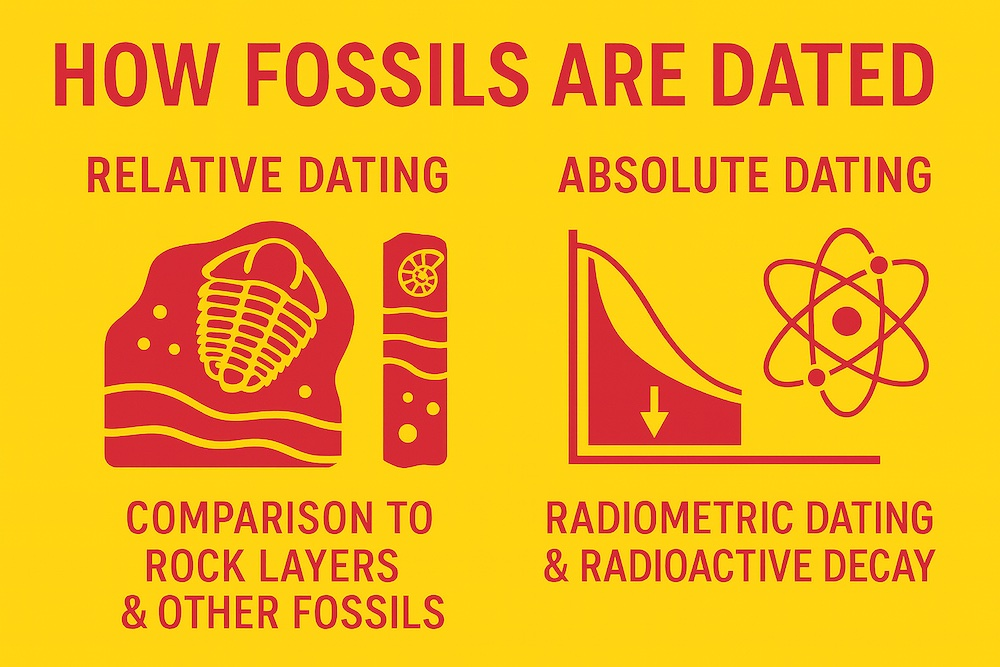
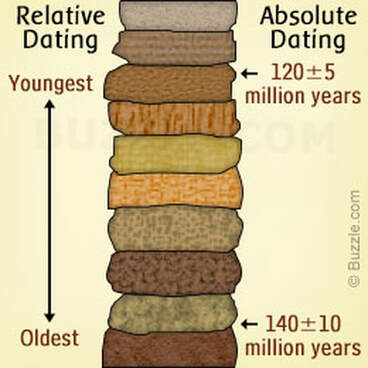
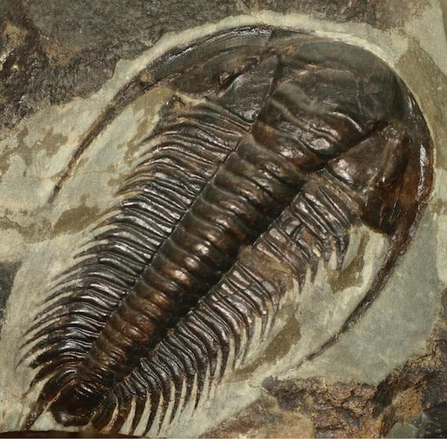
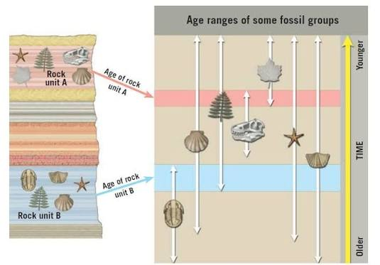
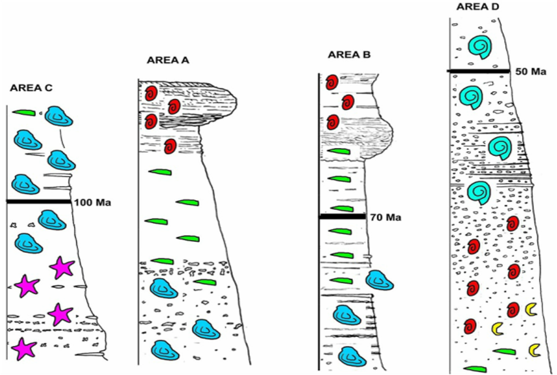
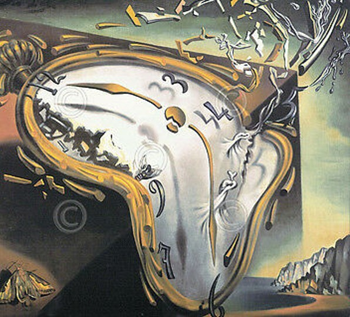
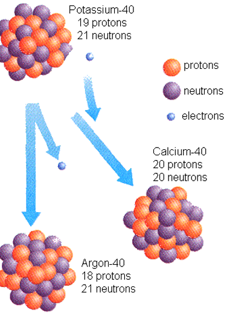
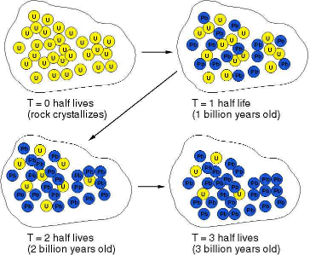
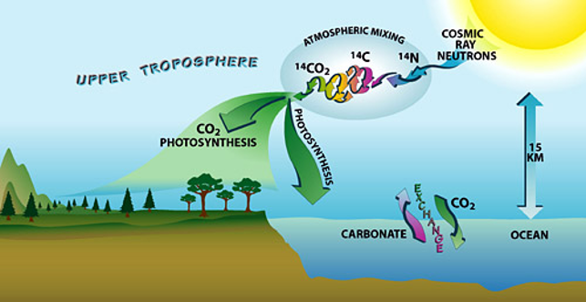
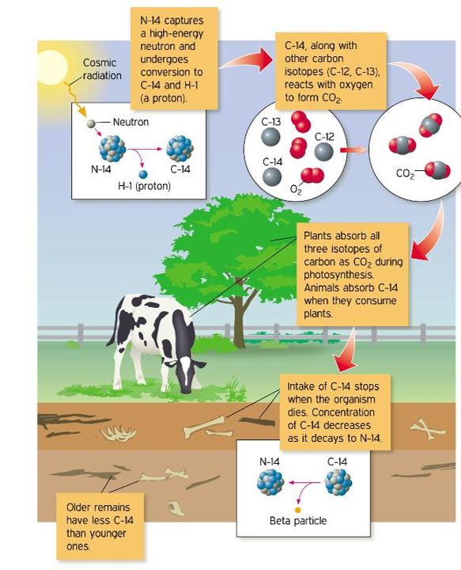

 
{.lightbox width="50%"}
 
::: {.callout-tip}
## Key Points

- [**Additional Assigned Reading:**]{ .underline } Ch. 7 in textbook; Section: [Dating Methods]{ .underline}
- [**Key Terms:**]{ .underline } Beringia, Cordilleran Ice Sheet, Laurentide Ice Sheet, Beringia Standstill,
Kelp Highway, Ice-Free Corridor, Clovis/Clovis-First 
- [**Summary:**]{ .underline } The earliest evidence of the peopling of the Americas sits between 18-15 ka. The ancestors of the first 
settlers of the Americas trace back to the Ancient Paleo-Siberians who settled in Northeast Eurasia
after migrating through the Inner Asian Mountain Corridor (IAMC). While it is clear that the route into North America
spans across the Bering Land Bridge, there is still much research into the path into the heart of the continent (or into S. America).
The primary hypotheses which aim to explain this process are the "Kelp Road" and "Ice-Free Corridor" hypotheses.
:::

# Unit 2: Intent and Strategy

This unit is designed to *walk* students through the spread of our species at the tail end of the [Paleolithic]{ .underline}.
The emergence of *Homo sapiens* at approximately 300 ka illustrates the last branch on our evolutionary tree
but in no way means that we stopped evolving. Along with other, co-existing hominins of the time, we continued
to adapt to everchanging landscapes, develop new technologies and survival strategies, and explore the great expanses of this planet
that humans had never seen. 

We discussed what a species *is* for some length in the last unit. While we don't need to open the conversation
of murky taxonomy back up here, I'd offer one more approach to considering what this taxon represents.
Recall the term [**Ontogeny**]{ .underline} from our lecture on "Primate Characteristics". This term refers to the developmental
history of an organism throughout it's individual lifetime. The word has also been co-opted in species discussions
to reflect the evolutionary nature of a single species' existence. We can thus consider the Ontogeny of *Homo sapiens* and
in doing so come to realize that we have only discussed its infant years so far. The period of time from
the origin of our species (~300 ka) until it began to *successfully* spread across the globe could, in this
sense, be compared to the moment of a child's birth until the moment it can competantly walk on its own. While
not a perfect analogy it should evoke some degree of understanding about what's to come in our discussions.
 
::: {style="float: left; margin-right: 15px; max-width: 20%;"}


:::

Before we get to any of the material on new cultural adaptations and global exploration, however, we have to take some time to understand
how it is that we know when and under what conditions our species began to navigate the Earth. That's right, buckle your seatbelts, it is time
for us to have "the talk". Over the next couple of weeks we will thus be learning about *how* we "know" what we "know". Being that much of our understanding
of human history and adaptation is dependant on time and environment, it is important that you come to understand our methods in reconstructing these
contextual aspects of human paleontology and archaeology. I can't stress enough how important these methods are to our fields of study. Perhaps surprisingly, the methods that have become so important to us
are not Anthropological methods at all but those of Geologists (Geochronology and Geochemistry/Biogeochemistry). Biological Anthropology and Archaeology are
are fields which are inherently multidisciplinary. In this case, we want to study human evolution and cultural development and to do so we need to
use the methods employed by Geologists to devlop a **Temporal Context** and a **Paleoenvironmental Context**. So here we go...

<details>

  <summary> :arrow_up: Anthropologists are Zombies!</summary>

I once had a professor who refered to Anthropologists as Zombies because we have a tendancy of moving across disciplines and consuming their
ideas and methods. I'm not sure this was meant as an entirely positive metaphor but I kinda dig it. It's not to say that we don't develop our
own ideas (we certainly do) but more to say that we do not shut ourselves off from the incredibly useful work of other disciplines. Shout out to 
Dr. Saetra here!

</details>

# Dating

::: {.callout-important}

This information reviews and expands on the sections in your assigned reading (Ch. 7: Dating Methods).
:::

The first thing that any student learns when it comes to establishing a temporal context in Paleontology and Archaeology is that there are
two general approaches to this goal: **Relative Dating** and **Absolute (or Radiometric) Dating**. Before getting into the details of each
we can summarize it with a colloquial analogy. In this hypothetical, let us say that the last time you travelled out of state was in the month of May.
If someone were to ask "when was the last time you travelled out of state?" you could respond in two ways which could satisfy the question: you could say that
you travelled just before the Summer or you could provide the exact date (say, 05/20/2026). The first response is less exact but in placing it in relative position to 
a known time/event you provide the context that is typically appropriate for the question. This is an example of a Relative Date. If the question was a 
bit more formal, however, this might not satisfy and you would want to provide the Absolute (or precise) Date. 

::: {style="float: right; margin-left: 15px; max-width: 25%;"}
{.lightbox}

:::

The image to the right highlights this. It shows successive layers of rock that we call **Strata** (see below). On the right side of these rocks are 
indicators of Absolute age in Millions-of-Years (which we have been abbreviating Ma). The (±) symbol tells you that there is an error range for this date.
It is known that our numerical dates are seldom 100% precise. Instead they are more likely to provide a range of dates within a certain degree of confidence. 
Here the upper date is really suggesting that that stratum dates between approximately 115-125 Ma. More on that later. On the left of the rocks, under Relative Dating, there is simply
an arrow showing that older rocks are on the bottom of this pile and younger ones are on top. This observation,
known as **The Law of Superposition**, is really only part of the story. As suggested in my analogy above, to make this a bit more explicit we would indicate 
that one of these layers represents a specific event (say like the date that you travveled out of state or, more to the point, the extinction of dinosaurs). With that we could use the relative 
dating scheme to say that some strata are older than the extinction of dinosaurs and some are younger (like saying that you travelled before or after the Summer). While this
brief overview should hopefully get the general difference between the two across, there are some important details of each that you will need to better understand in this class. 

# Relative Dating

The beauty of relative dating is in its ability to construct a logical timeline. In general discussion of history, specific dates are details that are 
only necessary with narrow inquiry. If we reflect on our timeline of human evolution, for example, I'd be happy if you could recount that *Ardipithecus* came before *Australopithecus* which came
before *Homo*. This is a relative dating timeline that can be redrawn in a couple of ways [*Diagram 1*]. 

:::: {.columns}
::: {.column width="5%"}
### **A**
:::

::: {.column width="95%"}
```{mermaid}
flowchart LR
		A1["*Ardipithecus*"] --> B1["*Australopithecus*"]
		B1 --> C1["*Homo*"]
```
:::
::::

<br>

:::: {.columns}
::: {.column width="5%"}
### **B**
:::

::: {.column width="95%"}
```{mermaid}
flowchart LR
		H1["*H. habilis*"] --> H2["*H. erectus*"] 
		H2 --> H3["*H. heidelbergensis*"]
		H3 --> H4["*H. neanderthalensis*"]
		H2 --> H5["*H. bodoensis*"]
		H5 --> H6["*H. sapiens*"]
```
:::
::::


<details>

  <summary> Diagram 1: Relative dating timelines</summary>

Both of the above timelines illustrate the logic of relative dating. Though they do not give you numerical ages, such timelines do well to illustrate an order of events. In many discussions
of history, these illustrations are sufficient to convey primary points. For instance, it was important for us to know that [bipedalism]{.underline} evolved before increased [encephalization]{.underline}.

I should also point out that I used two controversal designations in the bottom timeline: *H. heidelbergensis* and *H. bodoensis*. For more information on this layout refer back to 
our discussion in week 5 on "Post-*erectus* hominins".

</details>


### Sedimentary Rocks

The foundation of relative dating methods is situated in [Sedimentology](https://www.usgs.gov/publications/sedimentology-general-introduction-and-definitions-fluvial-sediment-and-channel) 
(the study of sedimentary rocks and the processes by which the are formed). If by chance you read the non-assigned sections of Chapter 7 in the textbook, you have learned that Sedimentary, 
Igneous, and Metamorphic are the three primary rock classes in Geology. We are interested in Sedimentary rocks here because (1) they are most likely to preserve
fossils and (2) because they form in predictable chronological ways. As suggested by the name, Sedimentary rocks are formed by sediments of other materials. While
largely sediments from other rocks, they are also regularly comprised of other materials (organic or inorganic). The original material (the sediments) come from the
process of **erosion** which all matter is subjected to. Be it wind, rain, sun, or simply time, all things erode into smaller pieces. When this happens, the sediments begin a new life detached 
from their parent structure. Depending on the size of the eroded particle, a variety of energetic forces now act to move it from one spot to another. Energetic disparity across different regions 
therefore creates areas of high erosion (high energy environments) and areas of **deposition** (lower energy environments where sediments are deposited). Depositional environments are where we see 
the formation of sedimentary rocks and, ultimately, the best preservation of fossils.

### Strata, Stratigraphy, and Superposition

To understand Relative Dating you must have knowledge of some rudimentary terms. Both **Stratigraphy** and the **Law of Superposition** are mentioned in the text, so we 
don't need to spend too much time on them here. Stratigraphy is simply the study of **Strata**. While the text doesn't provide much of a definition for strata, the term 
also quickly becomes self evident: each identifiable layer of sedimentary rock is refered to as a single stratum (*singular*) or, when multiple are discussed, layers of 
Strata (*plural*). With these details out of the way we can start to envision what is really meant by **The Law of Superposition**. Sediments are carried from the orignial 
structure that they eroded from by some energetic force (gravity, wind, water...) until the energy dwindles enough for the weight of the particle to overcome the transporting 
energy. Then it falls (becoming sediment). Being a low energy environment, this particle is not the only one that falls of in the area. Anything that has been energetically 
transported here faces this fate and becomes deposited as sediment just the same. We therefore have a "bed" of sediments that forms. This is essentially a sandbox (or a lake bed, 
river bed, and etcetera). 

[Sidenote: understanding the energy requirements for sediment transportation is actually pretty cool. When looking at depositional environments you can begin to form an idea of the 
original setting. If, for instance, you are hiking and come across a dried up river bed that has large stones scattered throughout, you can predict that the river was 
flowing fast and hard enough at this point to carry such large stones. If you then continue to follow it and notice that the stones get smaller, or just become beds of sand, you can 
observe how the flow of water changed in different parts of the river. Maybe it's not all that cool to you, but I love this stuff. Such understanding has a tendency of making the 
world seem infinitely more awesome.] 

OK, now picture this depositional environment. It could be a sand dune or the bottom of a lake or ocean. In any case sediments are slowly accumulating and burying whatever lied there 
before. As more and more sediment piles up, the underlying material becomes subjected to more and more pressure and heat. Combine this with the groundwater that percolates through these 
materials and the sediments begin to literally glue together. This is the process of Sedimentary Rock formation. From here we can have little doubt what the **Law of Superposition** is 
all about. Physical structures succomb to erosion,  eroded particles are carried away from from their parent structures until the transporting energy dissipates and they become sediments, 
sediments accumulate in depositional environments and bury the sediments that came before them, and finally the buried sediments (under the forces of pressure, heat, and moisture perculation) 
glue together to form distinct layers of rock. These are strata. The deepest strata, be necessity, formed before the strata above them. BAM! Superposition. Suffice it to say that this cycle starts all
over again when that stratum is eventually exposed again to the elements and begins to erode. Check out the diagram below for an overview of this process [*Diagram 2*].


::: {.columns style="display: flex; align-items: center; justify-content: space-between;"}

::: {.column width="80%"}
```{dot}
digraph G {
	layout=circo
	
	# Pushes nodes away from each other to prevent them from pressing together
	mindist=0.8
	
	# Ensures the engine actively corrects any stray overlapping text box regions
	overlap=false
	
	node [
		fontname="Helvetica", 
		shape=box, 
		style="filled,rounded", 
		fixedsize=true, 
		width=1.8, 
		height=0.6, 
		fontsize=11,
		color="#555555"
	]
	
	# Invisible anchor to maintain your layout position
	top_anchor [shape=point, style=invis]
	top_anchor -> "Erosion of Particles" [style=invis]
	
	# Sequential color coding 
	"Erosion of Particles"  [fillcolor="#bbdefb", style="filled,bold", color="#0288d1", penwidth=2.5] 
	"Transport"             [fillcolor="#e3f2fd"] 
	"Diminishing Energy"    [fillcolor="#e8f5e9"] 
	"Deposition"            [fillcolor="#c8e6c9"] 
	"Burial"                [fillcolor="#fff3e0"] 
	"Cementation"           [fillcolor="#ffe0b2"] 
	"Strata Formation"      [fillcolor="#d7ccc8"] 

	# Loop connections
	"Erosion of Particles" -> "Transport";
	"Transport" -> "Diminishing Energy";
	"Diminishing Energy" -> "Deposition";
	"Deposition" -> "Burial";
	"Burial" -> "Cementation";
	"Cementation" -> "Strata Formation";
	"Strata Formation" -> "Erosion of Particles" [color="#0288d1", penwidth=2];
}
```
:::

::: {.column width="18%" style="padding-left: 5px;"}
## The Sedimentary Rock Cycle

The processes of sedimentation, cementation, and erosion are commonly considered to be [Uniformitarian]{.underline} processes. It is a constant process by which our planet continues to recycle and reshape its principle structure.
:::

:::


But wait...how do we tell different strata apart? What makes them look different and what does this have to do with fossils and time? 

One of the beautiful things about sedimentary rocks being used as time markers is that they can often tell you about shifts in the environment.
Darker strata, for instance, commonly reflect regions abundant with life where the decomposition of organic matter 
mixes with sediments to make these darker hues. White horizons could signify an abundance of quartz or could be dense bands of limestone (made up of shells from microscopic marine organisms).
Bands of red strata might suggest that this layer was rich in iron which subsequently oxidized when exposed to high oxygen environments just as they can turn green in oxygen reducing environments. 
Whatever the case, the sedimentary rocks preserve the conditions of the depositional environments from which they formed. They lock these evidentary materials in stone and 
store them in the geological record. 

::: {#fig-stratigraphy layout-ncol=2}


Examples of Stratigraphy from around the world
:::

### Fossils and Time

From here there should be little problem understanding how the relative dating of fossils takes place. These strata are far from isolated. In fact, 
many **Stratigraphic Horizons** represent the same period of time across huge continental masses. But it is not just 
the sedimentary matter that helps us to identify and define them. Even more useful to this cause are the fossils that get buried within these horizons in successive 
layers. Whether they are transported by the same energetic forces as the sediments themselves or they simply become buried in the environments that they die in, 
plants, animals, and even bacteria can become preserved in these strata. Such environments create tombs which encase the most structurally sound components of 
the organisms that get buried within (often shells, bones, and teeth). What this means is that successive strata have the ability to preserve a record of the life that existed on our planet hundreds, 
thousands, millions, and even billions of years ago. This is the record that allows to definitively say, "No, Dinosaurs and Humans did not coexist. Dinosuars went extinct 
long before the first human-like animals ever existed. In fact, barring the continued success of archosaurs (including dinosaurs but currently represented by crocodilians and birds), 
dinosaurs went extinct long before even the first primates evolved." This is a succinct and scientifically accurate relative dating account of the history of life on our planet. 

But wait, there's more...

The most precise way to apply relative dating is in combination with absolute dating. Your assigned reading makes mention of **Biostratigraphy** but really does not give 
it its due justice. It states that "this form of dating looks at the context of a fossil or artifact and compares it to the other fossils and biological remains (plant and animal) 
found in the same stratigraphic layers." I just don't think that tells you much, so here is my attempt. First, one of the founding principles of biostratigraphy is that it can match 
strata from different parts of the world. Let's say you have two stratigraphic sequences in different regions that look the same but vary in depth. This is a common occurence. 
The strata might be color patterned (say grey, green, black, grey, white, red) in East Africa and India. But in India the red stratum is two meters deep and in East Africa it is 
barely visible (or absent altogether). You might have a thought that they represent the same period of time but you really can't tell. The best possible way of solving this 
riddle is to look at the fossils. Having not discussed it much, it may seem like the inclusion of fossils in strata is a rarity. Not really. There is [a lot]{.underline} of 
life on this planet and most of it gets buried after death. While fossilization is a relatively rare occurence, even a rare occerence can have a large yield if the base material 
is abundant. In the right environment, fossils should be an expectation not a surprise. In most stories of fossil hunting (including my own) the struggle is not finding fossils *per se*
but finding the desired fossils. In my previous research, for example, I was part of a team investigating the presence of *H. erectus* in a specific region of Ethiopia. While this was a daunting task
which provided only a few quality specimens from this species, the region provided thousands of fossils from other animals. Though not our primary research goal, one important aspect of this project
was establishing the specific context of the region at the time that *H. erectus* lived in it. It is largely due to these fossils and their quality as [Time Markers]{.underline} and 
[Environmental Indicators]{.underline} that we were successful in this goal. We will come back to the notion of fossils being environmental indicators in the next lecture. For now,
let us focus on the massive potential of **Biostratigraphy** and its use in Relative Dating.  


### Time Markers

::: {style="float: right; margin-left: 15px; max-width: 25%;"}
{.lightbox}

:::

Biostratigraphy is the study of fossil remains in stratigraphic contexts in order to (1) correlate strata from different environments and (2) provide evidence for the geologic
age of strata within a stratigraphic sequence (see @tbl-biostrat). The first aspect of this, referred to more specifically as **Fuanal Correlation**, is discussed above. This process allows 
geologists and paleontologists to match strata from different parts of the world which may have been separated through other geologic/geographic actions (plate techtonics, 
volcanic eruption, erosion of river valleys, and et cetera). The second approach to Biostratigraphy is the explicit use of fossils as time markers. Key to this effort is the 
identification of **Index Fossils**. 


::: {.card .border-success .w-70 .me-auto .mb-3}
::: {.card-header .bg-success .text-white}
**Applications of Biostratigraphy**
:::

::: {.card-body}
+------------------------+-------------------------------------------------------------------------------------------------------------------------------------------------+
| Biostratigraphy        | Description                                                                                                                                     | 
+========================+=================================================================================================================================================+
| **Correlate strata**   | Matching strata from different regions provides context for a study area. Even if you don't know the age, the correlated strata can             |
|                        | add ecological information by identifying fossil species present in one sample but not the other, it can inform on geologic/geographic          |
|                        | processes such as plate tectonics and volcanic activity, and establish a relative timeline across the fossil record.                            |
+------------------------+-------------------------------------------------------------------------------------------------------------------------------------------------+
| **Identify geologic**  | While similar to faunal correlation, identifying a geologic age is a specific agenda which uses distinct fossils sets and known numeric ages to | 
| **age**                | provide a narrow age range for particular stratigraphic units.                                                                                  |
+------------------------+-------------------------------------------------------------------------------------------------------------------------------------------------+

: Applications of Biostratigraphy {#tbl-biostrat}
:::
:::


Index Fossils come from species which are abundant in the fossil record, easy to identify, and have a relatively short geologic age. 
In meeting these criteria, these fossils not only have the power to identify specific strata from different regions (faunal correlation), but to delineate the specific period 
of time that that stratum represents. Consider the images to the right and below. On the right is a type of arthropod called a Trilobite. These animals crawled on the seafloor during the Paleozoic era hundreds
of thousands of years ago. This specific type of Trilobite, however, has a much narrower existence appearing in the fossil record during the Early Cambrian and
disappearing by the Middle Cambrian (existing from approximately 521 to 500 million years ago). This taxonomic order of Trilobite, known as *Redlichiida*, has a distinctive morphology which
makes it easy to identify, it was short lived to other Orders of Trilobite (only existing for about 21 million years), and it was abundant and widespread during its existence. For a paleontologist, 
this fossil represents a specific moment in time. If one of these fossils is discovered during excavation the team can be confident that they are working in early-to-middle Cambrian beds. 

While some fossils can provide fairly narrow age ranges, most biostratigraphy is achieved through *indexing* multiple fossils from the same deposit. The image below illustrates a more realistic use of Index Fossils
than the trilobite example. It shows an array of 7 fossils dispersed across a *stratigraphic column*, each associated with a white arrow indicating the species' existence in the fossil record. Note
that some of the age ranges overlap in some strata but not in others. This is how narrow age ranges are achieved for strata through biostratigraphy. Any one of these fossils could represent an
age range of hundreds of thousands of years, but to find five different Index Fossils that overlap in a single stratigraphic horizon could narrow this age range down to tens of thousands of years.

{.lightbox}

The final application of Biostratigraphy is to apply it alongside of Absolute Dating techniques. We will come to learn that there are only a handful of methods that can provide a numerical age
range for fossil sites and they tend to be very specific about the materials they are being used on. For example, some of these methods can only be applied to volcanic rocks while others are
only able to be applied on flowstones (stalctites and stalagmites) and corals. With such narrow applications it is no surprise that there are plenty of paleontological contexts where there are 
no options for absolute dating at all. This is where, again, Index Fossils come into play. We already know that the right fossil in one of these sites can be correlated with a statum elsewhere in the world.
Now imagine that the correlated stratigraphy also exists in a region where the right materials for Absolute Dating exist. All of the sudden your correlated fossil can be directly associated with 
a numeric age. 

The image below helps exemplify this process. Consider for a moment that you are a researcher in Area A. This is the only site that does not have the needed material to obtain a
 numeric age for an assemblage. Despite this, it is still your goal to figure out roughly how old some of these fossils are. Let’s take the red spiral shell fossils, for instance. 
 You know that similar fossils have been found in different parts of the world. In fact, Areas C, B, and D each seem to have a stratigraphic timeline similar to the progression of 
 fossils found in your site. Knowing this, and knowing that the other research areas have absolute dates associated with certain fossils, can you come up with an estimate for 
 the age of the red spiral shell fossils in your assemblage? You should be able to come up with a rough age of 60 Ma. 
 The red spiral shell fossils, when considering all research areas, are sandwiched between a 50 Ma and a 70 Ma date range. Again, not perfect, but certainly better than nothing. 

{.lightbox width="65%"}

# Absolute (Radiometric) Dating

::: {style="float: right; margin-left: 15px; max-width: 30%;"}
{.lightbox}

:::

Absolute dating is better referred to as Radiometric (or Chronometric) dating. This is because, despite refined methods, seldom are dates “absolute”. This was discussed briefly above (in the opening paragraphs of the **Dating** section). These dates always come with a confidence interval (age range) dictated by a margin of error. Thus in 
the figure above we saw an "Absolute" date of 120±5. Here the margin of error is ±5 and the confidence interval is 115-125 (*for those familiar with statistics you can attribute the 
margin of error to one or, ideally, two standard deviations*). The point is, an "Absolute Date" does not necessarily provide an [exact]{.underline} date. This is the influence for
moving away from the term "Absolute" and shifting to [Radiometric]{.underline}. The term Radiometric is the prefered replacement for Absolute because it conveys the methodological approach to these dates. Numerical ages provided in Archaeology and Paleontology 
typically come from understanding the **Radioactive Decay** of **Isotopes** in Geologic and Organic matter (though there are a few non-Radiometric methods...hence the use of Chronometric by 
some camps).

Your book does well to cover the fundementals of Radiometric Dating needed for this class. Be sure you understand the following terms/concepts: 

::: {.callout-important}

Be sure to understand these details from the text:

- What is the primary composition of an Atom?
- What are isotopes?
- Why do some isotopes decay?

:::

One thing that is barely mentioned which is important to understanding this process is the **Half-Life**, so let's discuss that here for a moment.

### Radioactive Decay and Half-Life

::: {style="float: right; margin-left: 15px; max-width: 20%;"}
{.lightbox}

:::

Hopefully by now you understand that there are unstable atoms and that they eventually stabilize by going through the process of radioactive decay. 
That’s all well and good, but how does that help us? We use our knowledge of decay rates of different isotopes to determine how much time has elapsed 
since the material that we are studying first formed. As an example, when a volcano erupts it creates volcanic rocks that are enriched with radioactive 
isotopes. This happens because of the immense amount of energy coursing through the materials. This energy destabilizes the atomic structure of the materials, 
making them radioactive. The image on the right depicts this process. Volcanic ash is largely comprised of radioactive potassium (^40^K). As the ash cools down, and 
the energy dissipates, these radioactive potassium nuclides spontaneously breakdown (decay) into more stable forms (^40^Ar). The moment this process starts is the 
moment that the [Radiometric Clock]{.underline} begins ticking. As long as we know how long it takes for a population of radioactive atoms to decay into stable forms, 
we can judge how much time has passed since the beginning of the clock. In this example, it would provide us with the amount of time that has elapsed since 
the eruption of the volcano. This is what we mean by “resetting” or “zeroing” the clock. Easy, right? 

#### Understanding Half-Life

::: {style="float: left; margin-right: 15px; max-width: 25%;"}
{.lightbox}

:::

When we measure decay rates, we are not measuring how long it takes for one radioactive atom to decay into a stable form. Instead, we are measuring how 
long it takes for a population of atoms to decay from their “parent” forms (original radioactive isotope) into a population of daughter atoms. We thus 
investigate the changing proportion of radioactive isotopes to stable isotopes in our sample material (volcanic rock, flowstones, bones, wood, and etcetera).
In the previous example we would measure the abundance of Potassium 40 to Argon 40 in volcanic rock (pumice). It is also important to understand that radioactive decay is spontaneous. 
As mentioned above, we can only measure the pace of decay through relative terms (not the time it takes for one atom to decay into the daughter product). 
This means that we are not counting how many atoms there are in a given sample. Instead, we investigate the proportion of parent to daughter atoms. Thus, our unit of measure 
is not an actual count of atoms. Instead we use the proportional measure of a **half-life**. This is the amount of time it takes for a sample to lose half of it’s radioactive material through decay. 
The image to the left relates the decay of radioactive Uranium to Lead, stating that the half-life is 1 billion years. Thus it takes 1 billion years for half of the radioactive uranium to decay into 
the daughter product of lead. After 1 billion years, therefore, there should be a 50-50 ratio of Uranium to Lead. Significantly, after another billion years, 
you would then observe half of that remaining product! Do see the trick? If we considered radioactive decay to be a regular and linear process, logic would 
dictate that after the subsequent billion year there would be no more parent product. But that is not what this is saying. The model for radioactive decay 
suggests that it takes a certain amount of time for half of the radioactive product to decay. Not a specific amount (i.e., certain number of atoms). Just a proportion. 
But that is all we need. 

A simplified example should help. Hypothetically consider that we, as humans, lose our fingers at a fixed rate over time throughout our lives. Assume the half-life for this is 
40 years (meaning that it takes 40 years to lose half of our fingers). Thus, at 40 years old the average person would only have 5 fingers. But what about an 
80-year-old? In a linear model of decay, we would expect the 80-year-old to have zero fingers. If you naturally lose 5 fingers over the course of forty years, 
another 40 years would mean another 5 fingers. This is not the case with radiometric decay. The decay rate of radioactive isotopes is one that is proportional 
to the larger composition. With a proportionally guided rate of decay, and a half-life of 40 years, the 80-year-old in the example would have 2.5 fingers remaining. 

### Review of Carbon Dating

This is a topic also covered pretty well by the textbook but it is an important method worth reviewing here as well. So how does it all work? 
Carbon is a naturally occurring element that is found in all lifeforms (carbon-based lifeforms…). It has an atomic number of 6 (6 protons) and 
three common isotopes (12, 13 14). Carbon 14 (^14^C) is radioactive. It originates in the atmosphere as Nitrogen 14 that is irradiated by the sun’s 
cosmic waves. The high-energy neutrons of these cosmic rays collide with Nitrogen 14 atoms (Atomic Number=7, Mass Number=14). When these particles 
collide, the incoming neutrons knock out a proton thus losing a proton and gaining a neutron. This accounts for the creation of ^14^C.

::: {style="float: right; margin-left: 15px; max-width: 40%;"}
{.lightbox}

:::

^14^C is found in the same materials as all other carbon isotopes. This is because, while in the atmosphere it binds to oxygen atoms to create carbon dioxide (CO2). 
Atmospheric CO2 is then cycled into the Biosphere (through metabolic pathways) and the Hydrosphere (through dissolution). For carbon dating we are more interested 
in the biosphere than the hydrosphere. This is because the materials that we are dating with this method are the organic remains of organisms that consumed carbon 
(which is all life on our planet). CO2 is consumed by plant life via photosynthesis, plant life is consumed by animals, and animals are consumed by other animals. 
Thus, carbon is constantly cycled through the biosphere, including radioactive carbon. This doesn’t mean that the carbon isn’t also always decaying but as long as we 
continue consuming carbon, the amount of ^14^C in our bodies will be the same as everything else consuming carbon. 

::: {style="float: left; margin-right: 15px; max-width: 25%;"}
{.lightbox}

:::

Regarding the radiometric clock, this starts at an organism’s death (when it stops consuming ^14^C). From here on out, the only ^14^C activity occurring in our 
tissues is decay. No more uptake. The decay process is similar to the initial irradiation. Beta decay commences by ejecting an electron and changing a neutron 
into a proton. Thus ^14^C (6 Protons and 8 neutrons) turns into ^14^N (7 protons and 7 neutrons). Since ^14^N is a gas, it is a byproduct which disperses into the atmosphere 
upon its inception, making it impossible for us to measure the proportion of ^14^C to ^14^N. But since we know how much ^14^C is in a living structure (or in the environment), 
we can see how much has remains in the artifact relative to how much there would be in the “zeroed” clock. From there the process is the same as most radiometric methods. 
We build or timeline from the knowledge of ^14^C having a 5730-year half-life. 

Carbon dating is often considered the most ideal radiometric technique being that it is the only method that can measure radioactive decay directly from the materials we are investigating. 
In contrast, when we use potassium-argon dating in paleontology, we need to find specific volcanic rocks in association with the fossils we have questions about. In this way, 
potassium-argon dating is an indirect method (does not directly date what we want to know the age of). This is not to say that there are not limitations with Carbon Dating.

### Limitations of Carbon Dating

The most notable limitation of Carbon Dating is the short half-life of ^14^C. Only dating materials as old as ~50-55 ka means that this method is inapplicable to many geochronological questions.
As long as we stick within the field of Archaeology, however, it is mostly a non-issue. More pressing issues relate to the fluctuating concentrations of ^14^C in our atmosphere and to the potential to
confuse the method's [precision]{.underline} with the [accuracy]{.underline} of its application. 

#### Calibrating the Carbon Record

The issue of fluctuating ^14^C concentrations is mentioned in the textbook when discussing Calibration Curves. 


::: {.text-center}


*Good review of Carbon Dating and Calibration*
:::
