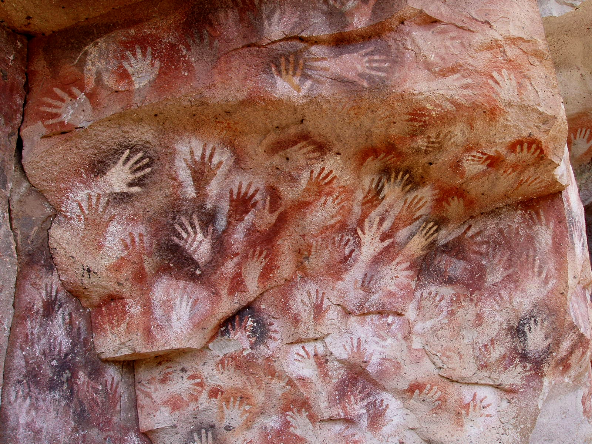
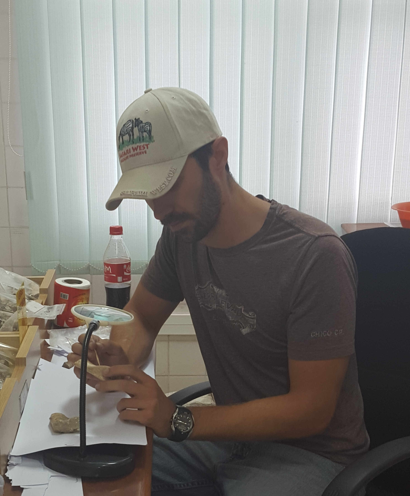

{.lightbox width="70%"}

  
Figure: Cueva de las Manos

  The above image is of the Cueva de las Manos in Argentina. It is a UNESCO World Heritage Site
  dating back approximately 9,000 years (9 ka). The stenciled hand prints accompany painted images of 
  people and local fauna (e.g., guanacos). While this is not a site that we will examine in this course, it does reflect the
  sort of material we will ultimately be talking about. Here is a link to some more information about Cueva de las Manos: 
  [Cueva de las Manos](https://www.bradshawfoundation.com/south_america/cueva_de_los_manos/index.php)

# Introduction

Welcome to Anthropology 151: Emerging Humanity. This website will act as a companion to our Lamaku page. Some of the information here
will be redundant if you read the syllabus but reviewing it twice is not a bad call. If you don't need the general overview just skip down
to the How To Use This Site section. 

Emerging Humanity is listed as "An introduction to human biological evolution and the archaeology of culture in the world prior to AD 1500". More specifically the course is designed
to foster an understanding of human development and culture changes through time from prehistory to the present (or near present) and across major regions of the globe. It is meant
to both feature populations which varied in time and space as well as emphasize, at some point, unique cultural aspects of Hawaiian, Pacific, and/or Asian societies. 

My approach to designing this course is thus: we will learn about the origin of our species, *Homo sapiens* and the ancestral hominins that preceded us, track the spread of our species across the globe (or at least
from Africa, through Eurasia, and into the Pacific and North America), and illustrate the rise of two complex civilizations after the emergence of agriculture. The course should map out a distinct trajectory that
will end with the development of early Hawaiian civilizations and their unification.

#### Syllabus

  <a class="btn btn-primary" href="files/Anthropology 151 fall 26 Online Async.pdf" download="Anthropology 151 fall 26 Online Async.pdf">
    <i class="bi bi-download"></i> Download Syllabus
  </a>

<!-- Creates an interactive click-to-expand section -->

  

    Preview Syllabus
  

  <iframe src="files/Anthropology 151 fall 26 Online Async.pdf" width="100%" height="800px" style="border: 1px solid #ccc;"></iframe>

#### Exam Guide

# How To Use This Site

#### Navigating :airplane:

Throughout the course you will navigate through 3 units of content on this site. Material for each unit can be found on the sidebar to the left.
Expand each Unit tab to view a week-by-week list of course material. 
Each page will additionally display a Contents menu that can help you navigate from section to section. Since some of these materials will be Supplementary and 
some will be Assigned, each week's page title will be followed by a (S) or an (A) respectively. The specific reading assignments are also noted under the Class Schedule and Reading Assignments heading
in the syllabus. 

#### "Chapters" :book:

For lack of a better term, we can refer to the weekly content pages as chapters. These chapters will either review/expand on your assigned reading, provide you a window to view an assigned article (or articles) and 
review learning objectives for it (them), or comprise all of the content for that week on it's own (reading content, videos, weblinks, and etcetera). Pay attention to the (S) or (A) signifiers next to each 
chapter title as these will tell you whether the chapter is Assigned or Supplimentary. The reading schedule is also viewable in the syllabus and will follow the following format:

- Assigned reading format:
	- textbook: ch.xx
	- website: ch. xx

Each Figure, Table, and Video in these web chapters is expandable by clicking on it. Some will also have drop down captions like the image above. Be sure to read through that information too when a website chapter is assigned. 

Articles will be presented in the same way as the syllabus above. There will be a window that can be expanded to read online as well as a button to download the PDF. These files will also be available on 
our Lamaku page.

#### Lamaku :seedling:

This site [**is not**]{ .underline} a replacement for our Lamaku page. All graded material will be obtained and submitted through Lamaku. Like this site, you can follow a week-by-week agenda with each
week detailing what the assigned reading is and providing a link to the quiz for it. There is a [Content Browser]{ .underline} window on our course home page that is organized much the
same way as the sidebar on this site. Use that to navigate to important files and unit specific content. For the week's which are labeled [Exam]{ .underline}, there will be a link to
the assignment overview and submission page. 

  
Get to know your instructor

::: {style="float: left; margin-right: 20px; margin-bottom: 10px;"}
  
  {width="150px" style="border-radius: 8px;"}
:::

  **Daniel Cusimano:** 
  I am a Doctoral Candidate here at UH. My field of study falls under the umbrella of Biological Anthropology and is specifically situated within Paleoanthropology (Unit 1 of this course). 
  I have been conducting research in this field and in the field of Bioarchaeology since 2011 with published work on archaeological populations from the Near East and fossil sites in Ethiopia. My work has 
  taken me all across the United States and as far as Ethiopia and China. My current research focuses on methods used to differentiate hominin species (human ancestors) in the fossil record and is directed
  at solving some current issues in Middle Pleistocene hominin systematics (colloquially refered to as "the muddle in the middle"). 
  

